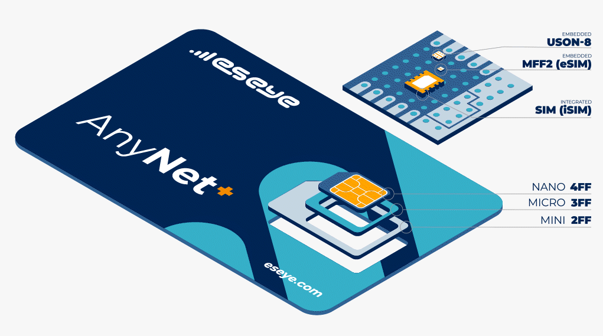

# AnyNet+ SIM card sizes

Eseye's AnyNet+ SIMs combine [eUICC](anynet-sims/esim-and-remote-provisioning/euicc-overview.md#euicc-identifier-eid) and [multi-IMSI](anynet-sims/how-anynet-sims-work/understanding-multi-imsi-functionality.md) technology to maximise network coverage for devices, and provide them with every opportunity to connect to a working network using Eseye's [Connectivity Management Platform](connectivity/about-the-connectivity-management-platform.md).

Eseye supplies physical [SIMs in different sizes (form factors)](./#anynet-sim-card-sizes-form-factors), embedded [SIMs (eUICCs)](anynet-sims/esim-and-remote-provisioning/euicc-overview.md#euicc-identifier-eid), and iSIMs (USON-8).


For more information about iSIMs, please contact your Account Manager.


The different versions of the AnyNet+ SIM support different technologies and features, as shown in the [specifications table](./#comparing-anynet-sim-specifications).

## AnyNet+ SIM card sizes (form factors)

You can order Eseye AnyNet Secure SIM cards in the following form factors (FF):

*   Original (1FF) 85.6 x 53.98 x 0.76 mm (not used in modern devices)

    Form factor refers to the SIM sizing. The full-size SIM (1FF) is the original form factor and is the size of a credit card – 85.60 mm × 53.98 mm × 0.76 mm. It is no longer produced. As technology has improved, the form factors (2FF, 3FF, 4FF) have become smaller. Most smaller form factors are housed within a full-size form factor, from which they are easily separated.
*   Mini (2FF) 25 x 15 x 0.76 mm

    Form factor refers to the SIM sizing. A 2FF (or Mini-SIM) is the current standard SIM card size – 25mm x 15mm x 0.76mm. The 2FF has the same contact arrangement as the full-size SIM card and is normally supplied within a full-size card carrier, attached by a number of linking pieces.
*   Micro (3FF) 15 x 12 x 0.76 mm

    Form factor refers to the SIM sizing. The micro-SIM (or 3FF) card is 15mm x 12mm x 0.76mm. It has the same thickness and contact arrangements as the mini-SIM (2FF) but is smaller in length and width for use in smaller devices.
*   Nano (4FF) 12.3 x 8.8 x 0.67 mm

    The nano-SIM (4FF) card is even smaller than the micro-SIM, with dimensions that are only slightly larger than the chip itself. 12.3 mm x 8.8 mm x 0.67 mm.
*   Embedded (MFF2) 6 x 5 x 0.9 mm

    The embedded (MFF) SIM is an integrated circuit that’s designed to be permanently soldered into an IoT device. It has eight electrical pins, which are the same as the eight gold contacts on removable SIMs.

## Comparing AnyNet SIM specifications

The specifications and supported features for the AnyNet+ SIM versions are provided in the table below and more detailed information is provided in the following datasheets:









Each version may have multiple variants identified by unique SIM number prefixes. The following table provides additional notes for differences between the variants.

| Feature                                                                     | ES56xx                                                                                              | ES57xx                                                                                              | ES6xx                                                                                               | ES7xxx                                                                                                                  | Additional notes                                                                                                   |
| --------------------------------------------------------------------------- | --------------------------------------------------------------------------------------------------- | --------------------------------------------------------------------------------------------------- | --------------------------------------------------------------------------------------------------- | ----------------------------------------------------------------------------------------------------------------------- | ------------------------------------------------------------------------------------------------------------------ |
| SIM variants                                                                | ES56**1x** ES56**2x** ES56**3x**                                                                    | ES57**1x** ES57**2x** ES57**3x**                                                                    | ES6**x2x** ES6**x3x** ES6**x5x**                                                                    | ES7**x2x** ES7**x3x**                                                                                                   |                                                                                                                    |
| **Form factor support**                                                     |                                                                                                     |                                                                                                     |                                                                                                     |                                                                                                                         |                                                                                                                    |
| Mini (2FF)                                                                  | ✓1                                                                                       | ✓2                                                                                       | ✓3                                                                                       | ES7x3x                                                                                                                  | 
1. Requires ES561x or ES563x SIMs 2. Requires ES571x or ES573x SIMs 3. Requires an ES6x3x SIM
         |
| Micro (3FF)                                                                 | ✓1                                                                                       | ✓2                                                                                       | ✓3                                                                                       | ES7x3x                                                                                                                  | 
1. Requires ES561x or ES563x SIMs 2. Requires ES571x or ES573x SIMs 3. Requires ES6x3x or ES6x5x SIMs
 |
| Nano (4FF)                                                                  | ✓1                                                                                       | ✓2                                                                                       | ✓3                                                                                       | ES7x3x                                                                                                                  | 
1. Requires an ES563x SIM 2. Requires an ES573x SIM 3. Requires an ES6x3x SIM
                         |
| Embedded (MFF2)                                                             | ✓1                                                                                       | ✓2                                                                                       | ✓3                                                                                       | ES7x2x                                                                                                                  | 
1. Requires an ES562x SIM 2. Requires an ES572x SIM 3. Requires an ES6x2x SIM
                         |
| **Compliance**                                                              |                                                                                                     |                                                                                                     |                                                                                                     |                                                                                                                         |                                                                                                                    |
| GSMA                                                                        | ✓                                                                                                   | ✓                                                                                                   | ✓                                                                                                   | ✓                                                                                                                       |                                                                                                                    |
| REACH                                                                       | ✗                                                                                                   | ✓                                                                                                   | ✓                                                                                                   | ✓                                                                                                                       |                                                                                                                    |
| RoHS                                                                        | ✗                                                                                                   | ✓                                                                                                   | ✓                                                                                                   | ✓                                                                                                                       |                                                                                                                    |
| ISO 7816                                                                    | ✗                                                                                                   | ✗                                                                                                   | ✓                                                                                                   | ✓                                                                                                                       |                                                                                                                    |
| ETSI TS 102.221                                                             | ✗                                                                                                   | ✗                                                                                                   | ✓                                                                                                   | ✓                                                                                                                       |                                                                                                                    |
| Halogen-free                                                                |                                                                                                     |                                                                                                     | ✓                                                                                                   | ✗                                                                                                                       |                                                                                                                    |
| **Technology/ Feature support**                                             |                                                                                                     |                                                                                                     |                                                                                                     |                                                                                                                         |                                                                                                                    |
| 4G (LTE data) support                                                       | ✓                                                                                                   | ✓                                                                                                   | ✓                                                                                                   | ✓                                                                                                                       |                                                                                                                    |
| 5G support                                                                  | ✗                                                                                                   | ✗/✓1                                                                                     | ✗                                                                                                   | ✗/✓2                                                                                                         | 1. ES5733+ SIMs can support 5G NSA mode after an over-the-air update.                                              |
| Multi-IMSI                                                                  | ✓                                                                                                   | ✓                                                                                                   | ✓                                                                                                   | ✓                                                                                                                       |                                                                                                                    |
| eUICC                                                                       | ✗                                                                                                   | ✗                                                                                                   | ✓                                                                                                   | ✓                                                                                                                       |                                                                                                                    |
| Supported test profiles                                                     | - [eseye-test-profile.md](anynet-sims/esim-and-remote-provisioning/eseye-test-profile.md "mention") | - [eseye-test-profile.md](anynet-sims/esim-and-remote-provisioning/eseye-test-profile.md "mention") | - [eseye-test-profile.md](anynet-sims/esim-and-remote-provisioning/eseye-test-profile.md "mention") | - GSMA test profile - [eseye-test-profile.md](anynet-sims/esim-and-remote-provisioning/eseye-test-profile.md "mention") |                                                                                                                    |
| **Timers**                                                                  |                                                                                                     |                                                                                                     |                                                                                                     |                                                                                                                         |                                                                                                                    |
| Bootstrap IMSI Rotate Timer (typical time before rotation occurs)           | 180 s                                                                                               | 180 s                                                                                               | 180 s                                                                                               | 180 s                                                                                                                   |                                                                                                                    |
| eUICC Rollback Timer (typical time before rollback occurs)                  | ✗                                                                                                   | ✗                                                                                                   | 300 s                                                                                               | 300 s                                                                                                                   |                                                                                                                    |
| eUICC Fallback Timer (typical time before fallback occurs)                  | ✗                                                                                                   | ✗                                                                                                   | 1200 s                                                                                              | 1200 s                                                                                                                  |                                                                                                                    |
| **Operating parameters**                                                    |                                                                                                     |                                                                                                     |                                                                                                     |                                                                                                                         |                                                                                                                    |
| Minimum operating temperature (°C)                                          | -40 -251                                                                                 | -40                                                                                                 | -40 -252                                                                                 | -40                                                                                                                     | 
1. Requires an ES563x SIM 2. Requires an ES6x3x SIM
                                                      |
| Maximum operating temperature (°C)                                          | 105 851                                                                                  | 105                                                                                                 | 105 852                                                                                  | 105                                                                                                                     | 
1. Requires an ES563x SIM 2. Requires an ES6x3x SIM
                                                      |
| Minimum storage temperature (°C)                                            | -40                                                                                                 | -40                                                                                                 | ✗                                                                                                   | -40                                                                                                                     |                                                                                                                    |
| Maximum storage temperature (°C)                                            | 105 851                                                                                  | 105                                                                                                 | ✗                                                                                                   | 105                                                                                                                     | 1. Requires an ES563x SIM                                                                                          |
| Minimum operating voltage (V)                                               | 1.62                                                                                                | 1.62                                                                                                | Class A: 4.5 Class B: 2.7 Class C: 1.62                                                             | 1.62                                                                                                                    |                                                                                                                    |
| Maximum operating voltage (V)                                               | 5.5                                                                                                 | 5.5                                                                                                 | Class A: 5.5 Class B: 3.3 Class C: 1.98                                                             | 5.5                                                                                                                     |                                                                                                                    |
| Non-volatile memory (kB)                                                    | 64 1281                                                                                  | 64                                                                                                  | 320                                                                                                 | 700 (before loading OS) 375 (after loading OS)                                                                          | 1. Requires an ES563x SIM                                                                                          |
| Write / erase time (ms)                                                     | 2.3 41                                                                                   | 2.3                                                                                                 | ✗                                                                                                   | ✗                                                                                                                       | 1. Requires an ES563x SIM                                                                                          |
| Data retention time at 85°C (years)                                         | 10                                                                                                  | 10                                                                                                  | 10                                                                                                  | 15 (ES7x2x only) 25 (ES7x3x only)                                                                                       |                                                                                                                    |
| Minimum write cycles per file (millions)                                    | 4 0.51                                                                                   | 4                                                                                                   | 10                                                                                                  | 10                                                                                                                      | 1. Requires an ES563x SIM                                                                                          |
| RAM (applets & network access authority) (kB)                               | ✗                                                                                                   | ✗                                                                                                   | 7                                                                                                   | 20 (before loading OS) 10 (after loading OS)                                                                            |                                                                                                                    |
| Plastic type1                                                    | ABS 102 ABS 83                                                                | ABS 10                                                                                              | Polycarbonate4 ABS5                                                           | H-ABS/ABS 2.0 (ES7x3x only)                                                                                             | 
1. N/A for MFF2 SIMs. 2. ES561x only 3. ES563x only 4. ES6x5x only 5. ES6x3x only
               |
| Moisture/reflow conditions (260°C)                                          | ✗                                                                                                   | ✗                                                                                                   | MSL 11                                                                                   | ✗                                                                                                                       | 1. ES6x2x only                                                                                                     |
| Humidity resistance (85°C, 85% humidity) (hours with bias)                  | ✗                                                                                                   | ✗                                                                                                   | 1000 n/a1                                                                                | ✗                                                                                                                       | 1. ES6x3x only                                                                                                     |
| Corrosion resistance (salt atmosphere at 35°C) (hours)                      | ✗                                                                                                   | ✗                                                                                                   | 2401 962 n/a3                                                      | ✗                                                                                                                       | 
1. ES6x5x only 2. ES6x2x only 3. ES6x3x only
                                                          |
| Vibration resistance (AEC-Q100 frequency 20\~2000Hz, acceleration 20G peak) | ✗                                                                                                   | ✗                                                                                                   | ✓ n/a1                                                                                   | ✗                                                                                                                       | 1. ES6x3x only                                                                                                     |
| Shock resistance (AEC-Q100 1500G)                                           | ✗                                                                                                   | ✗                                                                                                   | ✓ n/a1                                                                                   | ✗                                                                                                                       | 1. ES6x3x only                                                                                                     |
