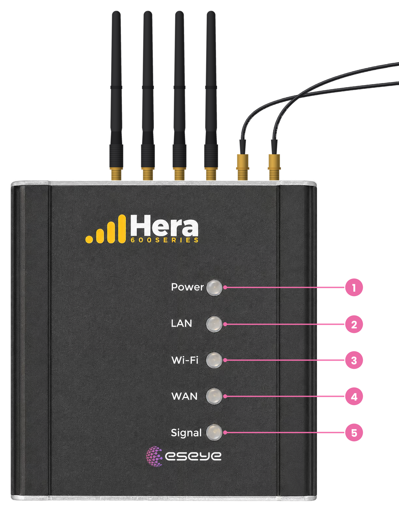

# APN configuration when changing eSIM profiles under SGP.32

## 1. Overview

This article explains how Access Point Name (APN) configuration is handled when an IoT device changes eSIM profiles under SGP.32. It covers the limits of the GSMA Remote SIM Provisioning (RSP) standard, differences between IPAe and IPA-d implementations, and the deployment patterns commonly used to maintain connectivity.

### Key points

- SGP.32 does not automatically update APNs.

- APN management remains outside the GSMA RSP standards.

- The issue exists in SGP.02, SGP.22 and SGP.32.

- IPA-d makes automation easier but does not solve the problem by itself.

- In practice, customers typically solve this through:

  - a common APN strategy,

  - custom device firmware that updates APNs automatically.

## 2. How APN configuration works

### APN configuration in IPAe implementations

SGP.32 does not manage APN configuration.

SGP.32 defines how profiles are downloaded, enabled, disabled and managed through the eIM, SM-DP+ and IPA architecture. However, the APN used by the device's packet data connection remains a function of the device, modem firmware and operating system.

For simple IPAe devices, such as trackers, sensors, and low-power IoT modules, APN handling typically follows one of three models:

1.  Use a common APN across all profiles

    - This is the simplest operational model.

    - Eseye generally prefers a common/global APN strategy where possible because it avoids device-side APN changes during profile transitions.

2.  Device firmware manages APN switching

    - The device maintains a mapping between profile/operator and APN.

    - After a profile change the modem or application layer updates the APN automatically.

    - This requires additional device intelligence.

3.  Managed orchestration approach

    - Connectivity providers build the profile, APN and routing model together as part of the solution design.

    - This is likely to become a custom impolementation of option 1

### Operational consideration

When a device transfers to a third-party SGP.32 profile, it must use the APN required by the new provider. This reflects the reality that profile switching alone does not guarantee that the correct APN is selected afterwards.

### Scope of SGP.32 APN support

It is important to separate profile management from device configuration. SGP.32 defines how a profile is downloaded, activated, secured and managed through the eIM, but there is no mechanism to update the APN that should be used. Generally The APN setting is the responsibility of the application.

### Modem and Operating system conflicts

However, there are some additional complexities introduced by modem and Operating systems that must be considered.

Some modems include customised firmware to optimise performance on that network. These modem profiles are selected by the modem after reading the SIM card and extracting the home network fMCC and MNC from the identifiers that are read back. The Modem profile settings may also include setting the APN to the MNO’s public APN. This is usually undesirable for IoT applications that need the security, monitoring and routing settings of a private APN, Modems provide AT commands to turn this automatic profile setting feature off.

The Android Operating system includes a feature to set the APN to the MNO’s public APN based on values read from the card. Whilst this may appear to offer a solution in the short term, there are concerns over IoT applications using public APNs and that a critical setting for device operation is removed from the device developer’s control.

### LTE Default APN

Opening a data context on an LTE network without specifying an APN will normally mean that the request is routed to a defined ‘LTE default APN’ by the MNO. In some cases this can be a good solution where the MNO can configure the LTE Default APN for the subscription when it is provisioned on the network. i.e. a new profile can be downloaded using SGP.32 and then provisioned wirth the LTE Default APN set to match the application requirements. As a note of caution, not all MNOs will allow the LTE Default APN to be defined, and this may limit which prfiles can be downloaded using SGP.32 in the future.

## 3. Conclusion

APN management, billing, routing, and fallback behaviour become more complex when a deployment mixes profiles from multiple providers.

Plan the APN and routing architecture together with profile lifecycle management. Although Treating profile switching as an isolated function can leave devices unable to establish a packet data session after a profile change.

SGP.32 enables profile provisioning and lifecycle orchestration, but it does not automatically configure the APN used by the device. Reliable deployments therefore require a deliberate APN strategy based on a common APN, managed orchestration, and device firmware that reacts to profile changes.
