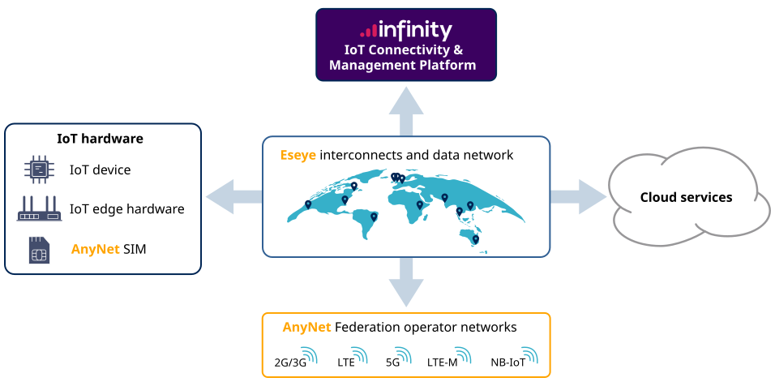

# How AnyNet SIMs work

This topic helps you understand Eseye's products and services, and where to find more information about the main functional areas shown in the diagram below.

This help is divided up into the following sections:

* [Welcome to Eseye Documentation](https://app.gitbook.com/s/irOtd1AXvHgo84Vp1oQ2/ "mention") – provides an overview of the Eseye products and services and contains links to more detailed information elsewhere in this help.
* [Hardware](https://app.gitbook.com/s/RChB1Oxa6heurAUHLp6P/ "mention") – describes Eseye's SIM solutions, HERA router products and third-party modem/module integrations.
* Cloud services best practices – describes the third-party integrations that Eseye supports, and how to integrate your cloud services into the Eseye network.
* [eseye-connectivity-overview.md](../../connectivity/eseye-connectivity-overview.md "mention") – describes how Eseye connects and transfers data between IoT devices, Eseye's data network and third-party cloud services.
* [Infinity IoT Platform](https://app.gitbook.com/s/SfHTmjIGpgngY8hr2pZJ/ "mention") – describes how to manage your IoT devices and SIMs, view reports and invoices and manage access to Eseye's Infinity web interfaces.
* [Overview](https://app.gitbook.com/s/0xQKujz8nVihyxgGvU7r/ "mention") – describes how to use Eseye's application programming interfaces (APIs) to integrate with third-party services.

## IoT technology

The following topics explain key IoT technologies and how Eseye uses them:

* [iot-wireless-technologies.md](iot-wireless-technologies.md "mention")
* [about-the-anynet-federation.md](about-the-anynet-federation.md "mention")
* [understanding-multi-imsi-functionality.md](understanding-multi-imsi-functionality.md "mention")
* [esim-and-remote-provisioning](../esim-and-remote-provisioning/ "mention")

## Connectivity

The following topics describe how Eseye provides connectivity to IoT devices and third-party applications and services:

* [eseye-connectivity-overview.md](../../connectivity/eseye-connectivity-overview.md "mention")
* [about-eseye-pops.md](../../connectivity/about-eseye-pops.md "mention")
* [security](../../connectivity/security/ "mention")
* Set up an account with Eseye: Get in touch
* [device-configuration-best-practices.md](../../connectivity/device-configuration-best-practices.md "mention"): speak to your Account Manager or Get in touch
* [Billing User Guide](https://app.gitbook.com/s/X0cODzoDlWNEI5nvG9sX/readme/billing-user-guide "mention")
* [Overview](https://app.gitbook.com/s/0xQKujz8nVihyxgGvU7r/location-api/overview "mention")
