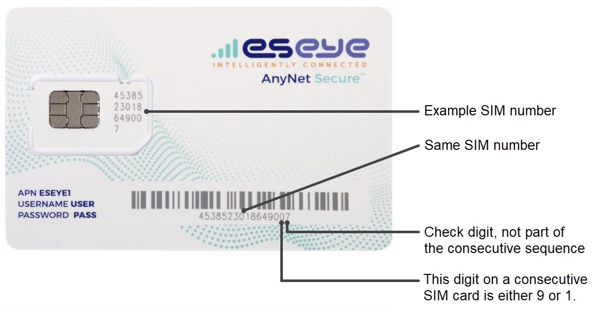

# Managing SIMs

Eseye SIM numbers end with a check digit, to allow the Eseye systems to verify that you have entered the number correctly. The check digit is not part of the consecutive sequence.

