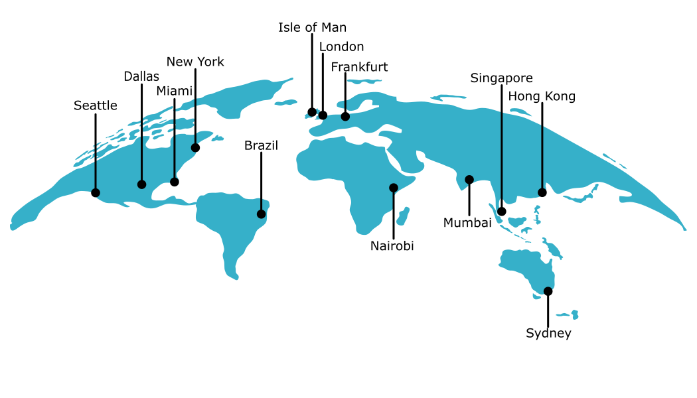
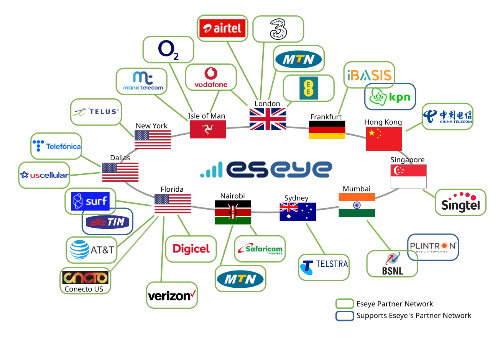

# About Eseye PoPs

Eseye has multiple geographically distributed Points of Presence (PoPs) that exist in data centres in the following locations worldwide:

The PoPs are inter-connected as part of Eseye's [MPLS network](section-a-connecting-over-the-mobile-network/section-b-connecting-over-eseyes-mpls-network.md). Devices request a data session with the Eseye network via an ingress PoP, then the device data is usually sent through an egress PoP to the customer network.

Depending on customer requirements, device data may ingress and egress Eseye's network either through a single PoP, or separate PoPs. Some data may bypass the Eseye network altogether, although the device is always assigned an IP address via the ingress PoP. For more information, see [Section A – Connecting over the mobile network](section-a-connecting-over-the-mobile-network/).

All the Eseye PoPs are mirrors of one another, so the configurations within them are identical. In the event of an outage, a PoP will failover to a different PoP in a separate geographic location. For more information, see [Data Centre PoP (Secondary)](mobile-network-operators-by-pop.md).


Failover usually takes about 24 hours to implement.


## Understanding how interconnects ingress Eseye's network

Eseye has preconfigured a specific ingress PoP for each of our partner mobile networks. These ingress PoPs form part of the [interconnects](section-a-connecting-over-the-mobile-network/section-b-connecting-over-eseyes-mpls-network.md) (connection points) between partner mobile networks and the Eseye network.

For example, the iBasis/KPN mobile network ingresses at Eseye’s Frankfurt PoP, whereas Verizon US ingresses at the Florida PoP. This reduces the network load on any particular PoP by ensuring that traffic is evenly distributed across the world. One PoP may host multiple interconnects.

The following diagram shows the primary ingress PoP for each of Eseye's partner operators:

For more information, see [Mobile Network Operators by PoP](mobile-network-operators-by-pop.md).

### About regionalised routing

Device data is usually routed through the PoP at which the network terminates, even if some devices are located in other countries and roam from their home network onto other networks. This can cause issues for deployments with low latency data transmission requirements. For example, unacceptable delays to data transmission may occur when data from roaming devices is transported a considerable distance to the ingress PoP, then routed back to a cloud service in the country in which the devices are located.

Regionalised routing enables local routing, based on where the devices are located. For example, data for devices connected using iBasis in the EU would route through the Frankfurt PoP, while data for devices in the US would route through either the Florida or New York PoPs.

Regionalised routing is provided using the AnyNet private APN `anynetsim.com`. For more information, see [Current AnyNet APN list](access-point-names/current-anynet-apn-list.md).

## Understanding how data egresses the Eseye network

Depending on customer requirements, there are two typical ways in which Eseye can send device data to the customer network (or another network):

* **Route-based VPN (highly recommended)** – Eseye can use our high-speed MPLS network to deliver the data between PoPs and egress it at a specific PoP that is preconfigured with a route-based VPN to the customer network. For more information, see [Understanding VPNs](security/understanding-vpns.md).
* **No VPN, or some traffic not VPN** – Alternatively, the device data can partially or completely bypass the Eseye network altogether and egress directly onto the internet from the device. For more information, see [Routing non-VPN network traffic](ip-addressing-and-routing/routing-non-vpn-network-traffic.md).


Eseye can also configure a policy-based VPN, but this is not recommended, as it restricts each device to a single mobile network. For more information, see [LAN-LAN or client VPNs](security/understanding-vpns.md#about-lan-lan-or-client-vpns).

