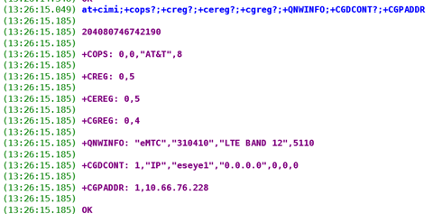
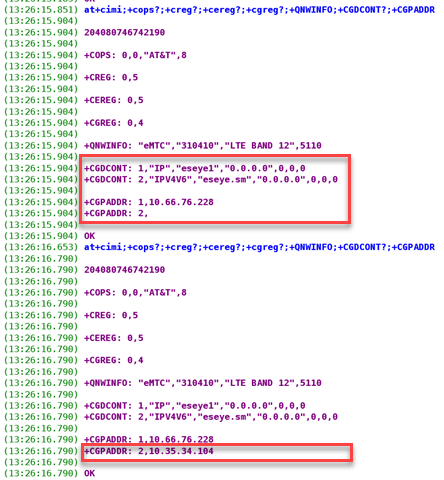
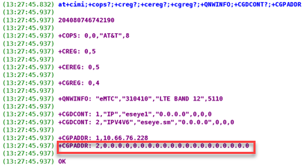

# Device configuration best practices

Secure, efficient connection with a network depends on how the device is developed. You must consider the following during device inception and design:

## Ensuring data security and integrity

You must develop devices with data security and integrity in mind, ensuring that they are configured to handle SSH and SSL/TLS correctly, if required. This ensures that all IoT data is end-to-end encrypted at the application layer before it traverses across the mobile network.


We highly recommend that you engage a third party penetration test company to perform full end-to-end penetration testing on your products and Eseye's network.


Customers handling credit card information must ensure the device (such as a payment terminal) is PCI compliant. This means ensuring that banking details are encrypted at the point that a credit or debit card is tapped onto the device to pay for an item.

Depending on your security requirements, we can provide different solutions for how data egresses the Eseye network across the customer’s firewall and network.

For information about providing security across your IoT deployment, see [Security Options](security/).

## Understanding IoT protocols, such as MQTTS, CoAP and HTTPs

IoT protocols provide a set of rules for transmitting data between devices and the customer network, so that each device sends and receives information in a structured, uniform way. Protocols ensure that devices communicate in a compatible and reliable manner.

Most modern IoT protocols are designed so that devices initiate communications, which means these protocols work well across a range of network topologies, including the AnyNet solution.

We recommend customers use any of the following industry standard IoT protocols for their deployment:

* [Secure MQTT (MQTTS)](https://mqtt.org/mqtt-specification/)
* [Constrained Application Protocol (CoAP)](https://www.rfc-editor.org/rfc/rfc7252.html)
* [Hypertext Transfer Protocol Secure (HTTPS)](https://www.rfc-editor.org/rfc/rfc9110.html)

### Some benefits of using IoT protocols:

* These provide standardised, industry-accepted solutions
* Proven to be robust across a range of network topologies
* Contain built-in security protocols
* Have the advantage of reusing community development and testing

### Avoiding TCP in NB-IoT radio environments

Transmission Control Protocol (TCP) is a widely used protocol for communication between devices over the internet. However, we have observed that TCP-based applications in Narrowband Internet of Things (NB-IoT) radio environments are prone to disruption and premature session termination.

#### Factors that cause disruptions in TCP-based communication

Eseye has observed the following behaviours:

* TCP packets in NB-IoT radio environments often fail to get delivered within the expected or required protocol timeframes.
* TCP session control packets occur at a frequency that oversaturates the limited bandwidth capabilities of the NB-IoT radio environment.


These control packets are redundant to the underlying application and data transfer.


* The oversaturation causes packet stacking or buffering at the mast/ENB.
* The longer the TCP session is maintained, the worse this phenomenon grows exponentially.
* To compensate for the limitations, the client will try to renegotiate the TCP window session parameters with the server.
* When tolerances are exceeded, the client then closes the data session.

We have observed that a small FTP-based download (30-40KB) is enough to disrupt the TCP-controlled timers and end a session prematurely. This is a significant obstacle for IoT applications that require reliable and continuous data transfer over a long period.

As a result, we recommend that IoT developers consider alternative highly efficient communication protocols that are better suited for NB-IoT radio environments, such as User Datagam Protocol (UDP) with an application layer-based transmission control, and CoAP. Applications targeting NB-IoT services should limit redundant network traffic, especially traffic that is actively controlled by timers. A further consideration is using [Power Saving Mode (PSM)](https://www.3gpp.org/ftp/Specs/archive/24_series/24.008/), which allows the device and ENB/mast to negotiate transmission control and avoid overloading either network segment. However, PSM availability varies between network operators and regions.

## Configuring devices to initiate communication

In all circumstances, it is IoT best practice for a device to initiate all communication with the customer network. This:

* Reduces security risks, ensuring that devices are not accessible outside of the customer network.
*   Optimises connectivity by ensuring that the device can access multiple networks for routing data.

    Devices with a single public IP address are restricted to one network. For more information, see [About secure subnets](ip-addressing-and-routing/about-secure-subnets.md).
* Increases scalability and decreases the costs incurred with assigning public IP addresses to devices. For more information, see [IP addressing and routing](ip-addressing-and-routing/).

For example, a payment terminal must initiate communication – the point of sale may occur at any time, and the banking information is pushed to the bank’s network. The terminal may also poll the customer network to see if software updates are available.

In a case where different customers need to rent the same device for a set period of time, perhaps to send a message to the device (for example, with highway maintenance signage), then depending on what IoT protocol is used, the device will initiate communication with the cloud to see what new messages are available.

## Configuring devices for connection efficiency

IoT devices can cause congestion on a network when communication requests are rejected and devices repeatedly try to connect. This is particularly a problem when thousands of devices try to connect simultaneously to a centralised network.

Eseye adheres to [GSMA device connection efficiency guidelines](https://www.gsma.com/newsroom/gsma_resources/ts-34-iot-device-connection-efficiency-guidelines/):

See Chapter 7.1.

It is IoT best practice to use delay timers to increase backoff time between communication attempts, as well as use a random element to avoid simultaneous requests, especially as the number of devices using any particular network is ever increasing.

Eseye will charge extra if your devices connect inefficiently to a network. For more information, see Understanding charges for inefficient network connection.

## Configuring devices to account for the maximum transmission unit (MTU)

Some cellular networks require a lower than standard MTU (1500 bytes on an ethernet-based network). Networks will segment or discard packets that are larger than their maximum MTU value. We recommend you analyse your network path to understand the encapsulation requirements for your IoT devices, as well as investigate regional mobile network MTU settings where your devices are deployed. Typically, you will find that you need to set your MTU to less than 1400 bytes. For more information, see [About the maximum transmission unit](ip-addressing-and-routing/about-the-maximum-transmission-unit.md).

## Configuring devices to handle national emergency alerts

Increasingly, governments have nationwide test alert systems that may send alerts over cellular networks, and may use different RAT types to distribute an alert.

IoT devices that are connected to such a network at the time of an alert will automatically receive the alert.

You must develop your devices to take appropriate action in response to emergency alerts, such as restarting, or activating a specific function.

We recommend you configure your devices to receive emergency alerts from authorized sources only. It is important to restrict the sources of alerts to trusted authorities, to prevent the device from receiving false or malicious alerts.

Eseye can offer test services, including operation verification, during and following a national emergency alert. Speak to your Account Manager for more information.

## Configuring devices to accept SIM management

SIM management provides better connectivity control by enabling over-the-air (OTA) localisation and SIM maintenance.

IoT devices often contain embedded sensors, software, and other electronics that allow them to connect and communicate with other devices and networks through the internet.

Like any other electronic device, IoT devices require maintenance to ensure their optimal performance, security, and longevity. Without proper maintenance, these devices may encounter various issues such as malfunctions, performance degradation, security breaches, and even complete failure.

SIM management on battery operated devices presents additional challenges, where typically the device only connects to the network for short time periods and then goes to sleep. Often these devices are not awake for long enough periods of time to receive SIM management. We recommend best practices to counteract this issue. For more information, see [SIM management best practice recommendations](device-configuration-best-practices.md#sim-management-best-practice-recommendations).

### SIM management considerations

Configuring your IoT devices to accept SIM management enables the following:

* Localisation: Eseye can send OTA localisation information to the device in a campaign that consists of multiple messages. Depending on the MNO and configuration required, the localisation campaign can vary in size. If the device only wakes up intermittently for short periods of time, a campaign may take months to download on the device, which limits connectivity choices.
* Firmware updates: IoT devices often rely on firmware to operate, and firmware updates are necessary to fix bugs, improve performance, and enhance security. Regular firmware updates can help ensure that IoT devices continue to function optimally and securely.
* Security patches: IoT devices are often connected to the internet, making them vulnerable to cyber attacks. Regular security patches and updates can help protect IoT devices from potential security threats and prevent data breaches.
* System integration: IoT devices often work in tandem with other devices and systems. Regular maintenance may ensure that these devices continue to communicate effectively and that data is transmitted accurately.

### How Eseye manages localisation

Eseye and the customer must first develop and agree a localisation plan and associated costs. Before we download an IMSI for a local network, we need to ensure that the network is available and the device can successfully connect to it. Typically, this means that we steer the device to an existing bootstrap IMSI with a roaming agreement on the desired network. When the device has successfully connected to the desired network via roaming, we then download the localised profile for that network and instruct the SIM to switch onto it. The length of time it takes to localise a SIM will vary, depending on the network and the device configuration.

### How Eseye performs SIM management

When a device requiring SIM management authenticates on the network, it will receive an Mobile Terminated (MT) SMS from Eseye's Remote SIM Provisioning (RSP) system that initiates a secondary data context on a separate connectivity management APN. The APN will vary depending on the current MNO. Eseye assigns a unique IP address to the device specifically for SIM management, which is listed alongside the primary IP address. When the SIM management completes, the context is closed, and the IP address is either cleared or displayed as 0.0.0.0 (depending on the module type).

You can request the module to list open contexts to the device firmware using AT commands.

#### Example 1 – SIM roaming on AT\&T with a standard primary data context open on the eseye1 APN.

The AT+CGDCONT? and AT+CGPADDR commands return all the open data contexts, and list the current APNs and the associated IP addresses if the data contexts are active.

#### Example 2 – initial progression of a network operational profile download

The following image demonstrates the open secondary data context and newly assigned IP address for the context, showing it is active:

#### Example 3 – SIM management completion and resulting closure of the secondary data context

The following image demonstrates the point at which the secondary data context changes from active to closed. The IP address becomes all 0s, as seen on a Quectel BG95 module:


Results vary between modules and possibly between firmware versions. We highly recommend you test your current module and retest if a firmware change occurs. For example, on the Quectel BG96 module, the secondary data context disappears completely when the channel closes.


### SIM management best practice recommendations

We recommend you design your IoT devices to actively poll for SIM management requests at regular intervals, and stay awake long enough to receive the localisation or maintenance campaign, as follows:

* Devices that need to conserve power must authenticate on the network and stay awake for at least 20 seconds to receive the SIM management MT SMS, even if the main application communication has finished.
* During this time, the device firmware should poll the module to see if an active Remote SIM Provisioning (RSP) context is open.
* If an active RSP context exists, the device must not shut down, nor close the data contexts.
*   The device firmware should repeatedly extend the module awake time by 20 seconds until the RSP context has closed and the IP address contains 0 values for nine sequential checks (three minutes).

    If the associated IP address changes from a non-zero value to 0.0.0.0 and then back to a non-zero value during the countdown, the firmware must continue to extend the awake time.
* After this, the module can safely disconnect from the network and the device can power down.
* Occasionally when the maintenance is complete in some modules, the context may close, but the IP address is not cleared (appearing active). In these cases, if the timer is finished but the RSP IP address is not 0.0.0.0, the maintenance is most likely complete.


We recommend you use a watchdog to shut down the module after 30 checks (10 minutes), even if the context remains open.

