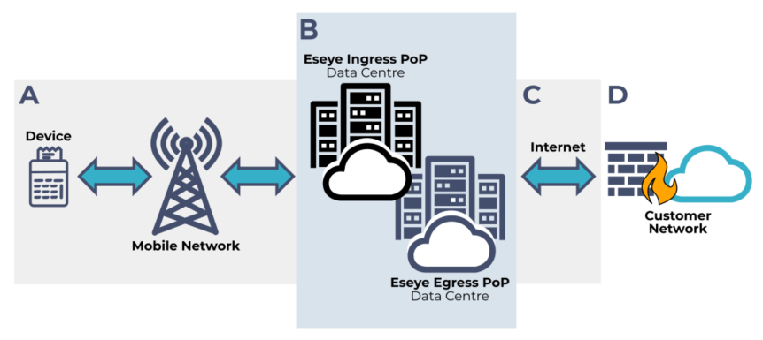

# Eseye connectivity overview

When you design and deploy your IoT devices, consider how data moves into your network. Consider your deployment options. Data movement depends on connectivity across the networks between the data source and its destination.

If you use [AnyNet](https://eseye-v3.gitbook.io/eseye-docs/L25WdLp1CEZBZ0aOlPAR/anynet-sims/anynet-sims), connectivity can enable data flow across four network systems:

* **A — Device to ingress PoP:** Data travels between the device, mobile network, and [Eseye ingress Point of Presence (PoP)](https://eseye-v3.gitbook.io/eseye-docs/L25WdLp1CEZBZ0aOlPAR/connectivity/about-eseye-pops).
* **B — Between Eseye PoPs:** Data travels through Eseye's high-speed MPLS network.
* **C — Egress PoP to customer network:** Data travels over the internet from the Eseye egress PoP to the customer network.
* **D — Within the customer network:** Incoming data can be stored and used for business purposes.


As each customer network is different, we can only describe the first three sections of the data journey.

