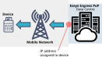

# IP addressing and routing

Every internet-connected device has an Internet Protocol (IP) address. IP addresses identify devices and indicate data origins and destinations.

IP addresses have these visibility options:

* **Private:** Visible only within a private network.
* **Public:** Visible on the internet.

IP addresses also have these assignment options:

* **Static:** The IP address remains constant. These are also called fixed IP addresses.
* **Dynamic:** The IP address changes automatically and regularly.

See [About secure subnets](about-secure-subnets.md) for customer IP address allocation.

Eseye assigns a unique IP address to every device.


MNO IPv6 support remains limited. Eseye uses IPv4 addressing within cellular networks. Eseye equipment supports IPv6 addressing. Contact Support about secure-subnet customization.


## Assigning private IP addresses to devices

Eseye usually assigns private static IP addresses to customer devices, one per IMSI, for the lifetime of the device.

Eseye PoPs use [Network Address Translation (NAT)](about-network-address-translation-nat.md) to translate multiple private IP addresses to one public IP address for sending device data across the internet.

Each PoP has one or more public IP addresses to egress data across the internet to the customer network. For more information, see [Egress IP addresses](egress-ip-addresses.md).

## Assigning static public IP addresses to devices

Usually, a customer requests static public IP addresses because they want to initiate communication with devices at any time. For example, an engineer might want to use a laptop with the Wi-Fi in an internet café to bring up a terminal session on remote equipment.


Initiating communication with a device is not IoT best practice. For more information, see [Configuring devices to initiate communication](../device-configuration-best-practices.md#configuring-devices-to-initiate-communication).


Using static public IP addresses for IoT devices is not recommended for a number of reasons:

* **Increased security risks:** Device IP addresses are accessible to anyone with an internet connection. Mapping a static public IP address directly to a device limits firewall protections. The device needs added security against hacking attempts.
* **Increased cost and decreased scalability:** IPv4 address exhaustion makes large public IP address allocations expensive and difficult. It also restricts scalability.
* **Less redundancy:** A static public IP address restricts a device to one cellular network and routing path.
* **Increased latency:** Restricting a device to one cellular network can delay data transfer. The device cannot switch to faster routes.
* **Reduced connectivity options:** A device can become inaccessible during an Eseye PoP failover. For more information, see [Configuring a device to access the correct network](../section-a-connecting-over-the-mobile-network/#configuring-a-device-to-access-the-correct-network).

