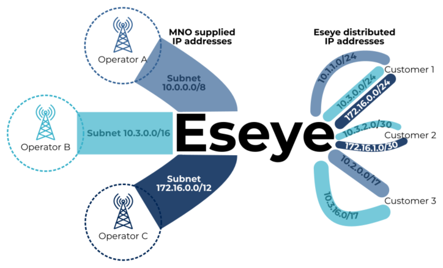
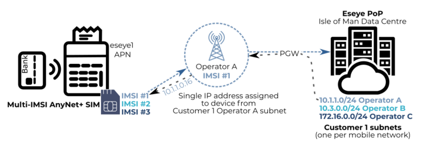
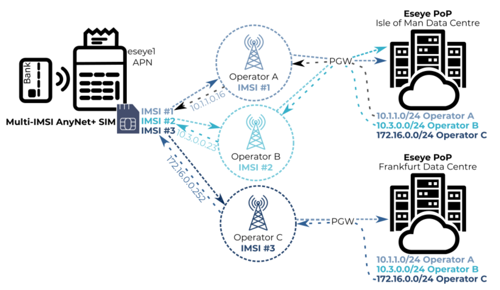

# About secure subnets

Each mobile network operator (MNO) supplies Eseye with a pool of private IP addresses to distribute to customer devices. To differentiate between customers that are connected on a single mobile network, Eseye uses secure subnets, which are segmented sections of these private IP address ranges. Eseye provides each customer with one subnet for every operator network that their devices use.

## How IP addresses are allocated to a SIM

During the device authentication process, Eseye allocates the IP addresses from within a customer’s subnet to the customer’s provisioned SIMs. Usually, a SIM is allocated a dedicated (static) [IPv4 address](./) for each profile or IMSI that is installed on it. This IP address is assigned for the lifetime of the device. For those SIMs where this is unnecessary, the IP address is dynamic, which means that it will change every time the SIM is authenticated.

The following diagram shows how an IP address is assigned to a specific IMSI. For the purposes of simplicity, the diagram does not describe any translation that occurs on the IP address:

For more information, see [About Network Address Translation (NAT)](about-network-address-translation-nat.md).

## How IMSI switching affects IP address allocation

The following diagram shows how, depending on which SIM profile is currently in use, Eseye will allocate a different IP address (and the data may route through a different PoP). In other words, the device may have multiple IP addresses assigned to it during its lifetime as connectivity shifts between mobile networks:

The secure subnets ensure that all devices within a specific subnet are allocated IP addresses within a contiguous range. This enables efficient device management and is required for security options, such as VPNs and ACL rules, which we will discuss later. For more information, see [Understanding VPNs](../security/understanding-vpns.md) and [Routing non-VPN network traffic](routing-non-vpn-network-traffic.md).

Eseye usually uses Network Address Translation to process the IP addresses for data routing across the internet. For more information, see [About Network Address Translation (NAT)](about-network-address-translation-nat.md).

## What happens next?

Eseye manages the complexities of mobile network switching between multiple IMSIs on a single SIM, ensuring that data can move securely and quickly between the device and the customer network.

Devices may have multiple static private IP addresses, depending on the number of IMSIs that exist on the SIM. This enables the device to access multiple mobile networks for increased connectivity.

After connectivity is established, the device can send data to the customer network.

You can learn about:

* How the data traverses the Eseye MPLS network. For more information, see [Section B – Connecting over Eseye's MPLS network](../section-a-connecting-over-the-mobile-network/section-b-connecting-over-eseyes-mpls-network.md).
* The options you have for configuring how data enters your network or third party network (such as the cloud). For more information, see [Section C – Connecting over the internet](../section-a-connecting-over-the-mobile-network/section-c-connecting-over-the-internet.md).
