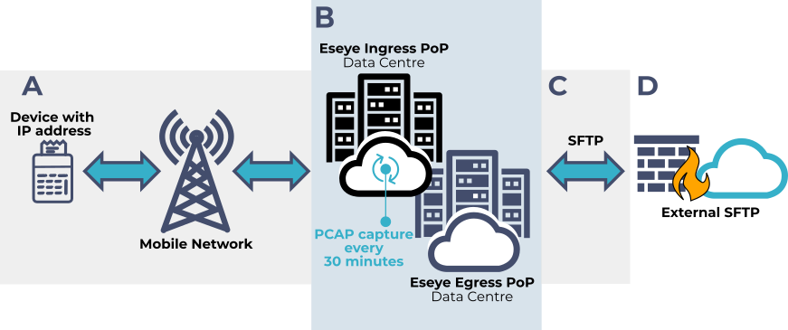

# About network traffic analysis using PCAP Explorer

PCAP Explorer helps network administrators and security professionals monitor and analyse network activity. Use it to investigate network congestion, data loss, and suspicious or unauthorized activity.

Request continuous capture of all network traffic data for devices in a portfolio. The captured data includes the full packet contents, including headers and payloads.

PCAP Explorer records this data chronologically in separate real-time files for 30-minute periods. Capture volume depends on the network configuration and IoT device activity. PCAP Explorer merges the files into one file, then compresses it.

Eseye sends the compressed file to you through SFTP. You can decode it with a tool such as Wireshark and analyse network traffic over time.


Eseye does not store captured data.


The Push API provides a lighter option for real-time monitoring. It transmits the API's specified data points rather than all raw device data. Use the Push API to monitor specific events or metrics in real time. For more information, see [Monitoring and administering network usage](monitoring-and-administering-network-usage.md).

### Request a pricing quote

To request a pricing quote for PCAP Explorer:

1. Select [Request pricing quote](mailto:orders@eseye.com?subject=Request%20a%20pricing%20quote%20for%20PCAP%20Explorer) to create a pre-formatted email. Edit the email to meet your requirements.
2.  Alternatively, email [Sales Admin](mailto:orders@eseye.com) with this information:

    **Subject:** Request a pricing quote for PCAP Explorer

    Include the following in the email body:

    * Company name
    * Your role
    * Contact phone number
    * Contact email address
3. An Account Manager will respond.
