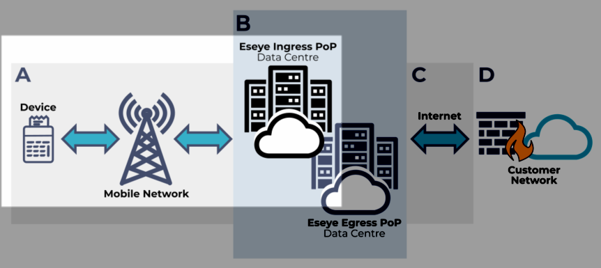
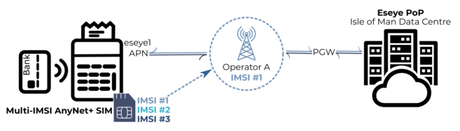
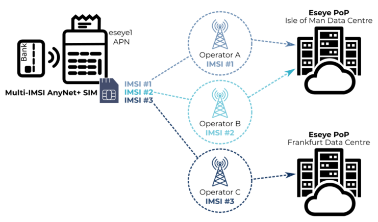

# Section A – Connecting over the mobile network

This section of topics unpacks the first part of the data journey between a device and the customer network.

For an overview on Connectivity, see [Eseye connectivity overview](../eseye-connectivity-overview.md).

## About the AnyNet solution

The AnyNet solution provides access to mobile networks across the world. Devices connect on whichever mobile network provides the best connectivity for their location and requirements. The AnyNet Connectivity Management Platform (CMP) can use [steering of roaming](../../anynet-sims/how-anynet-sims-work/understanding-roaming.md) and [IMSI switching](../../anynet-sims/how-anynet-sims-work/understanding-imsi-rotation-vs-imsi-switching.md) to connect to different mobile networks in order to maintain optimum connectivity between a device and the customer network.

The AnyNet solution provides cellular connectivity in the following countries:

| Americas            |                                  | Europe                 |                             | Africa                           |                             | Asia                             | Middle East              | Oceania     |
| ------------------- | -------------------------------- | ---------------------- | --------------------------- | -------------------------------- | --------------------------- | -------------------------------- | ------------------------ | ----------- |
| Anguilla            | Mexico                           | Albania                | Kosovo                      | Algeria                          | Mauritius                   | Azerbaijan                       | Bahrain                  | Australia   |
| Antigua and Barbuda | Montserrat                       | Andorra                | Latvia                      | Angola                           | Morocco                     | Bangladesh                       | Iraq                     | New Zealand |
| Argentina           | Nicaragua                        | Armenia                | Liechtenstein               | Benin                            | Mozambique                  | Cambodia                         | Islamic Republic of Iran |             |
| Aruba               | Panama                           | Austria                | Lithuania                   | Botswana                         | Namibia                     | China                            | Israel                   |             |
| Bahamas             | Paraguay                         | Belarus                | Luxembourg                  | Burkina Faso                     | Niger                       | Hong Kong                        | Jordan                   |             |
| Barbados            | Peru                             | Belgium                | Malta                       | Burundi                          | Nigeria                     | India                            | Kuwait                   |             |
| Belize              | Plurinational State of Bolivia   | Bosnia and Herzegovina | Monaco                      | Cameroon                         | Réunion                     | Japan                            | Lebanon                  |             |
| Brazil              | Puerto Rico                      | Bulgaria               | Montenegro                  | Cape Verde                       | Rwanda                      | Lao People's Democratic Republic | Oman                     |             |
| Canada              | Saint Kitts and Nevis            | Croatia                | Netherlands                 | Central African Republic         | Senegal                     | Macao                            | Qatar                    |             |
| Cayman Islands      | Saint Lucia                      | Cyprus                 | Norway                      | Chad                             | Sierra Leone                | Malaysia                         | Saudi Arabia             |             |
| Chile               | Saint Vincent and the Grenadines | Czech Republic         | Poland                      | Congo                            | South Africa                | Nepal                            | United Arab Emirates     |             |
| Colombia            | Suriname                         | Denmark                | Portugal                    | Côte D'Ivoire                    | South Sudan                 | Pakistan                         | Yemen                    |             |
| Costa Rica          | Trinidad and Tobago              | Estonia                | Republic of Moldova         | Democratic Republic of the Congo | State of Libya              | Palestine                        |                          |             |
| Curaçao             | Turks and Caicos Islands         | Faroe Islands          | Romania                     | Egypt                            | Swaziland                   | Republic of Korea                |                          |             |
| Dominican Republic  | United States                    | Finland                | Russian Federation          | Ethiopia                         | Togo                        | Sri Lanka                        |                          |             |
| Ecuador             | Uruguay                          | France                 | Serbia                      | Gabon                            | Tunisia                     | Taiwan                           |                          |             |
| El Salvador         | Venezuela                        | Georgia                | Slovakia                    | Gambia                           | Uganda                      | Türkiye                          |                          |             |
| French Guiana       | Virgin Islands (U.S.)            | Germany                | Slovenia                    | Ghana                            | United Republic of Tanzania | Uzbekistan                       |                          |             |
| Grenada             |                                  | Gibraltar              | Spain                       | Guinea                           | Zambia                      | Vietnam                          |                          |             |
| Guadeloupe          |                                  | Greece                 | Sweden                      | Kenya                            | Zimbabwe                    |                                  |                          |             |
| Guatemala           |                                  | Greenland              | Switzerland                 | Lesotho                          |                             |                                  |                          |             |
| Guyana              |                                  | Hungary                | Republic of North Macedonia | Madagascar                       |                             |                                  |                          |             |
| Honduras            |                                  | Iceland                | Ukraine                     | Malawi                           |                             |                                  |                          |             |
| Jamaica             |                                  | Ireland                | United Kingdom              | Mali                             |                             |                                  |                          |             |
| Martinique          |                                  | Italy                  |                             | Mauritania                       |                             |                                  |                          |             |

## Understanding data movement

Data needs a direction of flow, and as such it needs to know where it has come from (the source) and where it is going to (the destination). Direction of flow is determined on a device level (for example, the device needs to know which mobile network it can connect to) and network level (for example, the mobile network needs to know which TCP/IP network to connect with).

## Configuring a device for the mobile network

Each device connects to the mobile network through a modem across a [radio access network](https://en.wikipedia.org/wiki/Radio_access_network). For more information, see [About Radio Access Networks](../../anynet-sims/how-anynet-sims-work/iot-wireless-technologies.md).

Devices use SIMs to connect to a network. For more information, see [AnyNet SIMs](https://app.gitbook.com/o/ewPVTh5Hmb64cZjruxy6/s/zlTL8FVu6GaQkB5i1TRY/).

Devices can use IMSI technology to ensure optimum connectivity. For more information, see [Understanding multi-IMSI functionality](../../anynet-sims/how-anynet-sims-work/understanding-multi-imsi-functionality.md).

## Configuring a device to access the correct network

Before an IoT device can send data, it must first get permission to use a mobile network.

All SIMs contain unique numbers that the network uses to identify the SIM, the subscriber, and the home network. The modem also contains a unique identifier.

Every customer device must also contain the Eseye network Access Point Name (APN) details. The APN that the customer must use is detailed in the customer contract. For more information, see [Current AnyNet APN list](../access-point-names/current-anynet-apn-list.md).

When the device requests to connect to a mobile network, the network operator uses the SIM and device unique identifiers, as well as the APN details, to authenticate the device via a Packet Gateway (PGW).


For the sake of simplicity, the image below depicts the Packet Gateway (PGW) between the Eseye and MNO networks. However, the PGW will actually exist within either network, depending on the agreed configuration between Eseye and the MNO.


The current IMSI determines which mobile network the device uses. This means that data sent from a device may ingress the Eseye network at different PoPs, depending on the current IMSI (and therefore the MNO). For more information, see [About Eseye PoPs](../about-eseye-pops.md).

If the device is roaming, the data will ingress the Eseye network using the home mobile network. For more information, see [Understanding roaming](../../anynet-sims/how-anynet-sims-work/understanding-roaming.md).
