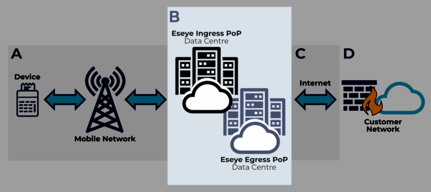

# Section B – Connecting over Eseye's MPLS network

This section of topics unpacks the second part of the data journey between a device and the customer network.

Depending on your unique configuration, data either passes through the Eseye network or bypasses it altogether. This section describes how data passes through the Eseye MPLS network.


Regardless of how data passes from a device to the customer network, Eseye provides the overall SIM management.


For an overview of connectivity, see [Eseye connectivity overview](https://eseye-v3.gitbook.io/eseye-docs/L25WdLp1CEZBZ0aOlPAR/connectivity).

## About Multiple Protocol Label Switching (MPLS)

Multi-protocol Label Switching is a high-speed, protocol-independent networking technology that routes data traffic along preconfigured paths, to handle forwarding over private wide area networks. MPLS assigns labels to each data packet, rather than network addresses, to control the path each packet follows.

* **High speed** – data passing through an MPLS network is labelled and forwarded in packets along preconfigured pathways through the network. This has a faster handling time than other encapsulation methods, where the source and destination IP addresses are checked at every point in the data journey in order to decide where to send the data. The journey between points in the preconfigured path is called a _hop_.
* **Protocol-independent** – an MPLS network can handle data in any format, regardless of the connections used to send and receive it.
*   **Preconfigured paths** – Eseye has set up the MPLS network between Eseye PoPs, which exist worldwide.

    For more information, see [About Eseye PoPs](https://eseye-v3.gitbook.io/eseye-docs/L25WdLp1CEZBZ0aOlPAR/connectivity/about-eseye-pops).

    Any data processed by the Eseye MPLS network ingresses at a preconfigured PoP. For operator locations, see [Mobile Network Operators by PoP](https://eseye-v3.gitbook.io/eseye-docs/L25WdLp1CEZBZ0aOlPAR/connectivity/mobile-network-operators-by-pop). The data then either egresses at the same PoP or travels in hops to another PoP before egressing to its destination.

    We can prioritise data in times of high traffic to ensure optimum connectivity for your devices.

    For information about egress data processing, see [Section C – Connecting over the internet](https://eseye-v3.gitbook.io/eseye-docs/L25WdLp1CEZBZ0aOlPAR/connectivity/connection-methods/section-c-connecting-over-the-internet).
* **Security** – Eseye encrypts all data that passes through the MPLS network. For more information, see [AnyNet security options](https://eseye-v3.gitbook.io/eseye-docs/L25WdLp1CEZBZ0aOlPAR/connectivity/security).

Eseye's MPLS network uses AWS cloud-based services for operation. It uses a combination of SDWAN and fiber optic technology for providing connectivity. The network is established as a mesh network to optimise availability.
