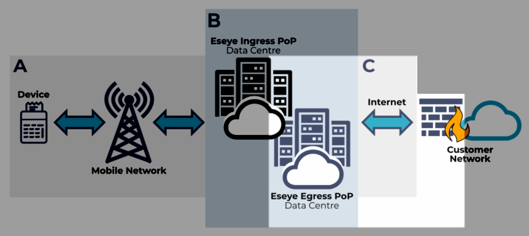

# Section C – Connecting over the internet

This section of topics unpacks the third part of the data journey between a device and the customer network, where data egresses the MPLS network to the internet, and into the customer network or third party network (such as a cloud).

For an overview of connectivity, see [Eseye connectivity overview](https://eseye-v3.gitbook.io/eseye-docs/L25WdLp1CEZBZ0aOlPAR/connectivity).

## About sending data securely over the internet

Eseye works with each customer to configure secure methods for sending device data over the internet to the customer network or third party network (such as a cloud).

This includes:

* Using Network Address Translation (NAT). For more information, see [About Network Address Translation (NAT)](../ip-addressing-and-routing/about-network-address-translation-nat.md).
* Configuring VPN where required. For more information, see [Configuring AnyNet VPNs](../security/understanding-vpns.md#configuring-anynet-vpns).
* Using an Access Control List (ACL) to restrict internet access. For more information, see [Routing non-VPN network traffic](../ip-addressing-and-routing/routing-non-vpn-network-traffic.md).


Customers may also request that the data egresses onto the internet for onward routing to its destination, with no restrictions. Data can bypass the Eseye MPLS network altogether.

_Speak to your Account Manager to help Eseye understand what your company needs, and to provide a bespoke solution to deliver device data securely and quickly._

