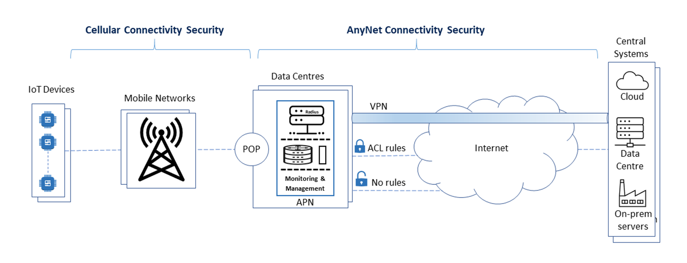

# Security

This topic describes the security options available with the AnyNet solution to protect devices and data in transit, particularly over the internet, so that your IoT deployment will work effectively.


Contact your Account Manager if you want to set up additional security options for your devices.


## About AnyNet security

The simplified diagram below shows connectivity between IoT devices, the Eseye PoPs and the central systems that devices are communicating with (which might exist in a private or public cloud, PoP, or on-premises servers).

It also shows how data is secured:

*   **Device security**

    Customers are responsible for their device security. For best practice recommendations, including which IoT protocols to use, see [Device configuration best practices](../device-configuration-best-practices.md).
*   **Mobile network security**

    With a cellular solution, connectivity between devices and the internet is provided by mobile networks. Cellular connectivity is based on GSMA standards and is covered by stringent regulations and quality of service requirements. Cellular networks provide inherent security for data transmission, including encryption of data in transit.
*   **Additional AnyNet solution security**

    Eseye can apply additional security options, such as VPNs and ACL rules, for routing data securely between the Eseye network and the customer or their partner systems. This ensures that data is not intercepted or lost as it transits over the internet, and prevents rogue actors gaining access to devices.

    Eseye provides the following security:

    *   **Private IP addresses and Network Address Translation (NAT)** – ensure IP addresses are hidden from the internet so that they are not used to access a device directly.

        For more information, see [IP addressing and routing](../ip-addressing-and-routing/) and [About Network Address Translation (NAT)](../ip-addressing-and-routing/about-network-address-translation-nat.md).
    *   **Secure subnets** – enable VPN configuration and ACL rules to control and route traffic

        For more information, see [About secure subnets](../ip-addressing-and-routing/about-secure-subnets.md).

        *   **VPNs** – enable a high level of security and control for data transfer across the internet. Data is encrypted and access to the VPN is authorised and controlled.

            For more information, see [Understanding VPNs](understanding-vpns.md).
        *   **ACL** – checks network traffic against an Access Control List (ACL) provided by the customer and discards the traffic unless the destination matches one of the destinations in the list. Recommended for routing non-VPN traffic.

            For more information, see [Routing non-VPN network traffic](../ip-addressing-and-routing/routing-non-vpn-network-traffic.md).

            The public IP addresses for AnyNet PoPs are available for configuring customer-side ACL rules. See [Egress IP addresses](../ip-addressing-and-routing/egress-ip-addresses.md).
