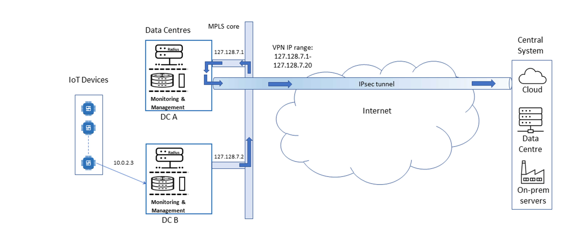
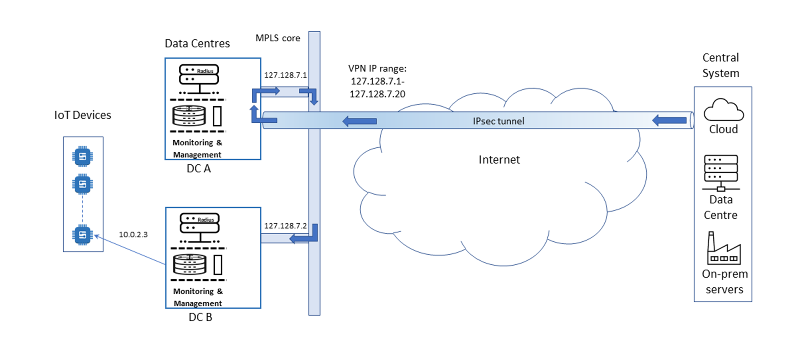

# Understanding VPNs

A Virtual Private Network (VPN) enables a high level of security and control for data transfer between two networks across the internet. Data is encrypted, and access to the VPN is authorised and controlled.

We often recommend implementing a VPN for transferring data across the internet, in addition to the essential task of encrypting the data within the device. For more information, see [Device configuration best practices](../device-configuration-best-practices.md).

In certain circumstances, customers do not require a VPN. For example, when using IoT messaging protocols with some cloud services, such as AWS IoT core or Azure IoT Hub. The cloud services typically offer internet-facing addresses for device communications. For more information, see [Routing non-VPN network traffic](../ip-addressing-and-routing/routing-non-vpn-network-traffic.md).

## About IPsec tunnels

The Internet Engineering Task Force (IETF) created Internet Protocol Security (IPsec), a suite of IP protocols that provide security services at the network level. IPsec is based on advanced cryptographic technology that provides secure data authentication, integrity, and privacy on large networks.

IPsec provides secure tunnels between two peers, such as two routers. Configuration rules determine which data is sent through the tunnels. By encrypting and authenticating the traffic at the IP level, IPsec ensures secure networking both for applications with good security mechanisms and for those that do not have adequate security provision.

We use IPsec tunnels to provide secure access between the Eseye PoPs and customer networks.

## About AnyNet VPNs

Connectivity within the AnyNet solution is complex, as a single device may connect to different global PoPs worldwide, depending on the current IMSI or profile in use. For more information, see [Configuring a device to access the correct network](../section-a-connecting-over-the-mobile-network/#configuring-a-device-to-access-the-correct-network). Multiple devices within a single deployment may also connect to different PoPs, depending on where they are deployed and which cellular network they are connected to.

Eseye may also route data through different PoPs for performance and resilience reasons.

Setting up a VPN tunnel between every Eseye PoP and the customer network is expensive, cumbersome, and difficult to manage. Instead, the AnyNet VPN solution provides an efficient, flexible way to use VPN tunnels, using the global high-speed MPLS core that connects the PoPs.

The diagrams below show an example configuration.


For simplicity, the diagrams do not show the cellular connectivity stage, or any configuration of dual failover sites or backup tunnels that connect to more than one Eseye PoP for high availability.


Together, Eseye and the customer configure a VPN tunnel between one Eseye PoP (DC A in the example) and the customer network. The customer configures their network to receive data from a range of IP addresses, which includes the IP address for each Eseye PoP, in the event that data is diverted through a different PoP. For more information, see [Egress IP addresses](../ip-addressing-and-routing/egress-ip-addresses.md).

When an Eseye PoP (for example, DC B) receives data from a device, it translates the device’s private IP address to its public IP address using NAT and transfers the data through the MPLS core to DC A for onward transmission through the tunnel.

The diagram below shows the central system responding with data for the device. DC A receives the data and transfers it through the MPLS core to DC B. When DC B receives the data, it uses NAT to identify the private IP address and sends the data to the device.

## Configuring AnyNet VPNs

The Eseye network and the customer network that are joined by an AnyNet VPN tunnel must both provide the range of IP addresses that are authorised to transfer data through the tunnel.

Using a range (or pool) of IP addresses provides the flexibility to add or change infrastructure at one side, without the other side needing to know or re-configure servers. For example, if Eseye adds another PoP to our network, it is assigned an unused IP address from the pool. The new PoP can then start transmitting and receiving data through the tunnel, without any re-configuration on the customer side.

AnyNet VPN tunnels are also configured with data routing rules so that only the required traffic is routed through the tunnel.


We highly recommend configuring backup VPN tunnels for resilience.



Contact your Account Manager if you want to configure AnyNet VPNs.


### About LAN-LAN or client VPNs


**Eseye does not recommend setting up a LAN-LAN or client VPN to transfer data.** These VPNs are expensive to implement. They limit the resilience, scalability, and flexibility of the AnyNet solution. For more information, see [Limitations of LAN-LAN and client VPNs](understanding-vpns.md#limitations-of-lan-lan-and-client-vpns).


AnyNet VPN is the best solution for ensuring device connectivity as it provides the AnyNet Connectivity Management Platform with full freedom to select the routing options for device data, while ensuring that data is secure in transit between the device and the customer network.

However, in some situations, it may not meet customer requirements. For example, the AnyNet VPN solution is not compatible with devices that need public IP addresses, or if a central system needs to initiate communication with devices.


We recommend you adhere to best practices when designing a device, including ensuring that the device initiates communication at all times. For more information, see [Device configuration best practices](../device-configuration-best-practices.md).


In these situations, Eseye can implement other options, such as LAN-LAN or client VPNs.

When a LAN-LAN VPN is configured to join an Eseye PoP and a cloud or central system, it enables customer applications to communicate directly with the devices in the secure subnet. NAT is not used on data that is sent from devices through the VPN.

#### Limitations of LAN-LAN and client VPNs

*   Devices are restricted to use one private IP address so that the customer network can identify each device, therefore they are limited to using a single cellular network

    For more information, see [How IP addresses are allocated to a SIM](../ip-addressing-and-routing/about-secure-subnets.md#how-ip-addresses-are-allocated-to-a-sim) and [How IMSI switching affects IP address allocation](../ip-addressing-and-routing/about-secure-subnets.md#how-imsi-switching-affects-ip-address-allocation).
* Limiting devices to a single cellular network means that devices cannot switch to a different cellular network for optimum connectivity.
* For client VPNs, each time the customer establishes a connection with an Eseye PoP, the customer computer is assigned a new IP address. Devices will not know the assigned IP address, which means that the customer network must always initiate communication with devices. This does not adhere to IoT best practices. For more information, see [Configuring devices to initiate communication](../device-configuration-best-practices.md#configuring-devices-to-initiate-communication).
