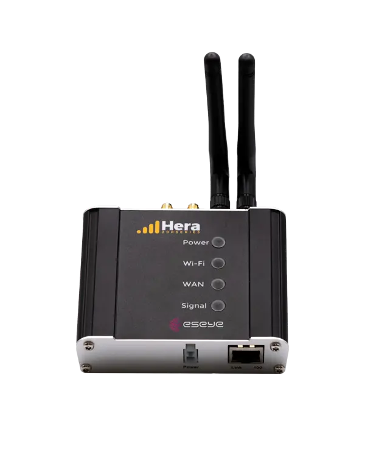
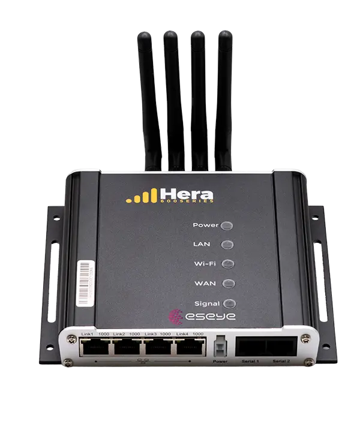

# Hardware



<figure><figcaption></figcaption></figure>

**Hera 204**

Built for lighter workloads, space-constrained installations, and high-volume rollouts.

<a href="https://eseye-v3.gitbook.io/eseye-docs/L25WdLp1CEZBZ0aOlPAR/hera204" class="button primary">Learn more</a>



<figure><figcaption></figcaption></figure>

**Hera 604**

Built for primary connectivity, complex sites, and enterprise edge environments.

<a href="https://eseye-v3.gitbook.io/eseye-docs/L25WdLp1CEZBZ0aOlPAR/hera604" class="button primary">Learn more</a>


