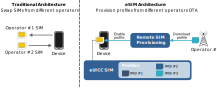

# About eSIM technology

An eSIM (embedded SIM) is an embedded chip that is manufactured onto a board in your device to replace the removable SIM. The information within it is rewritable, which means you can change mobile networks and enable SIM provisioning over-the-air (OTA) without needing to physically swap SIM cards.

eSIM technology is especially important for IoT devices, which may exist in remote locations and may contain embedded SIMs (without eSIM technology) that an engineer cannot swap without replacing an entire board. It also avoids the need to design a physical enclosure for multiple SIMs, saving space and simplifying device design, manufacturing, and provisioning.



The GSMA defines different eSIM architectures for machine to machine (M2M) and consumer device use cases. The Eseye eSIM solution uses the M2M eSIM architecture.



eSIM technology requires devices with [eUICC SIMs](euicc.md) that support the use of operator [profiles](profiles.md), and [remote SIM provisioning](remote-sim-provisioning.md) systems in the network to perform the updates. Both the eUICC SIMs and remote provisioning systems must achieve GSMA certification and operator-specific certification before you can use them on a live network. This ensures security and interoperability between operators.

## Eseye's eSIM solution

Eseye has agreements in place with multiple operators that enables Eseye to download profiles from operators with the best connectivity or services for the connected IoT device. The [Connectivity Management Platform](https://docs.eseye.com/Content/Connectivity/ConnectivityManagementPlatform.htm) can use predetermined rules to trigger the remote SIM provisioning systems to download and enable different profiles depending on the regional requirements. The available operators and services for an IoT device depend on the [package](https://docs.eseye.com/Content/Billing/Billing_Packages.htm) assigned to the device.

For IoT devices that include an [Eseye Hera router](https://docs.eseye.com/Content/HardwareProducts/Hera/HeraIntroduction.htm) (EU/USA/RoW model only), there is an embedded eUICC SIM as well as a physical SIM card within the Hera hardware.
