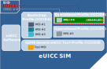
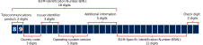
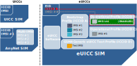

# eUICC overview

The embedded Universal Integrated Circuit Card (eUICC) is the eSIM software component that runs on a UICC. It is responsible for the storage of multiple [network profiles](profiles.md) and the secure, over-the-air (OTA) [remote SIM provisioning and management](remote-sim-provisioning.md) of profiles.

Each eUICC SIM has a unique identifier ([EID](https://docs.eseye.com/Content/Glossary/EID.htm)) and uses the [ICCID and IMSI](#IccidAndImsi) values from the enabled [profile](profiles.md).

Although initially eUICC SIMs were designed as soldered chips, or implemented within a system on a chip (SOC), they may exist as any form factor.

## eUICC Identifier (EID)

Each eUICC SIM is identified by a unique 32-digit eUICC identifier (EID), which is defined by the eUICC manufacturer (EUM).



SIM manufacturers may release updated numbering schema on future SIM batches. Eseye provide advance notice of any such changes to enable customers to update firmware and application software if required.



The first 18 digits define the EUM identification number (EIN), the next 12 digits define the EUM-specific identification number (ESIN) and the last two digits are check sum digits.

For more information about the EID, refer to the latest version of the SGP.02 Remote Provisioning Architecture for Embedded UICC specification, available here: <https://www.gsma.com/esim/esim-m2m-specifications/>.

### SIM supplier (SIMID)

For eUICC SIMs, the SIM supplier identifier is the initial digits of the [EID](#eid). For Eseye eUICC SIMs, the identifier is either:

- **8903302331217**
- 89044045, or
- 89883013



The first two digits (89) indicate that the SIM is a telecommunications product.



For non-eUICC SIMs, use the ICCID to identify the SIM and supplier.

### To identify the EID from the modem, using AT commands



Consult your modem manuals or contact your modem vendor for information on using modem commands to obtain the EID.



Some modem manufacturers have updated their firmware to handle the requirements for eUICC SIMs. For example, Sierra Wireless has updated the AT+CCID command for some AirPrime modems so that it returns both the ICCID and the EID in its response. The response is in the format:

+CCID: <iccid>[,<eid>]

### To identify the EID from the SIMs using AT commands

If your modem doesn’t have a command to return the EID directly, use the following AT commands to obtain the information from the SIM.

Consult your modem documentation for the exact format of the commands. The AT commands shown below are examples and may not work on your modem.

1. Open a logical channel to the eUICC SIM. Type:

   AT+CSIM=10,"0070000001"

   Example response:

   +CSIM: 6,"<nn>9000"

   where <nn> is is the allocated channel number, for example, 01, and 9000 is a successful command. This is only valid for channels 1-7 (depending on the SIM type).
2. Select the eUICC Controlling Authority Security Domain (ECASD) using the Application ID (AID) **A0000005591010FFFFFFFF8900000200**. Type:

   AT+CSIM=42,"<nn>A4040010A0000005591010FFFFFFFF8900000200"

   where <nn> is the allocated channel number, for example 01: 01A4040010A0000005591010FFFFFFFF8900000200

   Example response:

   +CSIM: 4, "614A"

   OK
3. Read data from the ECASD. Type:

   AT+CSIM=10,"8<n>CA005A12"

   where <n> is the channel number with the most significant bit set, in hexadecimal. For example 81CA005A12 for channel 1, 82CA005A12 for channel 2, and so on.

   The response contains the EID as shown (in red) in the following example:

   +CSIM: 40, "5A10890330233121700000000054211435429000"

   OK

   If the SIM is not an eUICC SIM, the response includes an error, as shown in the following example:

   +CSIM: 4, "6D00"

   OK
4. Close the logical channel. Type:

   AT+CSIM=10,"007000<nn>00"

   where <nn> is the previously allocated channel number, for example: 0070000100.

## ICCID and IMSI

On traditional SIM cards, the ICCID and IMSI uniquely identify the physical SIM card and subscriber respectively. The ICCID is printed on the physical SIM card during manufacture and the IMSI is unique to the subscriber.

On Eseye's AnyNet+ SIMs, a single SIM card can support multiple IMSIs.

On eUICCs, the ICCID and IMSI are unique to a profile and not the eUICC, which is uniquely identified using the [EID](#eid).

The following table describes the differences between the ICCID and IMSI on UICCs and eUICCs.

|  | ICCID | IMSI |
| --- | --- | --- |
| UICC | Identifies the physical SIM card | Identifies the subscriber |
| AnyNet SIM | Identifies the physical SIM card | Supports multiple IMSIs, each of which identify a subscriber |
| eUICC SIM | Identifies the profile | Identifies the subscriber within a profile |
