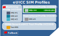

# About eUICC SIM profiles

An eUICC SIM profile acts as a virtual SIM within the SIM container. Downloading and enabling a new profile means that an IoT device can switch to a different network operator without the need to physically change the SIM.

Eseye provides the [Connectivity Management Platform](https://docs.eseye.com/Content/Connectivity/ConnectivityManagementPlatform.htm) (CMP) to manage loading, [switching](../imsirotation-switching.md#ImsiSwitching), and deleting profiles.

Each profile contains:

- An [ICCID](https://docs.eseye.com/Content/Glossary/Iccid.htm) to uniquely identify the profile
- One or more [IMSIs](https://docs.eseye.com/Content/Glossary/Imsi.htm), depending on the profile type, to identify the network subscriber
- Operator subscription data, including authentication credentials
- Policy rules

The content and structure of profiles is standardised to ensure interoperability between all network. Each IMSI account is provided by the mobile network to which it connects.

The number of profiles that can be stored on an eUICC is limited only by the memory available and the size of each network operator’s profile. For information about memory capacity, see the relevant [Datasheets](https://docs.eseye.com/Content/General/Files.htm#Datasheets).

You can only enable one profile at any time. The profile currently in use (enabled) is called the active profile.



For information about how eUICC IMSIs are managed OTA, see [Understanding the GSMA RSP M2M general architecture](remote-sim-provisioning.md).





For information about eUICC, see [eUICC overview](euicc.md).



eUICC SIMs support the following profile types:

Bootstrap profile (also known as the provisioning profile )

eUICC SIMs are pre-configured with a [multi-IMSI](https://docs.eseye.com/Content/Glossary/multiIMSI.htm) bootstrap profile that has full access to up to ten mobile networks and their corresponding roaming agreements. This enables the device to connect to a network as soon as it starts up. For more information, see [How long does an IMSI rotation or switch take?](../imsirotation-switching.md#How).

The bootstrap profile enables communication with the [Remote SIM Provisioning](remote-sim-provisioning.md) (RSP) system when the device first starts up. With an eUICC SIM, the device can use the RSP system to download an operational profile over-the-air (OTA) and activate it to connect to a more suitable network.



MNOs typically charge for RSP, so Eseye will also charge for OTA functions. These charges are detailed in your contract.



For information about how a device uses different IMSIs to connect to a network, see [Understanding the IMSI rotation and switching process](../how-imsirotate-switch-works.md).

For a comparison of bootstrap and operational profiles, see [Bootstrap profile vs operational profile comparison](bootstrap-vsoperational-profiles.md)

Operational profile (also known as a step 2 profile)

Operational profiles are single-IMSI profiles with full access to one mobile network and its corresponding roaming agreements.

The CMP manages loading and deleting operational profiles over-the-air (OTA) in an Eseye-enabled eUICC SIM. An operational profile is usually downloaded and activated after a device is deployed, to ensure that each device can [localise](../localisation.md), rather than roaming on a network within the bootstrap profile.

This is useful for ensuring your IoT devices adhere to local legislation and network policies. It is also useful if you manufacture thousands of devices that are shipped globally, and you do not know where each batch will end up.

You can use operational profiles on battery operated devices and mobile devices. For advice, contact Support ([support@eseye.com](mailto:support@eseye.com?subject=Require advice about operational (step 2) profiles for an IoT device)).



You can flag the bootstrap or an operational profile as the fall-back (see below).



Test profile

Test profiles are single-IMSI profiles used for device certification, production line sampling or product demonstrations.

For more information, see [Eseye test profile](../test-profiles/eseye-test-profile.md).

eUICC SIMs can include a [GSMA Generic eUICC test profile](../test-profiles/gsma-generic-euicc-test-profile.md).

Customers must use AT commands to enable or disable the test profile.

## About fall-back and roll-back

As a safe-guard against failed connections, eUICC SIMs use fall-back and roll-back.

About fall-back

One profile is designated as the fall-back. If the active (enabled) profile loses connectivity, or is rejected, disabled, or deleted, the device enables the fall-back profile in its place after up to 23 minutes has passed. The timing depends on how the module is manufactured.

Eseye configures the fall-back using the [Connectivity Management Platform](https://docs.eseye.com/Content/Connectivity/ConnectivityManagementPlatform.htm) (CMP).



The fall-back timer is separate from the multi-IMSI rotation timer, and will override multi-IMSI rotation if no connection occurs for 23 minutes.





You cannot delete the profile assigned as the fall-back.



To maximise connectivity when a device first starts, Eseye usually defines a [multi-IMSI](../imsirotation-switching.md) bootstrap profile as the fall-back on an AnyNet+ SIM. This gives the device access to up to ten networks, for greater connectivity.

If the fall-back occurs as a result of connectivity failure, the CMP uses its rules-based engine to determine whether and when to attempt to switch the device back to a preferred operational profile.

#### Disabling fall-back

If a device is localised using an operational profile and the connection is stable, the CMP can define an operational profile as the fall-back, which effectively disables fall-back to the bootstrap profile. This prevents the device switching between profiles if it temporarily loses connectivity. For example, a tracking device in a car may lose connectivity if the car is parked underground overnight, but will reconnect on the fall-back profile (in this case, a single-IMSI operational profile) the next day when the car leaves the car park.

About roll-back



This feature is for newly-downloaded profiles only.



After connection is established using an eUICC profile, if you load and enable a new profile and the connection fails, then the SIM rolls back to the previously connected profile. This is managed by the Connectivity Management Platform.

## Where to next?

- [Bootstrap profile vs operational profile comparison](bootstrap-vsoperational-profiles.md)
- [AnyNet SIMs](https://docs.eseye.com/Content/HardwareProducts/SIMsIntro.htm) (includes form factors)
- Understand [eSIM](esim.md)
- [About the Connectivity Management Platform](https://docs.eseye.com/Content/Connectivity/ConnectivityManagementPlatform.htm)
