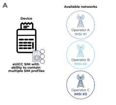
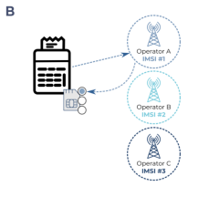
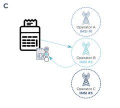
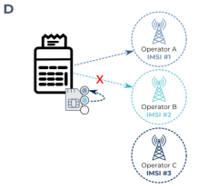

# About Remote SIM Provisioning (RSP)

Traditional SIM cards comprise of a single SIM profile that contains operator and subscriber data. In order to change which mobile network you are using, you need to physically replace the SIM.

[eUICC](euicc.md) SIMs are single SIMs that can host multiple network operator profiles, which are installed and managed remotely.

When a device connects to a mobile network, the operator uses a Remote SIM Provisioning (RSP) system to securely download the profile for their network onto the SIM.

When the profile is installed and activated, the device can connect to that operator's network. If the SIM contains multiple profiles, then you can change which network the device is using by remotely switching its current SIM profile.



SIMs can only connect to one network at a time.



For information about which modules support RSP, see [Modules supporting Remote SIM Provisioning (RSP)](modules-supporting-rsp.md).

## Benefits of using remote SIM provisioning

Loading an operational profile onto an eUICC SIM offers several benefits, including:

- Single hardware with multiple network profiles: eUICC SIMs can host multiple profiles, eliminating the need for physical SIM swaps when changing network providers.
- Remote provisioning: Operational profiles allow for remote management, activation, and configuration of subscription services without requiring physical access to devices. This is particularly useful where IoT devices are geographically dispersed or difficult to reach.
- Dynamic network selection: Devices with eUICC SIMs can switch between mobile networks based on predefined criteria, such as signal strength, network availability, or cost considerations.
- Efficient subscription management: Centralised control and administration of your SIM estate.
- Continuous flexible connectivity: Operational profiles enable profile switching based on factors like location and network availability, ensuring your device has near 100% connectivity.
- Customised services: Operational profiles can store additional information beyond connectivity services, such as storing messages and customised settings.
- Future-Proofing: You can prepare for future services and technologies by remotely downloading updated profiles onto the SIM, allowing for new features such as improved security protocols or emerging connectivity standards.

## Where to next?

- [About Remote SIM Provisioning (RSP)](#)
- [Understanding the GSMA RSP M2M general architecture](remote-sim-provisioning.md)
- [About eSIM technology](esim.md)
- [Understanding IMSI rotation vs IMSI switching](../imsirotation-switching.md)
- [AnyNet SIMs](https://docs.eseye.com/Content/HardwareProducts/SIMsIntro.htm)
