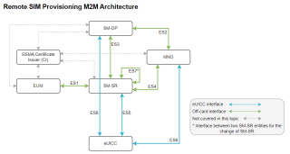

# Understanding the GSMA RSP M2M general architecture

Remote SIM Provisioning (RSP) is governed by GSMA (Global System for Mobile Communications) standards, ensuring that it works across different networks globally, and adheres to regulatory and security requirements. The GSMA provides the following general architecture for the roles and interfaces associated with RSP:

## Key RSP components

RSP relies on secure communications between servers and devices to download, install, enable, update, disable, and delete network profiles on eUICC SIMs.

The following core elements are required to support these processes:

### Subscription Manager - Data Preparation (SM-DP)

The SM-DP is a server-based network component that securely prepares subscription data, including subscriber profiles and security keys, for delivery to eUICC SIMs. The SM-DP enforces security measures to protect the confidentiality and integrity of the data, including encryption and authentication.

The SM-DP communicates with devices via an SM-SR. MNOs have their own SM-DP servers that can send SIM profiles directly to SM-SRs, or donate the SIM profiles directly to Eseye. Eseye has two SM-DPs, hosted by Thales and Kigen.

The available functions depend on how the SM-DP is uniquely configured for a specific MNO. The MNO can use the SM-DP to enable a profile on the eUICC, after it is downloaded and installed. Eseye manages this process on behalf of customers and the MNOs.

### Subscription Manager - Secure Routing (SM-SR)

The SM-SR is a server-based network component that ensures the subscription data is securely and reliably routed from the SM-DP to the target eUICC SIMs. The SM-SR manages the end-to-end security of the data transfer, validating the legitimacy of requests, ensuring the correct profile is sent for the module type, and securely delivering the subscription data to the eSIMs.

The SM-SR plays a crucial role in ensuring the overall security of RSP, preventing unauthorized access to subscriber profiles during the data transfer. Eseye has two SM-SRs, hosted by Thales and Kigen. Eseye manages this process on behalf of customers and the MNOs.

### eUICC

eUICC is the eSIM software component that runs on a UICC. For more information, see [eUICC overview](euicc.md).

During RSP, the eUICC securely stores the prepared subscription data (subscriber profiles and cryptographic keys), enabling subscribers to access mobile networks and services. eSIMs are designed with strong security features to protect stored data and resist tampering.

### Mobile Network Operators (MNOs)

The MNO interacts with the SM-DP and SM-SR to manage and deliver subscriber profiles to eUICC SIMs. MNOs use RSP to remotely provision, update, and personalise eUICCs for their subscribers. Eseye manage the profile stock to ensure near 100% availability for customer needs.

## Further RSP components and interfaces

### Entity and User Module Manager (EUM Manager)

The EUM Manager manages the entity and user modules with an eUICC SIM, ensuring their security and integrity. The entity module stores device manufacturer data, and the user module stores subscriber-specific data. The EUM Manager assists with securely loading and managing eUICC profiles, and is managed indirectly through the SM-DP and SM-SR by the MNO that owns or operates the eUICC.

### GSMA Certificate Issuer (CI)

The CI is responsible for issuing digital certificates used for various RSP and eSIM security and authentication purposes. The digital certificates are vital for maintaining the security and integrity of communication between different entities and components within the mobile network, including the eUICC, SM-DP, and SM-SR. The certificates are used for authentication, encryption, and the establishment of secure connections to protect sensitive information, such as subscriber profiles and encryption keys.

### Interfaces

The GSMA RSP M2M general architecture components communicate via a number of different interfaces. The table below briefly describes each interface. For more in-depth understanding, refer to the latest GSMA specifications.

| Interface | Description |
| --- | --- |
| ES1 | eUICC Manufacturer (EUM)-to-SM-SR interface. Enables the eUICC Manufacturer to register the eUICC based on its eUICC Information Set (EIS). The EIS contains initial information provided at registration time, such as the eid, which remains unchanged during the eUICC lifetime. |
| ES2 | MNO-to-SM-DP interface: Enables the caller MNO to:   - Securely retrieve the EIS information and instruct the SM-DP to download a profile (identified by its ICCID) to the eUICC (identified by its EID) via the SM-SR. - Update the current profile's policy rules. - Replace the profile subscription address (such as the MSISDN and/or IMSI) through which the eUICC is accessible from the SM-SR via the mobile network when the profile is enabled. - Request the SM-DP to enable or disable a target profile in a specified eUICC (identified by its EID). The target profile is owned by the caller MNO. - Request the SM-DP to delete a target profile. This function request is passed to the SM-SR.   Enables the SM-DP to:   - Send notifications to the MNO when the target profile is enabled, disabled, or deleted. - Send a notification to all MNOs with profiles on the eUICC when the SM-SR changes. |
| ES3 | SM-DP-to-SM-SR interface. Enables the SM-DP to download and install a target profile, specifically to:   - Establish a link with an SM-SR that is previously unknown to the SM-DP. - Retrieve the target profile EIS from the SM-SR. The target profile is identified using the EID. Only EIS data that is applicable for the specific SM-DP is retrieved. The information verifies the eligibility of the eUICC for storing the profile (for example, type, certificate, and memory). - Retrieve up-to-date EIS information. - Use secure commands to request that the SM-SR creates a new Issuer Security Domain Profile (the ISD-P that hosts a unique profile) in the eUICC. If the data is too large for the eUICC to handle at once, the SM-SR may send commands in several steps. - Inform the SM-SR that the profile download is complete. The subscription address may be set at this point, or updated later. - Replace the profile's subscription address in the EIS. The subscription address is the identifier (such as the MSISDN and/or IMSI) through which the eUICC is accessible from the SM-SR via the mobile network when the profile is enabled. - Request the SM-SR to enable or disable a profile. - Request the SM-SR to delete a target ISD-P containing a specific profile. - Update the Connectivity Parameters store on instruction by the MNO, for enabling or disabling the target profile. - Send notifications to the MNO when the target profile is enabled, disabled, or deleted. - Send a notification to all MNOs with profiles on the eUICC when the SM-SR changes. |
| ES4 | MNO-to-SM-SR interface. Enables secure communication between the MNO and SM-SR for profile delivery, activation, and management (including fall-back), ensuring that the MNO's network is appropriately configured and secured for remote SIM provisioning. Specifically, the MNO can:   - Retrieve EIS data that is applicable for that particular MNO. - Request the SM-SR to update the profile policy rules. - Request the SM-SR replace the target profile subscription address. - Request up-to-date information for the MNOs profiles. - Request that the SM-SR enable or disable a profile. - Request that the SM-SR delete the target ISD-P that contains a profile owned by the MNO. - Request a change in SM-SR.   Enables the SM-SR to:   - Send notifications to the MNO when the target profile is enabled, disabled, or deleted. - Send a notification to all MNOs with profiles on the eUICC when the SM-SR changes. |
| ES5 | SM-SR-to-eUICC interface. The SM-SR exclusively handles over-the-air (OTA) communication with the eUICC via either SMS, CAT\_TP, or HTTPS. Specifically, this interface enables the ISD-R to:   - Create an ISD-P on the eUICC - Enable and disable the target profile on the eUICC - Delete a disabled profile from the eUICC that is not the fall-back profile - Query the eUICC status - Assign the fall-back attribute to one profile on the eUICC. - Establish the ISD-R key set during an SM-SR change, for mutual authentication between the new SM-SR and the eUICC and to establish a shared secret key set between the new SM-SR and the ISD-R. - Clear previous SM-SR keys from the ISD-R. - Request that the ISD-R updates the SM-SR addressing parameters after an SM-SR change. - Notify the SM-SR about a change in the target profile network attachment state. - Confirm a notification about the change in network attachment state and trigger follow-up activities. |
| ES6 | MNO-to-eUICC interface. The secure interface between the MNO OTA platform and the target profile in the eUICC. Enables the MNO to:   - Update policy rules (POL1) on the eUICC. - Update Connectivity Parameter rules on the eUICC. |
| ES7 | SM-SR to SM-SR interface. Enables secure communication between the SM-SR and another SM-SR for the specific purpose of securely changing or updating the SM-SR. Specifically, this enables a new SM-SR to request that a new key set is created in the ISD-R. The new key set belongs to the new SM-SR and is unknown to the current SM-SR. This enables the secure and authenticated handover of the eUICC from one SM-SR to another. |
| ES8 | SM-DP-to-eUICC interface. This secure interface is between the SM-DP and the ISD-P, and goes through the SM-SR. The SM-DP and its ISD-P are mutually authenticated. All commands and responses sent between the SM-DP and ISD-P are signed and encrypted. |

## Where to next?

- [About Remote SIM Provisioning (RSP)](remote-sim-provisioning-overview.md)
- [Modules supporting Remote SIM Provisioning (RSP)](modules-supporting-rsp.md)
- [About eSIM technology](esim.md)
- [Understanding IMSI rotation vs IMSI switching](../imsirotation-switching.md)
- [AnyNet SIMs](https://docs.eseye.com/Content/HardwareProducts/SIMsIntro.htm)
