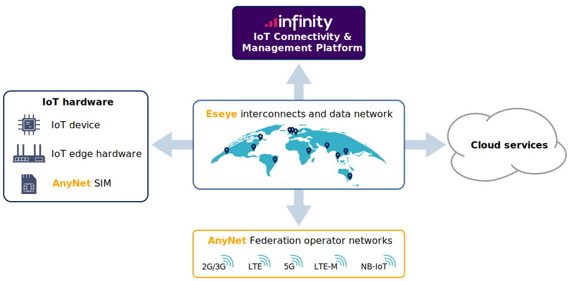

# Getting Started

This topic helps you understand Eseye's products and services, and where to find more information about the main functional areas shown in the diagram below.

This help is divided up into the following sections:

- [Getting Started](#) – provides an overview of the Eseye products and services and contains links to more detailed information elsewhere in this help.
- [IoT Hardware](https://docs.eseye.com/Content/HardwareProducts/HardwareProducts.htm) – describes Eseye's SIM solutions, HERA router products and third-party modem/module integrations.
- [Cloud services best practices](https://docs.eseye.com/Content/CloudServices/CloudServicesIntro.htm) – describes the third-party integrations that Eseye supports, and how to integrate your cloud services into the Eseye network.
- [Eseye connectivity overview](https://docs.eseye.com/Content/Connectivity/ConnectivityIntro.htm) – describes how Eseye connects and transfers data between IoT devices, Eseye's data network and third-party cloud services.
- [Managing my Estate](https://docs.eseye.com/Content/ManagingMyEstate/ManagingMyEstate.htm) – describes how to manage your IoT devices and SIMs, view reports and invoices and manage access to Eseye's Infinity web interfaces.
- [APIs](https://docs.eseye.com/Content/DeveloperDocs/GettingStartedForDevelopers.htm) – describes how to use Eseye's application programming interfaces (APIs) to integrate with third-party services.

## IoT technology

The following topics explain key IoT technologies and how Eseye uses them:

- [IoT Wireless Technologies](iot-wireless-technologies.md)
- [About the AnyNet Federation](any-net-federation.md)
- [Understanding multi-IMSI functionality](multi-imsi.md)
- [About eSIM technology](e-sim/esim.md)

## Connectivity

The following topics describe how Eseye provides connectivity to IoT devices and third-party applications and services:

- [Eseye connectivity overview](https://docs.eseye.com/Content/Connectivity/ConnectivityIntro.htm)
- [About Eseye PoPs](https://docs.eseye.com/Content/Connectivity/UnderstandingPoPs.htm)
- [AnyNet security options](https://docs.eseye.com/Content/Connectivity/SecurityOptionsOverview.htm)

## Where to next?

- Set up an account with Eseye: [Get in touch](https://www.eseye.com/get-in-touch/)
- Device design advice: speak to your Account Manager or [Get in touch](https://www.eseye.com/get-in-touch/)
- Understand my invoices: [Billing user guide (PDF)](../.gitbook/assets/8286-Billing-User-Guide.pdf)
- Locate my device: [Locating devices using a cellular connection](https://docs.eseye.com/Content/InfinityClassic/LocatingDevices.htm)
