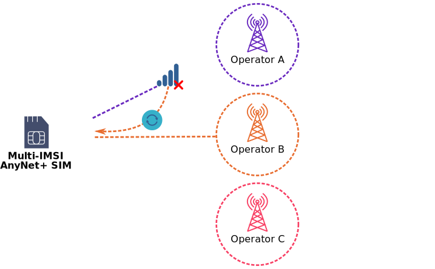
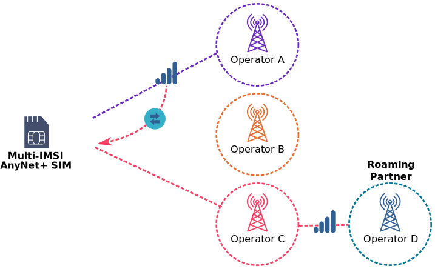

# Understanding IMSI rotation vs IMSI switching

If your SIMS use multi-IMSI functionality, the device can rotate or switch between IMSIs in order to maximise connectivity.

## About IMSI rotation

If a device modem loses connection or fails to connect to a network, after three minutes a SIM application automatically rotates the SIM onto the next IMSI and presents the alternative to the modem. The modem is refreshed to use the alternative settings.



IMSI rotation only works with a SIM or eUICC profile that has multi-IMSI functionality.



In the following example, the SIM has three IMSIs. When it cannot connect using Operator A, the SIM rotates to IMSI #2 and connects using Operator B:

## About IMSI switching

After connection is established, the Connectivity Management Platform (CMP) can instruct the SIM to switch to a specific IMSI. This is useful for [localising](localisation.md) the IoT device to the home network, or [steering](roaming.md#Steering) the device to a different roaming partner.

In the following example, the SIM first connects using Operator A, but is switched onto IMSI #3, to use Operator C's roaming partner (Operator D), for legislative purposes:

## How long does an IMSI rotation or switch take?

The length of time taken for an IMSI to rotate or switch, either on the device or OTA, depends on the following factors:

- Time set for auto-rotation (usually 3 minutes)
- Device power constraints or optimisations, such as the length of time it is awake
- Modem setup, such as how often and how long it connects to a network
- The number of IMSI accounts available if connectivity is not established. Three IMSIs are quicker to rotate through than ten IMSIs.
- Whether the device is mobile or static. If a device is constantly moving, it may take a while to establish a network connection.



You can manage configurations and optimise timing using the Rules Engine.



## IMSI rotation and switching configuration options

Eseye supports the following:

- Enable or disable the IMSI rotation feature. For localisation purposes, you may need to disable the IMSI rotate feature to ensure that the device remains on a preferred network.
- Add or remove IMSIs from the SIM. This is important to ensure that the device can connect to available networks at the best rates, or for legislative purposes, throughout its lifetime.
- Eseye can work with the customer to customise the SIM application, either at build time or during the service life of the IoT device where the SIM exists.

## Where to next?

- Understand [roaming](roaming.md), [steering of roaming](roaming.md#Steering) and [localisation](localisation.md)
- Understand [eSIM](e-sim/esim.md)
- [AnyNet SIMs](https://docs.eseye.com/Content/HardwareProducts/SIMsIntro.htm)
