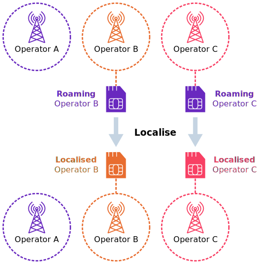

# Understanding localisation

Localisation is the process of [switching the IMSI (or network profile)](multi-imsi.md#ImsiSwitching) of a roaming subscriber to that of a local network operator. Eseye maintains control of the SIM management at all times.



For [multi-IMSI](multi-imsi.md) or [eUICC](e-sim/euicc.md)-enabled SIMs, you can localise a device over-the-air (OTA). For IoT devices with SIMs that do not support these features, localising a subscriber requires physically swapping the SIMs in the device.



On multi-IMSI or eUICC-enabled SIMs, customers can automate localisation and profile switching using Eseye's advanced rules engine. .

Eseye uses localisation to solve the manufacturing and deployment issues that arise because of [roaming](roaming.md) limitations, such as data sovereignty, roaming network policies, and latency.

We can use additional roaming IMSIs from iBasis (KPN), Vodafone, Manx, TELUS and Three.

## How Eseye uses localisation

Eseye supplies SIMs with multi-IMSI functionality that enables the device to use an IMSI that is suitable for where the device is deployed. Typically, we use two or three IMSIs from our global AnyNet Federation to deliver service to the device. These IMSIs are activated post-deployment. They may make use of roaming agreements, depending on local restrictions.

For more information, see [About the AnyNet Federation](any-net-federation.md).

## Localisation considerations

Customers must take their unique device requirements into account when considering localisation. For example, localisation will impact battery consumption in battery-operated devices. In such cases, the best solution may require leaving the device on a single roaming profile.

Customers must also consider if the device is truly mobile (like a tracking device) versus a device in a fixed position (like a smart meter). This will impact how many networks the device needs to access.

The deployment context will impact how many networks are available, and dictate which legislation and network policies the device is subject to, such as whether it can remain on [permanent roaming](roaming.md#About).

## Localisation rules in the Connectivity Management Platform

Eseye's [Connectivity Management Platform](https://docs.eseye.com/Content/Connectivity/ConnectivityManagementPlatform.htm) uses pre-defined rules to automatically identify when to localise devices, then triggers an IMSI switch, or downloads and enables a new [profile](e-sim/profiles.md) on the SIM. In cases where it is better for devices to continue roaming, the Connectivity Management Platform can [steer devices to roam on different networks](roaming.md#Steering). For example, localising a device that is at the edge of your home network coverage may cause it to switch between roaming and localising, thus increasing downtime.
