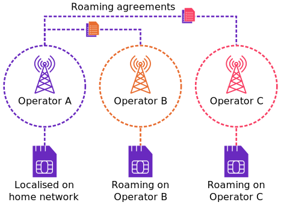

# Understanding roaming

Roaming occurs when a device connects on a different local cellular network to its [home network](https://docs.eseye.com/Content/Glossary/HomeNetwork.htm) in order to access services, such as sending and receiving data. Usually this occurs when the device is outside the geographical coverage area of the home network.

Roaming is either temporary (for a short period of time), or permanent (for the lifetime of the device). It can only occur if there are commercial [roaming agreements](https://docs.eseye.com/Content/Glossary/RoamingAgreement.htm) in place between the home network operator and the roaming network operator, and the roaming network operator dictates the cellular footprint and services that the device IMSI can access.

Typically, this will give the device access to most other network operators, at varying economic rates, although this won’t necessarily give access to every operator in every country. In certain countries, such as North Korea, roaming is not permitted.

## How the device chooses a roaming partner

If the home operator has multiple roaming agreements, the device chooses between them using the preferred Public Land Mobile Network (PLMN) list, which is defined in the SIM.

## About restricted group permanent roaming

Some operator partner groups allow permanent roaming, but only within their own networks. These often have a designated rate that only covers partners in the group. For example, Three and Three Ireland; or Airtel and Airtel Jersey.

## Roaming limitations

Roaming on a local network may have some of the following limitations compared to connecting to your home network:

- Limits to how long a device can roam in a country before the subscriber must switch to a local operator, depending on local [data sovereignty and network policies](#Data).
- Increased costs, for example a higher rate for voice, data or SMS services.
- Reduced services, for example no support for [power saving features](https://docs.eseye.com/Content/LPWAN/PSMandeDRX.htm) when roaming.
- [Latency](#Latency) and performance issues because data is [backhauled](https://docs.eseye.com/Content/Glossary/Backhaul.htm) to the home operator's core network.

Customer preferences for [global data distribution](#Customer) may also limit the available roaming networks.

To avoid these limitations, you can [localise](localisation.md) the SIM, or [steer](#Steering) the SIM onto a roaming partner with a more favourable roaming agreement.

## Data sovereignty and network policies

Roaming agreements are restricted by data sovereignty, where digital data is subject to the laws of the country in which it is processed. In some countries, certain types of data are not allowed to leave the country. Local legislation may also determine what safeguards must occur to protect data, and some legislation is deliberately set up to favour data flow for local operators over foreign firms. For example, in Brazil and China, devices are prohibited from existing permanently in a roaming state on a network.

All data flow, including temporary or permanent roaming, is also subject to the varying policies and rules of the local network operators. Some MNOs block permanent roaming on their networks in order to prevent competition. Cancellation or changes to roaming agreements between network operators may also occur.

## Latency

Latency is the time taken to send a data packet and receive a response between two points. This is increasingly becoming an issue for high data throughput as well as transaction speed, particularly in credit card type or phone-based transactions.

Latency when roaming is typically higher than on a local profile. For more information, see [Measuring latency](https://docs.eseye.com/Content/Connectivity/MeasureLatency.htm).

## Customer preferences for global data distribution

Some customers prefer certain networks over others, depending on where they have deployed their devices. For example, most large US companies prefer a US network solution, where data is routed via US data centres and taken into the rest of the world. In Europe, most companies prefer a European roaming solution, as long the device uses a European IMSI.

[GDPR](https://docs.eseye.com/Content/Glossary/RoamingAgreement.htm) is also a global requirement.

## Steering of roaming

Steering of roaming is the process of switching roaming IoT devices to a different roaming partner network. Network operators often steer devices onto new operator networks irrespective of how it affects device connectivity or performance but Eseye can steer devices to operator networks that are beneficial to the IoT device. An example could be steering a device that does not require voice services onto a roaming partner that has reduced costs for data compared to voice services.

Operators perform steering of roaming by:

- Sending SS7 or Diameter signalling messages
- Updating the preferred PLMN list in the subscriber's SIM
