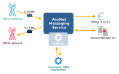
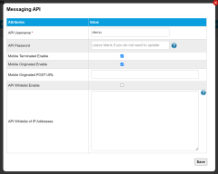

# Understanding SMS

The Short Message Service (SMS) is a text messaging service supported on circuit-switched radio access networks (2G, 3G) and also compatible with packet-switched networks (4G, 5G) by using either circuit switched fallback or SMS over IMS.



Eseye do not currently support SMS over IMS. For more information, contact your Account Manager.



IoT devices use [SMS](https://docs.eseye.com/Content/Glossary/SMS.htm) messages send data to devices or applications, or to receive SMS messages and/or over-the-air (OTA) network commands.

## AnyNet Messaging Service

The Eseye AnyNet Messaging Service controls the SMS messages sent to and from IoT devices with Eseye SIMs using interconnects with partner MNO core networks.

The AnyNet Messaging Service treats incoming messages and outgoing messages separately. The delivery paths are logically separated into:

- Mobile-originated (MO) – path originating from an IoT device with an AnyNet SIM.
- Mobile-terminated (MT) – path terminating on messages delivered to an IoT device with an AnyNet SIM.



Incoming and outgoing SMS messages are queued at each Eseye PoP and not distributed across them.



Eseye also provide an [SMS API](https://docs.eseye.com/Content/API/SMS/SMSAPIIntro.htm) that customers can use to create applications to send and receive SMS messages via the AnyNet Messaging Service. These SMS API generated messages are charged according to the charges outlines on your SMS API contract.

To add or remove IP addresses from which the SMS API accepts requests:

1. In Infinity Classic, display the [Settings > Messaging API](https://docs.eseye.com/Content/InfinityClassic/Settings.htm#Messaging) page.
2. For the API username, under Action, select  to edit the Messaging API information.

   
3. Select the API Whitelist Enable checkbox.
4. In the API Whitelist of IP Addresses, specify a list of comma-separated IP addresses, from which the SMS API accepts requests.

### SMS billing records

For more information about SMS billing records, see [Understanding SMS charges on the CSV invoice](https://docs.eseye.com/Content/Billing/Billing_SMScharges.htm).

### Allowlists and Blocklists

Eseye provides a database of allowed and blocked MSISDNs it checks when sending SMS messages. To add or remove MSISDNs from the database, contact Support.

## Mobile originated (MO) SMS messages

MO SMS messages originate from IoT devices with an AnyNet SIM can send:

- Text messages to a user device
- Send data to a customer application that is integrated with the SMS API

SMS messages are sent through the radio access network and are intercepted by the Eseye AnyNet Messaging Service, which controls the routing and [billing of SMS messages](https://docs.eseye.com/Content/Billing/Billing_SMScharges.htm).

IoT devices can send MO messages to the MSISDN(s) configured in Infinity Classic on the [Settings > Messaging API](https://docs.eseye.com/Content/InfinityClassic/Settings.htm#Messaging) page. For each account, Infinity Classic supports creating multiple MSISDNs to which to send MO SMS messages, with each MSISDN being configured to forward the message to a different URL.

## Mobile terminated (MT) SMS messages

Customers with IoT devices using AnyNet SIMs can send SMS messages to their device (MT) using any of the following methods:

- By sending a text message to the primary MSISDN for the device.
- Using an application that is integrated with Eseye's [SMS API](https://docs.eseye.com/Content/API/SMS/SMSAPIIntro.htm).

When sending SMS messages to devices with [multi-IMSI](../multi-imsi.md) AnyNet SIMs, the AnyNet Messaging Service sends SMS messages to the primary MSISDN associated with every IMSI on the SIM. This ensures that the SMS is delivered irrespective of the currently active IMSI. All SMS messages sent to non-active IMSIs will not be delivered and so only the SMS sent to the currently active IMSI will be successful and charged.

## Where to next?

- [Understanding SMS charges on the CSV invoice](https://docs.eseye.com/Content/Billing/Billing_SMScharges.htm)
- [SMS API introduction](https://docs.eseye.com/Content/API/SMS/SMSAPIIntro.htm)
- [Troubleshooting errors: SMS API](https://docs.eseye.com/Content/API/SMS/SMSAPITroubleshooting.htm)
- [Delivery receipts for MT and MO SMS messages](https://docs.eseye.com/Content/API/SMS/DeliveryReceipt.htm)
- [Troubleshooting SMS](troubleshooting-sms.md)
