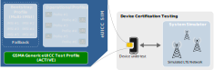

# GSMA Generic eUICC Test Profile

The GSMA Test Profile is only supported on Eseye's v7 AnyNet+ SIMs. For more information, contact Eseye support.

The GSMA Generic eUICC Test Profile was developed by the GSMA to fulfil the requirements of industry standardised testing defined by the GCF and PTCRB certification bodies, as well as to support devices with non-removable UICCs. It contains the necessary authentication and security data required to perform testing using a test network (system simulator), during production line sampling or during sales demonstrations where there is no need for operator-specific profiles.

The GSMA Generic eUICC Test Profile should be preloaded on SIMs, and is distinct from both the [bootstrap (provisioning) profiles](../e-sim/profiles.md#Bootstra) and [operational (step 2) profiles](../e-sim/profiles.md#Operatio).

To request a SIM that supports the Generic eUICC Test Profile, contact your Eseye Account Manager.

## USIM authentication parameters

The following table lists the authentication parameter values for v4.0 of the GSMA Generic eUICC Test Profile.

| Authentication parameter | Value |
| --- | --- |
| Algorithm | XOR 3G |
| Ki | 0x00 0x01 0x02 … 0x0E 0x0F |
| Opc | N/A |
| algorithmOptions | 0x02 (128 bits) |
| rotationConstants | Default |
| xoringConstants | Default |
| numberOfKeccak | N/A |
| sqnOptions | 0x02 (SQN wrap around) |
| sqnDelta | 000010000000 |
| sqnAgeLimit | 000010000000 |
| SQN initial values | 0x000000000000 (all records) |

For a full list of authentication parameters, download the **TS.48 eSIM GTP Profile Structure** spreadsheets from: <https://www.gsma.com/newsroom/resources/ts-48-generic-euicc-test-profile-for-device-testing/>

## How to use the Generic eUICC Test Profile

### Before you begin

Ensure you have installed a private LTE test network. You may use your own test network. Alternatively:

- Eseye can introduce you to third party suppliers who can provide a test network.
- Eseye can rent you a fully supported test network.



Before switching to the Generic eUICC Test Profile, we recommend setting the modem to full functionality mode (AT+CFUN=1).



### To switch to and from the Generic eUICC Test Profile using AT commands

Use the following AT command (for generic SIM access) to trigger the device to switch to and from the GSMA Generic eUICC Test Profile:

AT+CSIM=<Length>,"<Command>"

Where:

- <Length> – is the decimal number of characters contained in the command string.
- <Command> – is a string of hexadecimal characters that specify the action to take, including the following:
  - 80C2000003E40102 – switches to the Generic eUICC Test Profile.
  - 80C2000003E40103 – switches back from the Generic eUICC Test Profile.



For more information, see [GSMA\_TS48\_eSIM\_GTP\_Profile\_Structure v4.0.xlsx](https://eseyeltd.sharepoint.com/:x:/r/sites/SIMinformation/Shared Documents/SIM Batch Information/specs/TS48 test profile/GSMA_TS48_eSIM_GTP_Profile_Structure v4.0.xlsx?d=w2ec221a39b94470c8217474e18125f2a&csf=1&web=1&e=0CatSe).



To use the Generic eUICC Test Profile:

1. Use the following AT command to trigger the device to switch to the GSMA Generic eUICC Test Profile:

   AT+CSIM=<Length>,"80C2000003E40102"

   For example: AT+CSIM=16,"80C2000003E40102"
2. Run the test.

   

   You do not have to activate the SIM. Eseye will not charge you for the test. There is no limitation on data usage.

   
3. After all tests are complete, use the following AT command to switch back to the previous SIM profile:

   AT+CSIM=<Length>,"80C2000003E40103"

   For example: AT+CSIM=16,"80C2000003E40103"

## Where to next?

- [About eSIM technology](../e-sim/esim.md)
- [eUICC overview](../e-sim/euicc.md)
- [Eseye test profile](eseye-test-profile.md)
- Anritsu test profile
