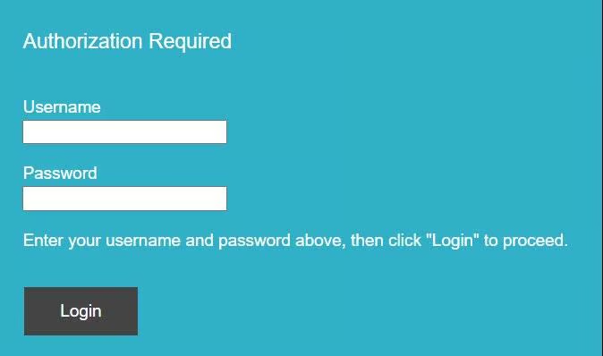

# Login to the Hera 204

### Access the web interface

1. Open a web browser.
2.  In the address bar, enter the Hera 204 IP address:

    `https://192.168.1.1`
3. If your browser displays an **untrusted certificate** or **private connection** warning, continue to the address.
4.  At the sign-in prompt, enter the **username** and **password** provided in your Configuration Information Sheet.

    <figure><figcaption></figcaption></figure>

    

You can change your username and password later.

5.  Select **OK**.

    <figure><figcaption></figcaption></figure>

The Hera web interface opens. You can use it to configure the device. In most cases, the device applies a predefined setup after it first connects to the Eseye device management system.
