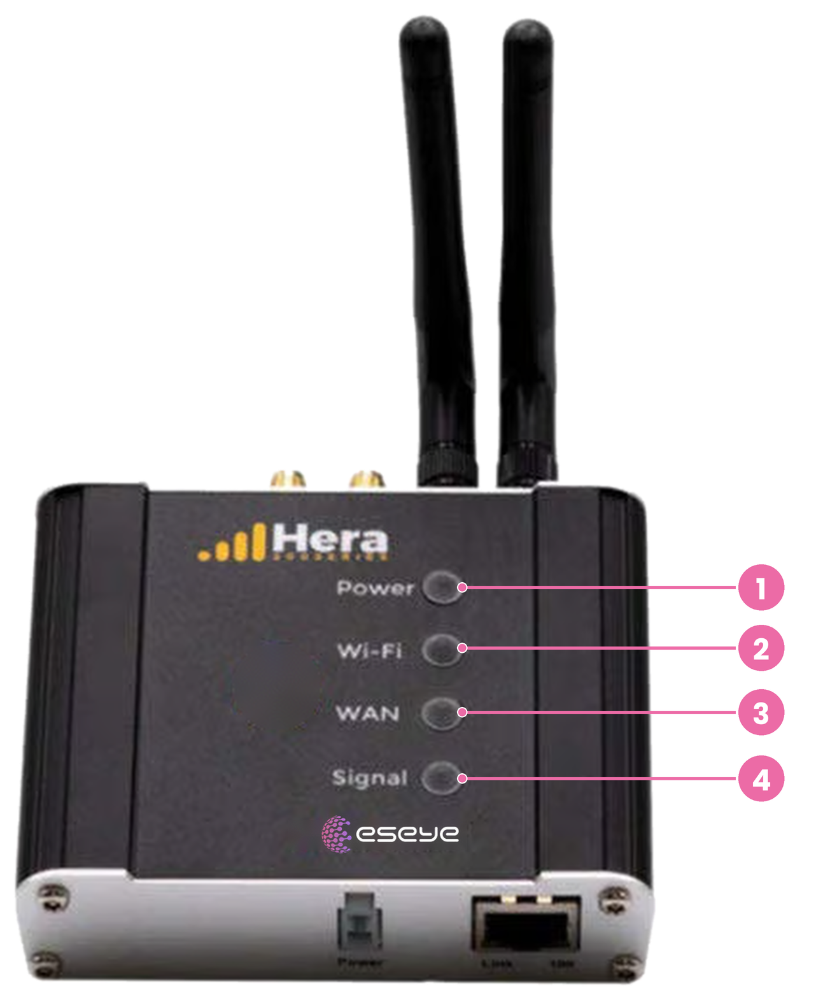
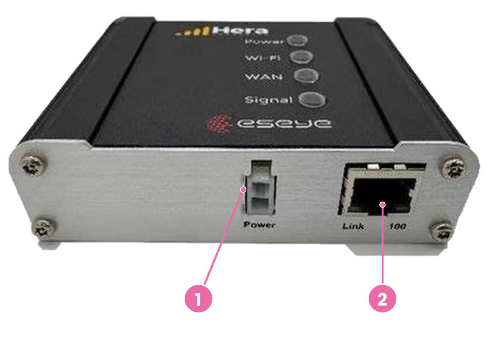
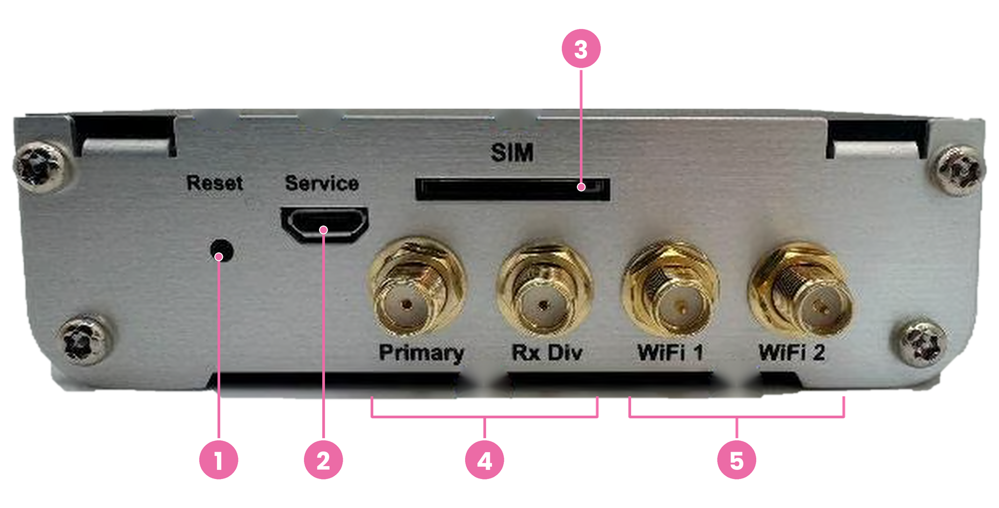

# Hera 204 panels and ports

The Hera 204 has status indicators, network connections, antenna connectors, and controls on its enclosure.

| Location                 | Components                                                            |
| ------------------------ | --------------------------------------------------------------------- |
| Front                    | Power, Wi-Fi, WAN, and Signal LEDs                                    |
| Power and Ethernet panel | Power connector and Ethernet port                                     |
| Back panel               | Reset button, Service port, external SIM slot, and antenna connectors |

### Front panel

The front panel has four vertically arranged status LEDs:

<figure><figcaption></figcaption></figure>

| Number | LED    | Purpose                                    |
| ------ | ------ | ------------------------------------------ |
| 1      | Power  | Power and software status                  |
| 2      | Wi-Fi  | Wi-Fi availability and traffic             |
| 3      | WAN    | Wide area network availability and traffic |
| 4      | Signal | Cellular signal strength                   |

For LED states, see [Status indicators](status-indicators.md).

### Power and Ethernet panel

This panel contains the power connector and one Ethernet port:

<figure><figcaption></figcaption></figure>

| Number | Component       | Purpose                                                         |
| ------ | --------------- | --------------------------------------------------------------- |
| 1      | Power connector | Connects the supplied 12 VDC power adapter                      |
| 2      | Ethernet port   | Connects local equipment or provides an Ethernet WAN connection |

#### Ethernet port

The Hera 204 has one RJ45 Ethernet port with a maximum speed of 100 Mbps. The port can operate as either LAN or WAN.

| Property   | Details                                                       |
| ---------- | ------------------------------------------------------------- |
| Speed      | 10/100 Mbps                                                   |
| Standards  | IEEE 802.3 and IEEE 802.3u                                    |
| Cabling    | Auto MDI/MDIX; supports straight-through and crossover cables |
| Role       | Configurable as LAN or WAN                                    |
| Indicators | Link and Data LEDs                                            |

When configured as LAN, the port connects local equipment to the router. When configured as WAN, it connects the router to an upstream network.

#### Power connector

The power connector accepts the supplied 12 VDC power adapter.

| Property                  | Value             |
| ------------------------- | ----------------- |
| Supplied adapter output   | 12 VDC            |
| Supported input voltage   | 9–24 VDC          |
| Connector                 | Molex Mini Fit Jr |
| Maximum power consumption | 10 W              |

The connector has two pins:

| Pin | Function |
| --- | -------- |
| 1   | Power    |
| 2   | Ground   |


Use the supplied power adapter. Contact [Eseye Support](mailto:support@eseye.com) before using a non-standard power supply.


### Back panel

The back panel contains the Reset button, Service port, external SIM slot, and four antenna connectors.

<figure><figcaption></figcaption></figure>

| Number | Component          | Purpose                                         |
| ------ | ------------------ | ----------------------------------------------- |
| 1      | Reset button       | Reboots the router or restores factory defaults |
| 2      | Service port       | Port labelled **Service**                       |
| 3      | External SIM slot  | Accepts an additional removable SIM card        |
| 4      | Primary and Rx Div | Cellular antenna connectors                     |
| 5      | WiFi 1 and WiFi 2  | Wi-Fi antenna connectors                        |

#### Antenna connectors

The Hera 204 has two cellular and two Wi-Fi antenna connectors:

| Label   | Connection | Purpose                   |
| ------- | ---------- | ------------------------- |
| Primary | Cellular   | Primary cellular antenna  |
| Rx Div  | Cellular   | Receive diversity antenna |
| WiFi 1  | Wi-Fi      | Wi-Fi antenna             |
| WiFi 2  | Wi-Fi      | Wi-Fi antenna             |

The cellular and Wi-Fi antenna connections use 50 Ω SMA connectors. Attach the cellular antennas to **Primary** and **Rx Div**, and the Wi-Fi antennas to **WiFi 1** and **WiFi 2**.


The supplied antennas are not suitable for outdoor use.


#### SIM slot

The Hera 204 includes an embedded Eseye AnyNet eSIM and one external SIM slot for an additional removable SIM card.


Power off the router before inserting or removing a SIM card.


For the SIM installation procedure, see [Connect Hera 204](../get-started/connect-hera-204.md).

#### Reset button

The Reset button is on the back panel. After the router has powered on, use it for either action:

| Action                   | Operation                                                 |
| ------------------------ | --------------------------------------------------------- |
| Reboot                   | Press and release the Reset button                        |
| Restore factory defaults | Press and hold the Reset button for at least five seconds |

The Power LED turns solid red when the reboot or factory reset begins.


Restoring factory defaults removes all user configuration changes.


For the procedure, see [Restart and reset](../diagnostics-and-maintenance/restart-and-reset.md).
