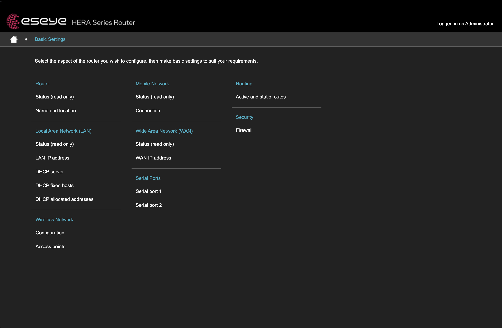

# Basic settings

Use **Basic Settings** to configure the Hera 604 network interfaces, wireless access points, serial ports, routes, and firewall.

> **Important:** Changes to LAN, WAN, mobile, or wireless settings can interrupt your connection to the router. Before saving, confirm how you will reconnect if the current interface or IP address changes.

Pages labelled **Status (read only)** display current operating values and do not change the configuration. For explanations of those values, see **System Status**.

After changing a page, select **Save** to apply the new values. Select **Reset** to discard changes that have not been saved.

<figure><figcaption></figcaption></figure>

| # | Section                  | What you set here                                                             |
| - | ------------------------ | ----------------------------------------------------------------------------- |
| 1 | Router                   | The site name, site location, notes, and GPS receiver.                        |
| 2 | Local Area Network (LAN) | The router address, DHCP server, and reserved addresses for specific devices. |
| 3 | Wireless Network         | The 2.4 GHz and 5 GHz radios, and the access points that run on them.         |
| 4 | Mobile Network           | Cellular profiles and the SIM each profile uses.                              |
| 5 | Wide Area Network (WAN)  | The Ethernet WAN connection.                                                  |
| 6 | Serial Ports             | The line settings for serial port 1 and serial port 2.                        |
| 7 | Routing                  | Static routes and the active routes.                                          |
| 8 | Security                 | The firewall, including inbound rules, outbound rules, and port redirections. |

Each section holds one or more pages. The pages appear on the left after you open a section.

Sections marked **Status (read only)** show current values. You cannot edit them.
