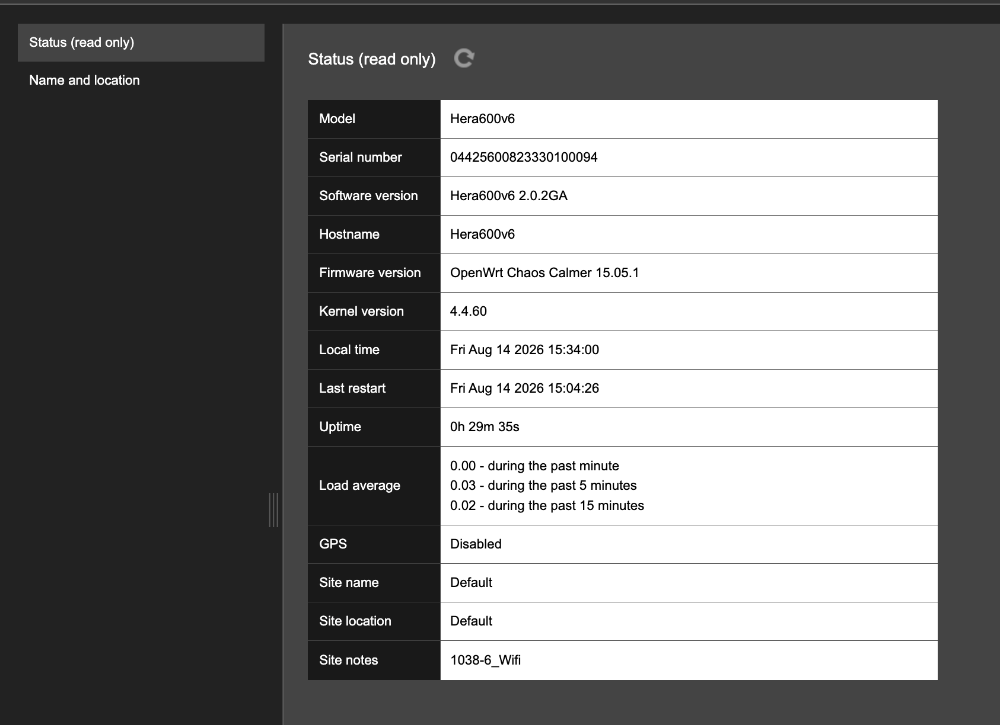

# Router

Use the **Router** pages to identify the Hera 604, check its current operating status, and record where the unit is installed. The status page is read only; the name and location page contains settings that an operator can update.

#### Status (read only)

Open **Basic Settings > Router > Status (read only)** to view identification and operating information for the Hera 604, including its serial number, software versions, last restart time, and uptime.

The values on this page cannot be edited. Select the **refresh** icon to retrieve the latest information. For a full explanation of the displayed fields, see **System Status > Router**.

<figure><figcaption></figcaption></figure>

#### Name and location

Open **Basic Settings > Router > Name and location** to identify where the Hera 604 is installed and record site-specific information.

<figure><figcaption></figcaption></figure>

| Field         | Example                 | Description                                                                                                                          |
| ------------- | ----------------------- | ------------------------------------------------------------------------------------------------------------------------------------ |
| Site name     | Default                 | Name used to identify the site where the Hera 604 is installed. Use the site name defined in the deployment record.                  |
| Site location | Default                 | Address, room, cabinet, or other description of the router's physical location.                                                      |
| GPS           | `Enabled` or `Disabled` | Enables or disables the GPS receiver. Enable it only when GPS is required for the deployment and the GPS antenna has been installed. |
| Notes         | 1038-6\_Wifi            | Represent the configuration version                                                                                                  |

To update the details:

1. Enter the **Site name**.
2. Enter the **Site location**.
3. Enable **GPS** if it is required for the installation.
4. Select **Save**.
