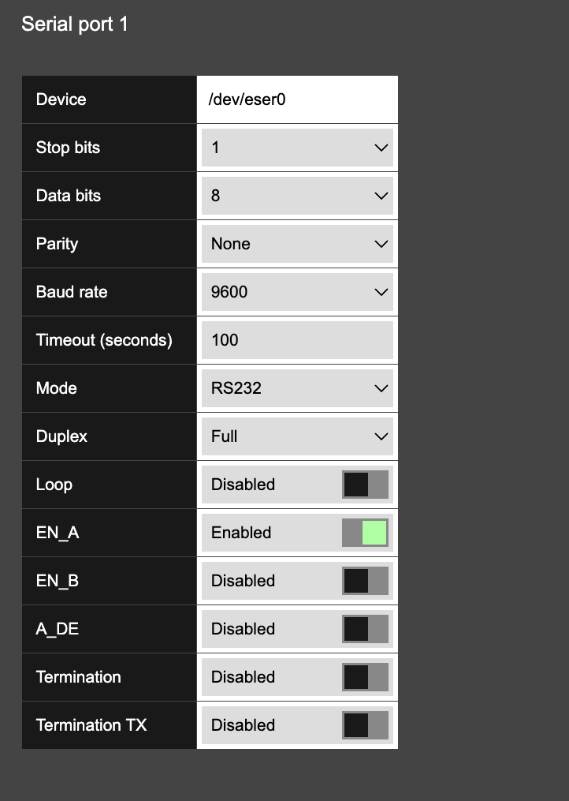

# Serial Ports

The Hera 604 provides two configurable serial ports. Open **Basic Settings > Serial Ports > Serial port 1** or **Serial port 2** to match a port to the connected equipment.

<figure><figcaption></figcaption></figure>

> **Important:** The serial mode, baud rate, data bits, parity, stop bits, and electrical controls must match the connected device and wiring. Incorrect electrical-mode or termination settings can prevent communication. Use the values specified in the equipment design or installation record.

| Field             | Example or available values                      | Description                                                                                                                  |
| ----------------- | ------------------------------------------------ | ---------------------------------------------------------------------------------------------------------------------------- |
| Device            | `/dev/eser0` or `/dev/eser1`                     | Internal device assigned to serial port 1 or serial port 2.                                                                  |
| Stop bits         | `1`, `1.5`, or `2`                               | Number of stop bits used to mark the end of each transmitted character.                                                      |
| Data bits         | `5`, `6`, `7`, or `8`                            | Number of data bits in each character.                                                                                       |
| Parity            | `None`, `Even`, `Odd`, `Forced 0`, or `Forced 1` | Parity method used for serial error checking.                                                                                |
| Baud rate         | 9600                                             | Communication speed in bits per second. Select the rate required by the connected device.                                    |
| Timeout (seconds) | 100                                              | Time the router waits before treating an inactive serial operation as timed out.                                             |
| Mode              | `RS232`, `RS422`, or `RS485`                     | Electrical signalling standard used by the connected serial equipment.                                                       |
| Duplex            | `Half` or `Full`                                 | Determines whether the link transmits and receives alternately or at the same time.                                          |
| Loop              | `Enabled` or `Disabled`                          | Enables serial loopback behaviour. Use only for an approved test configuration.                                              |
| EN\_A             | `Enabled` or `Disabled`                          | Hardware control for serial transceiver channel A. Use the value specified for the selected electrical mode and wiring.      |
| EN\_B             | `Enabled` or `Disabled`                          | Hardware control for serial transceiver channel B. Use the value specified for the selected electrical mode and wiring.      |
| A\_DE             | `Enabled` or `Disabled`                          | Driver-enable control for serial channel A. Use the value specified for the selected electrical mode and duplex arrangement. |
| Termination       | `Enabled` or `Disabled`                          | Enables line termination where required by the RS422 or RS485 wiring design.                                                 |
| Termination TX    | `Enabled` or `Disabled`                          | Enables transmit-side termination where required by the wiring design.                                                       |

Select **Save** after configuring the port.

###
