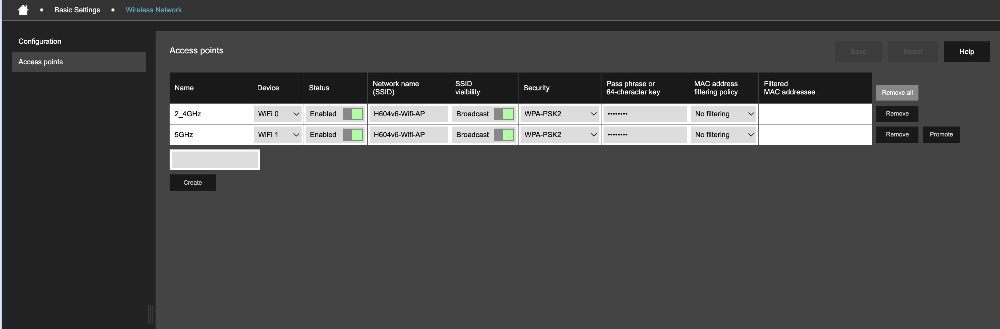

# Wireless Network

Use **Wireless Network** to configure the 2.4 GHz and 5 GHz radios and the Wi-Fi access points broadcast by the Hera 604.

> **Important:** Changing the wireless network name, password, radio status, or security mode disconnects Wi-Fi clients. Make sure you have the new connection details or an alternative management connection before saving.

#### Configure the wireless radios

Open **Basic Settings > Wireless Network > Configuration**.

<figure><figcaption></figcaption></figure>

The page contains separate settings for the **2.4 GHz radio** and **5 GHz radio**.

| Field         | Example                 | Description                                                                                 |
| ------------- | ----------------------- | ------------------------------------------------------------------------------------------- |
| Hardware mode | 802.11NG or 802.11AC    | Wireless standard used by the radio. Available modes depend on the selected frequency band. |
| Status        | `Enabled` or `Disabled` | Enables or disables the radio. Disabling a radio disconnects access points assigned to it.  |
| Country       | UK (United Kingdom)     | Applies the wireless channels and power limits permitted in the installation country.       |
| Channel       | Auto                    | Wireless channel used by the radio. `Auto` allows the router to select a channel.           |
| Bandwidth     | 40 MHz or 80 MHz        | Width of the wireless channel. The available values depend on the hardware mode and band.   |

> **Important:** Set **Country** to the country where the router is physically installed. This ensures that the available channels comply with local radio regulations.

Select **Save** after configuring both radios.

#### Configure wireless access points

<figure><figcaption></figcaption></figure>

Open **Basic Settings > Wireless Network > Access points** to configure the Wi-Fi networks available to local devices.

| Field                           | Example                            | Description                                                                                                                   |
| ------------------------------- | ---------------------------------- | ----------------------------------------------------------------------------------------------------------------------------- |
| Name                            | 2\_4GHz                            | Internal name used to identify the access-point configuration.                                                                |
| Device                          | WiFi 0 or WiFi 1                   | Radio used by the access point.                                                                                               |
| Status                          | `Enabled` or `Disabled`            | Enables or disables the access point.                                                                                         |
| Network name (SSID)             | H604v6-Wifi-AP                     | Wi-Fi network name shown to nearby devices.                                                                                   |
| SSID visibility                 | `Broadcast` or `Hidden`            | Determines whether the network name appears during a Wi-Fi scan. A hidden network must be entered manually on client devices. |
| Security                        | WPA-PSK2                           | Authentication and encryption method used by the access point.                                                                |
| Pass phrase or 64-character key | Masked                             | Credential required to join the wireless network.                                                                             |
| MAC address filtering policy    | `No filtering`, `Allow`, or `Deny` | Controls whether the filtered MAC-address list is unused, treated as an allow list, or treated as a deny list.                |
| Filtered MAC addresses          | One or more MAC addresses          | Devices affected by the selected MAC filtering policy.                                                                        |

> **Important:** Use the strongest security mode supported by the installed equipment. Do not use an open network for an operational deployment.

Use **Create** to add an access point, **Remove** to delete one, and **Promote** to move an entry higher in the list. Select **Save** after making changes.

