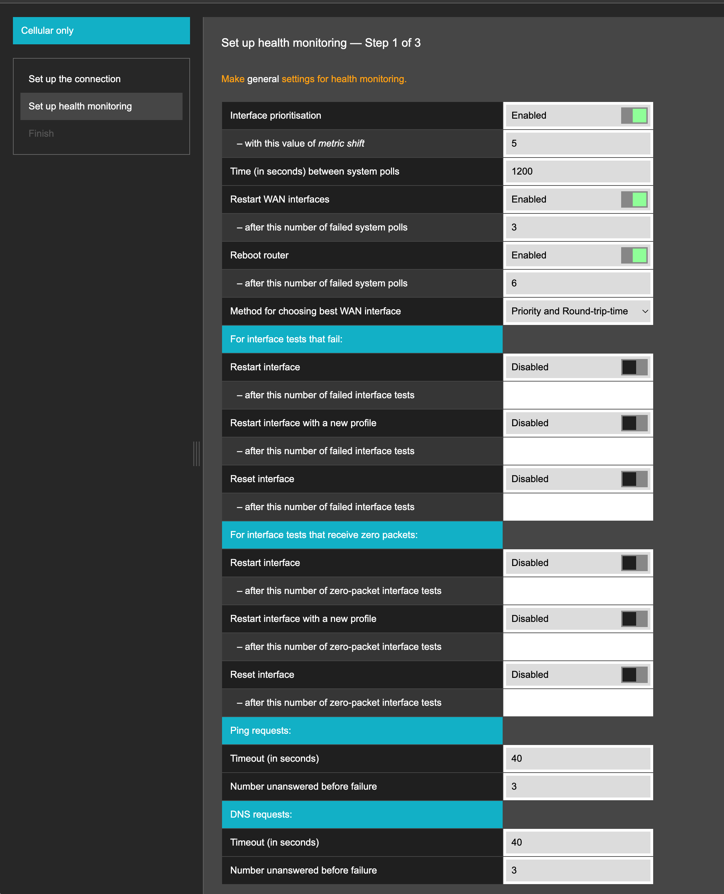

# Set up health monitoring

## Set up health monitoring

Configure global and interface-level connectivity monitoring in the Network Connection wizard.

**Set up health monitoring** is the second stage of the Network Connection wizard. The Hera 604 uses two separate monitoring systems:

* The **global Health Monitor** manages WAN interface prioritisation and system-level recovery actions, including restarting WAN interfaces, resetting the cellular connection and rebooting the router.
* An **interface Health Monitor** tests each WAN interface independently. Each interface has its own test interval and recovery settings.

This stage has three steps:

| **Step**    | **Configures**                                                                              |
| ----------- | ------------------------------------------------------------------------------------------- |
| Step 1 of 3 | Global Health Monitor settings and default recovery settings for interface Health Monitors. |
| Step 2 of 3 | Connectivity tests and test intervals for each WAN interface.                               |
| Step 3 of 3 | Recovery and request settings that override the defaults for a specific interface.          |

> Leaving a numeric threshold blank disables its associated recovery action.

### Step 1 of 3: Configure monitoring defaults

Step 1 contains settings for both the global Health Monitor and the interface Health Monitors. The first section configures global monitoring. The remaining sections define the default recovery and request settings applied to each interface Health Monitor.

#### Global Health Monitor

The global Health Monitor manages interface prioritisation and system-level recovery.

<figure><figcaption></figcaption></figure>

| **Field**                                  | **Example or possible values**                                   | **Description**                                                                                                                                                                                                                                                |
| ------------------------------------------ | ---------------------------------------------------------------- | -------------------------------------------------------------------------------------------------------------------------------------------------------------------------------------------------------------------------------------------------------------- |
| Interface prioritisation                   | `Enabled` or `Disabled`                                          | Determines whether WAN interfaces are ranked. If the primary interface loses connectivity, the router switches to another available interface. The original priorities are restored when connectivity returns.                                                 |
| - with this value of metric shift          | `5`                                                              | Amount added to an interface metric when the interface is not primary or has failed.                                                                                                                                                                           |
| Time (in seconds) between system polls     | `1200`                                                           | Time between tests performed by the global Health Monitor.                                                                                                                                                                                                     |
| Restart WAN interfaces                     | `Enabled` or `Disabled`                                          | Determines whether the global Health Monitor restarts all WAN interfaces when connectivity tests fail across every interface. The cellular connection is reset, and DHCP connections renew their addresses.                                                    |
| - after this number of failed system polls | `3`                                                              | Number of consecutive failed global tests allowed before the WAN interfaces restart. Leave this field blank to disable the action.                                                                                                                             |
| Reboot router                              | `Enabled` or `Disabled`                                          | Determines whether the router restarts when global connectivity tests continue to fail across every interface.                                                                                                                                                 |
| - after this number of failed system polls | `6`                                                              | Number of consecutive failed global tests allowed before the router restarts. Leave this field blank to disable the action.                                                                                                                                    |
| Method for choosing best WAN interface     | `Priority`, `Round-trip-time`, or `Priority and Round-trip-time` | Determines how the global Health Monitor selects an active WAN interface. **Priority** selects the highest-ranked interface. **Round-trip-time** selects the interface with the fastest ping response. **Priority and Round-trip-time** considers both values. |

#### Default actions for failed interface tests

The following settings apply to the interface Health Monitors. They determine what happens when the connectivity tests for an individual interface fail.

| **Field**                                     | **Example or possible values** | **Description**                                                                                                                                                         |
| --------------------------------------------- | ------------------------------ | ----------------------------------------------------------------------------------------------------------------------------------------------------------------------- |
| Restart interface                             | `Enabled` or `Disabled`        | Determines whether the interface restarts after its connectivity tests fail.                                                                                            |
| - after this number of failed interface tests | Blank or a number              | Number of consecutive failed tests allowed before the interface restarts. Leave this field blank to disable the action.                                                 |
| Restart interface with a new profile          | `Enabled` or `Disabled`        | Determines whether a cellular interface restarts with another cellular profile. The router cycles through the available profiles before returning to the first profile. |
| - after this number of failed interface tests | Blank or a number              | Number of consecutive failed tests allowed before the cellular profile changes. Leave this field blank to disable the action.                                           |
| Reset interface                               | `Enabled` or `Disabled`        | For cellular interfaces, determines whether the router disconnects and reconnects to the cellular network.                                                              |
| - after this number of failed interface tests | Blank or a number              | Number of consecutive failed tests allowed before the interface resets. Leave this field blank to disable the action.                                                   |

#### Default actions for zero-packet interface tests

These settings apply when an interface receives no incoming packets during a test period.

| **Field**                                          | **Example or possible values** | **Description**                                                                                                                           |
| -------------------------------------------------- | ------------------------------ | ----------------------------------------------------------------------------------------------------------------------------------------- |
| Restart interface                                  | `Enabled` or `Disabled`        | Determines whether the interface restarts when no incoming traffic is detected.                                                           |
| - after this number of zero-packet interface tests | Blank or a number              | Number of consecutive zero-packet test periods allowed before the interface restarts. Leave this field blank to disable the action.       |
| Restart interface with a new profile               | `Enabled` or `Disabled`        | Determines whether a cellular interface restarts with another cellular profile.                                                           |
| - after this number of zero-packet interface tests | Blank or a number              | Number of consecutive zero-packet test periods allowed before the cellular profile changes. Leave this field blank to disable the action. |
| Reset interface                                    | `Enabled` or `Disabled`        | For cellular interfaces, determines whether the router disconnects and reconnects to the cellular network.                                |
| - after this number of zero-packet interface tests | Blank or a number              | Number of consecutive zero-packet test periods allowed before the interface resets. Leave this field blank to disable the action.         |

#### Default ping request settings

| **Field**                        | **Example value** | **Description**                                                                                         |
| -------------------------------- | ----------------- | ------------------------------------------------------------------------------------------------------- |
| Timeout (in seconds)             | `40`              | Time the interface Health Monitor waits for a ping response before recording the request as unanswered. |
| Number unanswered before failure | `3`               | Number of consecutive unanswered ping requests required for the interface test to fail.                 |

#### Default DNS request settings

| **Field**                        | **Example value** | **Description**                                                                                        |
| -------------------------------- | ----------------- | ------------------------------------------------------------------------------------------------------ |
| Timeout (in seconds)             | `40`              | Time the interface Health Monitor waits for a DNS response before recording the request as unanswered. |
| Number unanswered before failure | `3`               | Number of consecutive unanswered DNS requests required for the interface test to fail.                 |

#### How metric shift works

Lower interface metrics have a higher priority.

For example, consider an Ethernet interface with a metric of `1`, a cellular interface with a metric of `2` and a metric shift of `5`:

* While Ethernet is available, the cellular metric becomes `2 + (5 × 1) = 7`. Ethernet retains its metric of `1` and carries the traffic.
* If Ethernet fails its tests, its metric becomes `1 + (5 × 2) = 11`. Cellular returns to its original metric of `2` and carries the traffic until Ethernet recovers.

Select **Next Step** after configuring the settings.

### Step 2 of 3: Configure interface tests

Step 2 configures the interface Health Monitor for each WAN interface created by the selected connection mode.

Each interface Health Monitor operates independently from the global Health Monitor and has its own test interval.

Choose the connection mode:



This mode tests the cellular WAN interface.

<figure><figcaption></figcaption></figure>

| **Field**               | **Value**                | **Description**                                                   |
| ----------------------- | ------------------------ | ----------------------------------------------------------------- |
| Priority                | `1`                      | Gives the cellular interface the highest routing priority.        |
| Interface               | `cellpri`                | Cellular WAN interface shared by all SIMs.                        |
| Role                    | Active WAN interface     | Carries traffic while the interface is healthy.                   |
| Ping address            | `192.168.109.2, 8.8.8.8` | Addresses used to test cellular connectivity.                     |
| DNS lookup              | Blank                    | Disables DNS lookup for the interface test.                       |
| Test interval (seconds) | `1200`                   | Runs a cellular interface test every 1200 seconds.                |
| Health monitoring       | `Enabled`                | Enables the interface Health Monitor for the cellular connection. |



This mode tests the Ethernet WAN interface.

<figure><figcaption></figcaption></figure>

| **Field**               | **Value**            | **Description**                                                   |
| ----------------------- | -------------------- | ----------------------------------------------------------------- |
| Priority                | `1`                  | Gives the Ethernet interface the highest routing priority.        |
| Interface               | `ethwan`             | Ethernet WAN interface.                                           |
| Role                    | Active WAN interface | Carries traffic while the interface is healthy.                   |
| Ping address            | `1.1.1.1`            | Address used to test Ethernet connectivity.                       |
| DNS lookup              | `www.eseye.com`      | Domain resolved during the interface test.                        |
| Test interval (seconds) | `30`                 | Runs an Ethernet interface test every 30 seconds.                 |
| Health monitoring       | `Enabled`            | Enables the interface Health Monitor for the Ethernet connection. |



This mode uses cellular as the primary WAN interface and Ethernet as the backup.

<figure><figcaption></figcaption></figure>

| **Field**               | **Cellular (`cellpri`)** | **Ethernet (`ethwan`)** | **Description**                                                |
| ----------------------- | ------------------------ | ----------------------- | -------------------------------------------------------------- |
| Priority                | `1`                      | `2`                     | Gives cellular the higher routing priority.                    |
| Role                    | Primary WAN interface    | Backup WAN interface    | Ethernet carries traffic if cellular connectivity fails.       |
| Ping address            | `192.168.109.2, 8.8.8.8` | `1.1.1.1`               | Addresses used to test each interface.                         |
| DNS lookup              | Blank                    | `www.eseye.com`         | Performs a DNS lookup for Ethernet only.                       |
| Test interval (seconds) | `1200`                   | `30`                    | Tests each interface independently at its configured interval. |
| Health monitoring       | `Enabled`                | `Enabled`               | Enables the interface Health Monitor for both connections.     |



This mode uses Ethernet as the primary WAN interface and cellular as the backup.

<figure><figcaption></figcaption></figure>

| **Field**               | **Ethernet (`ethwan`)** | **Cellular (`cellpri`)** | **Description**                                                |
| ----------------------- | ----------------------- | ------------------------ | -------------------------------------------------------------- |
| Priority                | `1`                     | `2`                      | Gives Ethernet the higher routing priority.                    |
| Role                    | Primary WAN interface   | Backup WAN interface     | Cellular carries traffic if Ethernet connectivity fails.       |
| Ping address            | `1.1.1.1`               | `192.168.109.2, 8.8.8.8` | Addresses used to test each interface.                         |
| DNS lookup              | `www.eseye.com`         | Blank                    | Performs a DNS lookup for Ethernet only.                       |
| Test interval (seconds) | `30`                    | `1200`                   | Tests each interface independently at its configured interval. |
| Health monitoring       | `Enabled`               | `Enabled`                | Enables the interface Health Monitor for both connections.     |



> Each ping address must be reachable through the interface being tested. The Eseye AnyNet Ping Service at `192.168.109.2` responds only when an Eseye SIM activated in Infinity is used. For other SIMs and Ethernet connections, enter an address that responds through the relevant interface.

Select **Next Step** after configuring the interface tests.

### Step 3 of 3: Configure interface overrides

Step 3 allows each interface Health Monitor to override the default recovery and request settings configured in Step 1.

A value of `Default` means that the interface uses the corresponding Step 1 setting.

Choose the connection mode:



<figure><figcaption></figcaption></figure>

| **Setting**                   | **`cellpri`**\*\* value\*\* | **Description**                                                      |
| ----------------------------- | --------------------------- | -------------------------------------------------------------------- |
| Failed-test recovery settings | `Default`                   | Applies the default recovery actions after failed interface tests.   |
| Zero-packet recovery settings | `Default`                   | Applies the default recovery actions after zero-packet test periods. |
| Ping request settings         | `Default`                   | Applies the default ping timeout and failure threshold.              |
| DNS request settings          | `Default`                   | Applies the default DNS timeout and failure threshold.               |



<figure><figcaption></figcaption></figure>

| **Setting**                   | **`ethwan`**\*\* value\*\* | **Description**                                                      |
| ----------------------------- | -------------------------- | -------------------------------------------------------------------- |
| Failed-test recovery settings | `Default`                  | Applies the default recovery actions after failed interface tests.   |
| Zero-packet recovery settings | `Default`                  | Applies the default recovery actions after zero-packet test periods. |
| Ping request settings         | `Default`                  | Applies the default ping timeout and failure threshold.              |
| DNS request settings          | `Default`                  | Applies the default DNS timeout and failure threshold.               |



<figure><figcaption></figcaption></figure>

| **Setting**                   | **Cellular (`cellpri`)** | **Ethernet (`ethwan`)** | **Description**                                                   |
| ----------------------------- | ------------------------ | ----------------------- | ----------------------------------------------------------------- |
| Failed-test recovery settings | `Default`                | `Default`               | Each interface applies the default failed-test recovery settings. |
| Zero-packet recovery settings | `Default`                | `Default`               | Each interface applies the default zero-packet recovery settings. |
| Ping request settings         | `Default`                | `Default`               | Each interface applies the default ping request settings.         |
| DNS request settings          | `Default`                | `Default`               | Each interface applies the default DNS request settings.          |



<figure><figcaption></figcaption></figure>

| **Setting**                   | **Ethernet (`ethwan`)** | **Cellular (`cellpri`)** | **Description**                                                   |
| ----------------------------- | ----------------------- | ------------------------ | ----------------------------------------------------------------- |
| Failed-test recovery settings | `Default`               | `Default`                | Each interface applies the default failed-test recovery settings. |
| Zero-packet recovery settings | `Default`               | `Default`                | Each interface applies the default zero-packet recovery settings. |
| Ping request settings         | `Default`               | `Default`                | Each interface applies the default ping request settings.         |
| DNS request settings          | `Default`               | `Default`                | Each interface applies the default DNS request settings.          |



Select **Next Step** to continue to the final stage of the Network Connection wizard.

Select **Save** to apply the configuration to the router.
