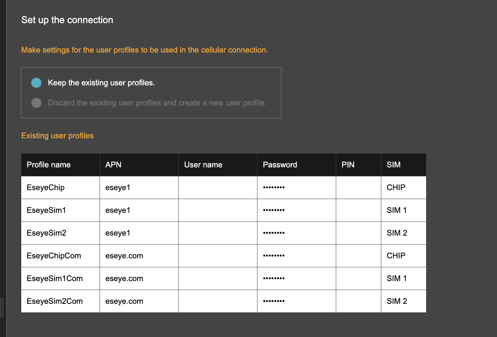
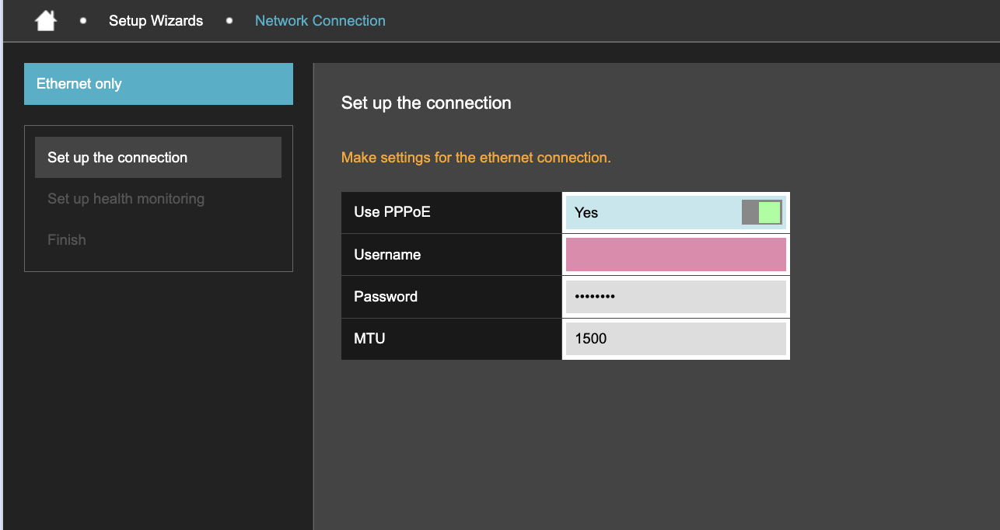
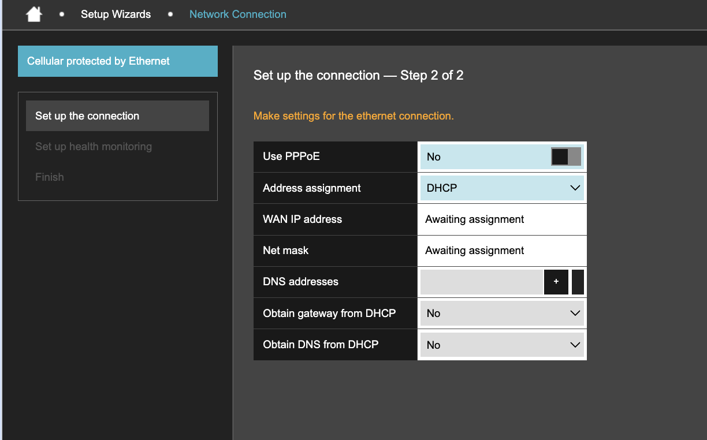
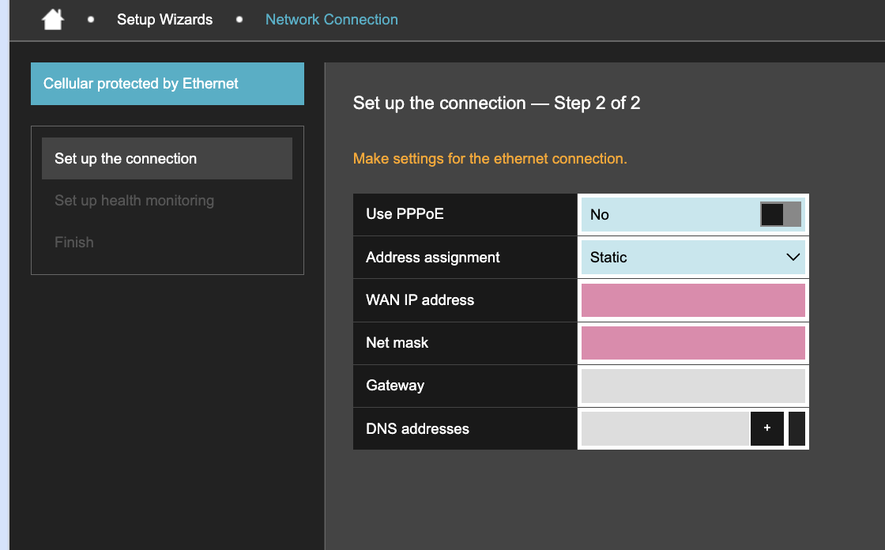

# Set up the connection

**Set up the connection** is the first stage of the Network Connection wizard. The fields it displays depend on the connection mode you selected.

Choose the mode selected in the wizard:



Cellular is the only WAN interface. Configure [cellular profiles](set-up-the-connection.md#cellular), then select **Next Step**.



Ethernet is the only WAN interface. Configure [Ethernet](set-up-the-connection.md#ethernet), then select **Next Step**.



Cellular is the primary WAN interface. Ethernet is the backup.

1. In **Set up the connection — Step 1 of 2**, configure [cellular profiles](set-up-the-connection.md#cellular).
2. Select **Next Step**.
3. In **Set up the connection — Step 2 of 2**, configure [Ethernet](set-up-the-connection.md#ethernet).
4. Select **Next Step**.



Ethernet is the primary WAN interface. Cellular is the backup.

1. In **Set up the connection — Step 1 of 2**, configure [Ethernet](set-up-the-connection.md#ethernet).
2. Select **Next Step**.
3. In **Set up the connection — Step 2 of 2**, configure [cellular profiles](set-up-the-connection.md#cellular).
4. Select **Next Step**.



The last screen opens [Set up health monitoring](set-up-health-monitoring.md).


A pink field is mandatory and does not yet contain a valid value. Selecting the field displays a message describing what is expected, such as **Enter a valid IP address**.


### Cellular

This screen is shown in **Cellular only**, first in **Cellular protected by Ethernet**, and second in **Ethernet protected by Cellular**.

Choose how to configure the cellular profiles:



Select **Keep the existing user profiles** to retain the listed profiles. The profiles appear under **Existing user profiles** as a read-only list.

<figure><figcaption></figcaption></figure>

| Field        | Example or possible values  | Description                                                                                        |
| ------------ | --------------------------- | -------------------------------------------------------------------------------------------------- |
| Profile name | EseyeChip                   | Name identifying the cellular profile.                                                             |
| APN          | eseye1                      | Access Point Name the profile uses to reach the carrier network.                                   |
| User name    | Blank                       | User name for the APN, where the carrier requires one.                                             |
| Password     | Hidden                      | Password for the APN, where the carrier requires one.                                              |
| PIN          | Blank                       | PIN for a SIM that is locked.                                                                      |
| SIM          | `CHIP`, `SIM 1`, or `SIM 2` | SIM the profile uses. `CHIP` is the embedded SIM. `SIM 1` and `SIM 2` are the removable SIM slots. |



Select **Discard the existing user profiles and create a new user profile**. The wizard replaces the list with one editable profile named `wizardProfile`.


This option replaces every profile on the router, including profiles configured by Eseye.


<figure><figcaption></figcaption></figure>

| Field        | Example or possible values  | Description                                                                                        |
| ------------ | --------------------------- | -------------------------------------------------------------------------------------------------- |
| Profile name | wizardProfile               | Name identifying the cellular profile.                                                             |
| APN          | eseye1                      | Access Point Name the profile uses to reach the carrier network.                                   |
| User name    | Blank                       | User name for the APN, where the carrier requires one.                                             |
| Password     | Hidden                      | Password for the APN, where the carrier requires one.                                              |
| PIN          | Blank                       | PIN for a SIM that is locked.                                                                      |
| SIM          | `CHIP`, `SIM 1`, or `SIM 2` | SIM the profile uses. `CHIP` is the embedded SIM. `SIM 1` and `SIM 2` are the removable SIM slots. |



Cellular profiles can also be created and edited outside the wizard, on [Connection](../basic-settings/mobile-network.md).

### Ethernet

This screen is shown in **Ethernet only**, first in **Ethernet protected by Cellular**, and second in **Cellular protected by Ethernet**.

The Ethernet screen sets how the Ethernet WAN interface obtains its address. The displayed fields depend on **Use PPPoE** and, when PPPoE is not used, **Address assignment**.

| Field     | Example or possible values | Description                                                                                                                             |
| --------- | -------------------------- | --------------------------------------------------------------------------------------------------------------------------------------- |
| Use PPPoE | `Yes` or `No`              | Determines whether the connection uses Point-to-Point Protocol over Ethernet. Your internet provider confirms whether this is required. |

Choose the configuration that matches the selected values:



The router authenticates with the provider, which supplies the address. No address fields are displayed.

<figure><figcaption></figcaption></figure>

| Field    | Example or possible values | Description                                                                          |
| -------- | -------------------------- | ------------------------------------------------------------------------------------ |
| Username | Blank                      | User name issued by the provider.                                                    |
| Password | Hidden                     | Password issued by the provider.                                                     |
| MTU      | 1500                       | Maximum Transmission Unit, the largest packet size the connection carries, in bytes. |



Set **Address assignment** to `DHCP`.

The upstream network supplies the address. **WAN IP address** and **Net mask** are read only and display `Awaiting assignment` until it does.

<figure><figcaption></figcaption></figure>

| Field                    | Example or possible values | Description                                                                          |
| ------------------------ | -------------------------- | ------------------------------------------------------------------------------------ |
| Address assignment       | `Static` or `DHCP`         | Determines how the interface obtains its address.                                    |
| WAN IP address           | Awaiting assignment        | Address assigned to the Ethernet WAN interface.                                      |
| Net mask                 | Awaiting assignment        | Identifies the network associated with the WAN address.                              |
| DNS addresses            | Blank                      | DNS servers the router uses. Select **+** to add an address and **-** to remove one. |
| Obtain gateway from DHCP | `Yes` or `No`              | Determines whether the default gateway is taken from the DHCP server.                |
| Obtain DNS from DHCP     | `Yes` or `No`              | Determines whether DNS addresses are taken from the DHCP server.                     |



Set **Address assignment** to `Static`.

You supply the address yourself. **Gateway** replaces the two DHCP fields.

<figure><figcaption></figcaption></figure>

| Field              | Example or possible values | Description                                                                          |
| ------------------ | -------------------------- | ------------------------------------------------------------------------------------ |
| Address assignment | `Static` or `DHCP`         | Determines how the interface obtains its address.                                    |
| WAN IP address     | 192.168.107.31             | Address to assign to the Ethernet WAN interface. Mandatory.                          |
| Net mask           | 255.255.255.0              | Identifies the network associated with the WAN address. Mandatory.                   |
| Gateway            | 192.168.107.1              | Address through which traffic leaves the WAN network.                                |
| DNS addresses      | Blank                      | DNS servers the router uses. Select **+** to add an address and **-** to remove one. |

Setting **Obtain gateway from DHCP** or **Obtain DNS from DHCP** to `No` requires a corresponding route on [Active and static routes](../basic-settings/routing.md).


