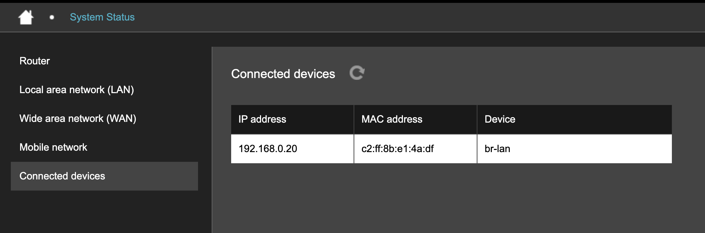

# Connected devices

**Connected devices** lists equipment detected on the Hera 604 local network, including IP addresses, MAC addresses, and router interfaces.

<figure><figcaption></figcaption></figure>

| Field       | Example value     | Description                                                                                            |
| ----------- | ----------------- | ------------------------------------------------------------------------------------------------------ |
| IP address  | 192.168.0.20      | Local IP address currently used by the connected device.                                               |
| MAC address | c2:ff:8b:e1:4a:df | Hardware address that identifies the device's network interface.                                       |
| Device      | br-lan            | Router interface through which the device is connected. `br-lan` is the router's local network bridge. |

For device hostnames and lease expiry times, see [DHCP allocated addresses](../basic-settings/local-area-network-lan.md#dhcp-allocated-addresses).
