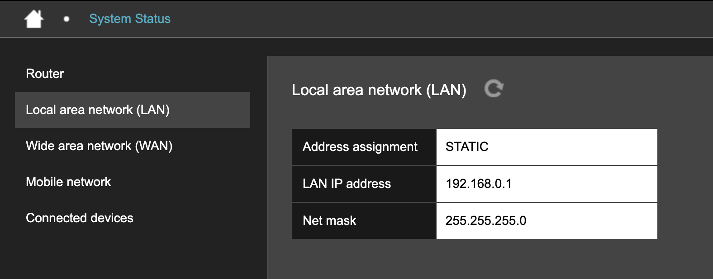

# Local area network (LAN)

**Local area network (LAN)** displays the Hera 604 LAN address-assignment method, IP address, and net mask.

The LAN includes equipment connected through Ethernet ports and wireless access points.

<figure><figcaption></figcaption></figure>

The page displays:

| Field              | Example or possible values | Description                                                                                                                                                     |
| ------------------ | -------------------------- | --------------------------------------------------------------------------------------------------------------------------------------------------------------- |
| Address assignment | `STATIC` or `DHCP`         | Determines how the Hera 604 obtains its LAN IP address. `STATIC` means the address is configured manually. `DHCP` means a DHCP server assigns it automatically. |
| LAN IP address     | 192.168.0.1                | Address used by the Hera 604 on the local network. Enter this address in a browser from a connected device to open the router interface.                        |
| Net mask           | 255.255.255.0              | Identifies which addresses belong to the same local network as the router.                                                                                      |


If you change the LAN IP address, use the new address the next time you open the router interface. You can configure these settings on [LAN IP address](../basic-settings/local-area-network-lan.md#lan-ip-address).

