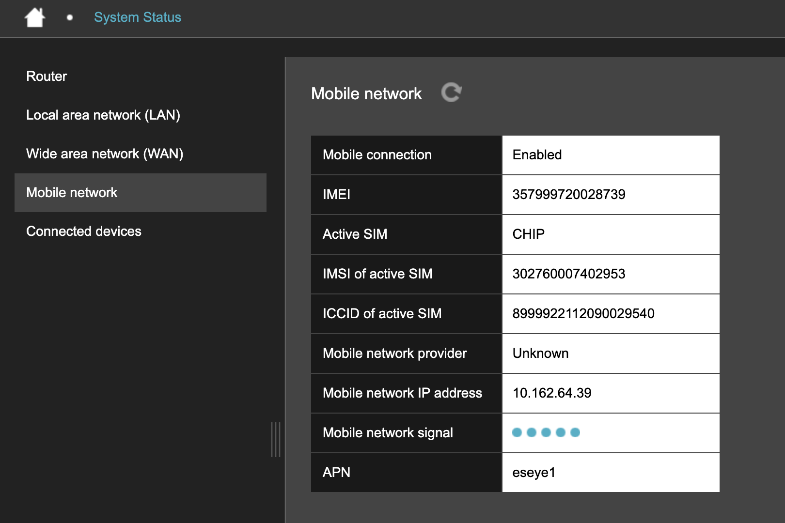

# Mobile network

**Mobile network** displays cellular connection status, modem and SIM identifiers, the current network operator, IP address, signal strength, and APN.

The Hera 604 holds three SIMs:

* `CHIP`, an embedded SIM built into the unit.
* `SIM 1`, the first removable SIM card slot.
* `SIM 2`, the second removable SIM card slot.

A cellular profile pairs one SIM with an APN. The router uses one profile at a time. **Active SIM** and **APN** show the active profile.

<figure><figcaption></figcaption></figure>

The page displays:

| Field                     | Example or possible values                            | Description                                                                                                                                                  |
| ------------------------- | ----------------------------------------------------- | ------------------------------------------------------------------------------------------------------------------------------------------------------------ |
| Mobile connection         | `Enabled` or `Disabled`                               | Shows whether mobile connectivity is switched on. `Enabled` means the mobile connection is on. `Disabled` means it is off.                                   |
| IMEI                      | 357999720028739                                       | International Mobile Equipment Identity of the modem installed in the router.                                                                                |
| Active SIM                | `CHIP`, `SIM 1`, or `SIM 2`                           | Identifies the SIM currently selected for the mobile connection. `CHIP` is the SIM built into the Hera 604. `SIM 1` and `SIM 2` are the removable SIM slots. |
| IMSI of active SIM        | 302760007402953                                       | International Mobile Subscriber Identity associated with the active mobile subscription.                                                                     |
| ICCID of active SIM       | 8999922112090029540                                   | Unique serial number of the active SIM.                                                                                                                      |
| Mobile network provider   | `Unknown` or an operator name, such as `VODA UK (4G)` | Mobile operator and network technology currently in use. `Unknown` means an operator name is not currently available.                                        |
| Mobile network IP address | 10.162.64.39                                          | IP address assigned to the router's mobile interface.                                                                                                        |
| Mobile network signal     | Signal indicator                                      | Current cellular signal strength. Hover over the indicator to view the value in dBm. Values closer to `0` indicate a stronger signal.                        |
| APN                       | eseye1                                                | Access Point Name used by the active cellular profile.                                                                                                       |

Configure cellular profiles, and select the active profile, on [Connection](../basic-settings/mobile-network.md#connection).
