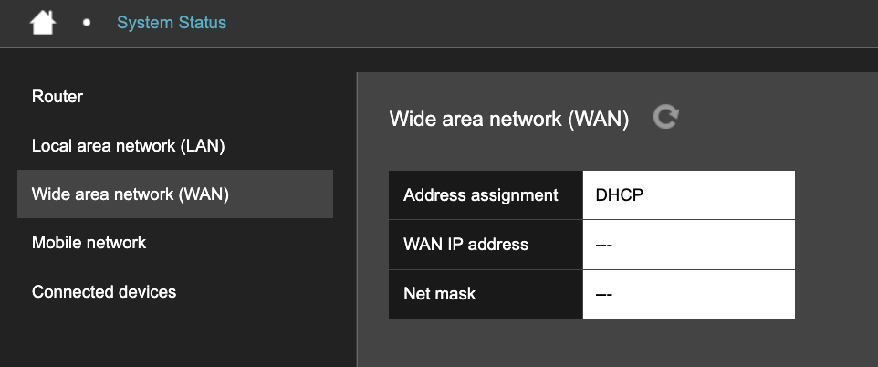

# Wide area network (WAN)

**Wide area network (WAN)** displays address information for a configured Ethernet WAN connection.

An Ethernet WAN connection uses port 4 on the Hera 604 to reach an external network. Depending on the mode selected in the Network Connection wizard, it can be the router's only connection, a backup for the mobile connection, or the connection that the mobile network backs up.

<figure><figcaption></figcaption></figure>

The page displays:

| Field              | Example or possible values | Description                                                                                                                                                                  |
| ------------------ | -------------------------- | ---------------------------------------------------------------------------------------------------------------------------------------------------------------------------- |
| Address assignment | `STATIC` or `DHCP`         | Determines how the Hera 604 obtains its Ethernet WAN address. `STATIC` means the address is configured manually. `DHCP` means the upstream network assigns it automatically. |
| WAN IP address     | `---` or an IP address     | Address assigned to the router's Ethernet WAN interface. `---` means an address is not currently assigned.                                                                   |
| Net mask           | `---` or a net mask        | Identifies the network associated with the WAN address. `---` means a net mask is not currently assigned.                                                                    |


Values appear on this page only when an Ethernet interface is configured to connect to an external network. If the router connects over the mobile network only, see [Mobile network](mobile-network.md).


Set up an Ethernet WAN connection using the [Network Connection wizard](../setup-wizards/#choose-a-network-connection). Once configured, adjust it on [WAN IP address](../basic-settings/wide-area-network-wan.md#wan-ip-address).
