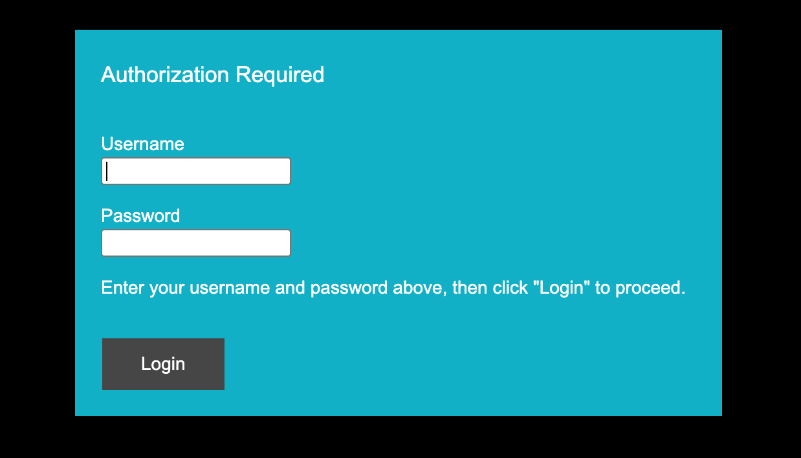

# Log in to the Hera 604

1. In a browser, enter the Hera web interface address. For example, `http://192.168.0.1`.
2. Your browser might show an untrusted certificate or private-connection warning. This is expected with Hera's local certificate. Continue to the address.
3. At the sign-in prompt, enter the username and password from your Configuration Information Sheet.


You can change your username and password later.


<figure><figcaption>
Enter the credentials supplied with your router.
</figcaption></figure>

4. Select **OK**.

The Hera web interface opens.

<figure><figcaption>
The Hera interface appears after you sign in.
</figcaption></figure>

You can use the Hera web interface to configure the device. In most cases, the device applies a predefined setup after it first connects to the Eseye device management system.
