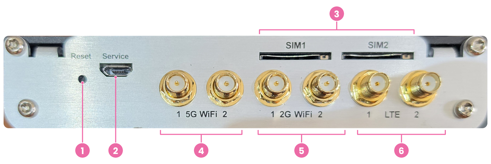
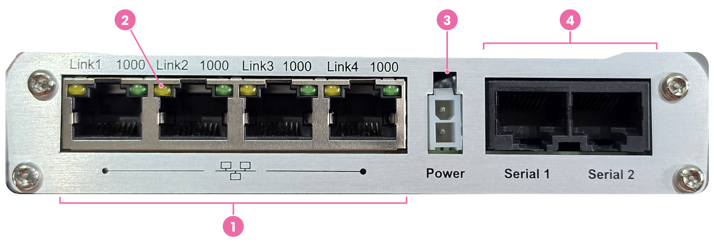
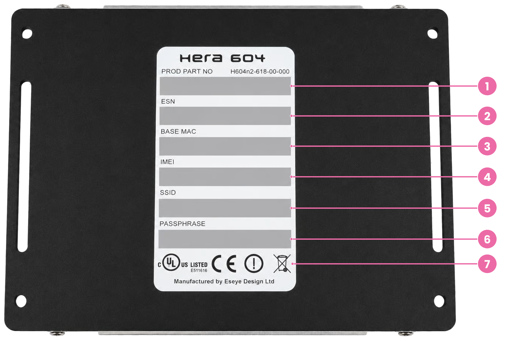

# Hera 604 panels and ports

The Hera 604 has three panels that contain its status indicators, connections, and controls.

| Panel  | Carries                                                   |
| ------ | --------------------------------------------------------- |
| Front  | Status LEDs                                               |
| Top    | Antenna connectors, SIM slots, Service port, Reset button |
| Bottom | Ethernet ports, power connector, serial ports             |

The panel names describe the Hera when wall mounted. The antennas sit uppermost. The cabling sits below.

> **Note:** This documentation covers the Hera 604 v6. Check the product label on the base to confirm your revision.

### Front panel

The front panel has five vertically arranged status LEDs. Number them from top to bottom:

<figure><figcaption></figcaption></figure>

| # | Item   | What it reports                            |
| - | ------ | ------------------------------------------ |
| 1 | Power  | Power and software status                  |
| 2 | LAN    | Local network availability and traffic     |
| 3 | Wi-Fi  | Wi-Fi availability and traffic             |
| 4 | WAN    | Wide area network availability and traffic |
| 5 | Signal | Cellular signal strength                   |

See [Status indicators](status-indicators.md) for LED states.

### Top panel

The top panel carries the antenna connectors, SIM card slots, Service port, and Reset button. Number them from left to right:

<figure><figcaption></figcaption></figure>

| # | Item                    | What it does                                                                     |
| - | ----------------------- | -------------------------------------------------------------------------------- |
| 1 | Reset button            | Reboots the Hera or restores factory defaults                                    |
| 2 | Service port            | Micro USB port for command line access. You do not need it for normal setup.     |
| 3 | SIM1 and SIM2           | Slots for removable SIM cards                                                    |
| 4 | 5G WiFi 1 and 5G WiFi 2 | Antenna ports for the 5 GHz Wi-Fi band                                           |
| 5 | 2G WiFi 1 and 2G WiFi 2 | Antenna ports for the 2.4 GHz Wi-Fi band                                         |
| 6 | LTE 1 and LTE 2         | Antenna ports for the cellular connection. LTE 1 is primary. LTE 2 is diversity. |

> **Note:** On the antenna labels, **2G** and **5G** mean the 2.4 GHz and 5 GHz Wi-Fi bands. They do not mean cellular generations. The cellular antennas are marked LTE.

#### Antennas

The Hera has six antenna connectors:

* Four Wi-Fi connectors: 50 Ohm SMA, male.
* Two cellular connectors: 50 Ohm SMA, female. Of these, one is the Primary connection and the other is the diversity connection.

| Connector               | Band     | Purpose                                                                                                                                                     |
| ----------------------- | -------- | ----------------------------------------------------------------------------------------------------------------------------------------------------------- |
| LTE 1                   | Cellular | Primary transmit and receive                                                                                                                                |
| LTE 2                   | Cellular | Diversity antenna. On LTE, this adds transmit and receive diversity for a more reliable connection, or MIMO for higher throughput. On 3G, it receives only. |
| 2G WiFi 1 and 2G WiFi 2 | 2.4 GHz  | Wi-Fi                                                                                                                                                       |
| 5G WiFi 1 and 5G WiFi 2 | 5 GHz    | Wi-Fi                                                                                                                                                       |

Fit both LTE antennas. Using both improves signal performance and reduces interference. Mount antennas high, and separate them from the router and each other.

#### SIM slots

The **SIM1** and **SIM2** slots accept removable Mini (2FF) SIMs. Each slot uses a push-to-insert and push-to-release socket.

A SIM security plate can prevent SIM removal after installation. It requires a Security Torx T10 screwdriver.

See [Install the Hera 604](/broken/spaces/BMckwRPzYNvOiZyh1fl3/pages/nRG6cJM4R4N9gdim6obs) for the SIM installation procedure.

#### Service port

The Micro USB port marked **Service** provides direct serial access to the command line interface. You do not need this port for normal setup.

#### Reset button

The recessed reset button sits beside the **Service** port. Press it with a straightened paperclip or similar tool. A short press performs a soft reboot. Press and hold the button to restore factory defaults.

Use the reset button only when you need to restart or reset the router. See [Restart and reset](../diagnostics-and-maintenance/restart-and-reset/) for the procedure.

### Bottom panel

The bottom panel carries the Ethernet ports, power connector, and serial ports. Number them from left to right:

<figure><figcaption></figcaption></figure>

| # | Item                  | What it does                               |
| - | --------------------- | ------------------------------------------ |
| 1 | Link1 to Link4        | Ethernet ports, configurable as LAN or WAN |
| 2 | Link indicators       | Ethernet connection and speed indicators   |
| 3 | Power connector       | Connects the supplied 12 VDC adapter       |
| 4 | Serial 1 and Serial 2 | Connect serial equipment                   |

#### Ethernet ports

The Hera has four RJ45 Ethernet ports, labelled **Link1** to **Link4**. Each is marked 1000, which indicates a maximum speed of 1000 Mbps.

| Property | Detail                                                          |
| -------- | --------------------------------------------------------------- |
| Standard | 10/100/1000baseT/TX                                             |
| Cabling  | Auto MDI/MDIX. Straight-through and crossover cables both work. |
| Role     | Each port is configurable as either WAN or LAN.                 |

Any port can take either role. You can run an Ethernet WAN uplink on one port. You can connect local devices to the remaining ports. You can also use more than one port as a LAN port.

See [Status indicators](status-indicators.md) for port indicator details.

#### Serial ports

Two RJ45 ports, labelled **Serial 1** and **Serial 2**, connect serial equipment. Configure each port to match your equipment: RS232, RS422, or RS485.

| Setting      | Range                     |
| ------------ | ------------------------- |
| Baud rate    | 300 to 230400             |
| Data bits    | 7 or 8                    |
| Stop bits    | 1 or 2                    |
| Parity       | Mark, space, odd, or even |
| Flow control | Software or hardware      |
| Other        | BREAK support             |

Use **Serial 1** and **Serial 2** for application data from connected equipment. They do not provide command line access. Use the **Service** port on the top panel to access the Hera command line.

#### Power connector

The power connector sits between **Link4** and **Serial 1**. It accepts the supplied 12 VDC power adaptor and powers the Hera.

| Property            | Value             |
| ------------------- | ----------------- |
| Input               | 12 VDC            |
| Connector           | Molex Mini Fit Jr |
| Maximum consumption | 10 W              |

> **Warning:** Use only an Eseye-approved mains adapter. Other adapters invalidate the warranty.

### Product label

The product label appears on the base of the Hera. Each value also has a barcode:

<figure><figcaption></figcaption></figure>

| Field        | Purpose                     |
| ------------ | --------------------------- |
| PROD PART NO | Product part number         |
| ESN          | Router identifier for Eseye |
| BASE MAC     | Router base MAC address     |
| IMEI         | Cellular modem identifier   |
| SSID         | Wi-Fi network name          |
| PASSPHRASE   | Wi-Fi password              |

> **Tip:** Record the SSID and passphrase before mounting the Hera.
