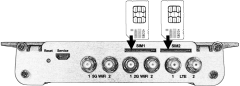

# Physical specifications and mounting

The Hera 604 is designed for wall mounting, with its antennas uppermost and its cable connections below.

### Dimensions and operating conditions

| Property               | Value                             |
| ---------------------- | --------------------------------- |
| Dimensions (W × D × H) | 155 × 140 × 28 mm                 |
| Product weight         | 0.5 kg                            |
| Packaged weight        | 1.3 kg                            |
| Operating temperature  | -20 °C to 55 °C (-4 °F to 131 °F) |
| Operating humidity     | 5% to 95%, non-condensing         |
| Mounting               | Wall mount                        |

### Choose a mounting location


Before selecting a mounting location, review [Safety information](../reference/safety-information.md).


Make sure the location meets these requirements:

1. Choose a stable, weather-protected location free from vibration.
2. Check cellular and Wi-Fi signal strength, and avoid nearby equipment that can cause interference.
3. Keep the antenna connectors, cable connections, and LEDs accessible.

### Before you begin

You need these tools:

* Security Torx screwdriver with a T10 tip
* Tape measure, spirit level, pencil, and masking tape
* Cross-head Pozidriv or Phillips screwdriver
* Drill with an Ø 5 mm or Ø 3⁄16 in bit

You need these fixings:

* Four plastic wall plugs: Ø 5 mm × 30 mm or Ø 3⁄16 in × 1¼ in
* Four pan-head wood screws: Ø 3.5 mm × 30 mm or Ø #6 × 1¼ in

### Mount the Hera



#### Fit the SIM

The socket uses a push-to-insert, push-to-release mechanism, so the SIM clicks into place and sits flush with the edge of the SIM slot.

If a SIM card is supplied with your Hera, insert it fully into the SIM card slot.

<figure><figcaption></figcaption></figure>



#### Fit the SIM card security plate

Use a Security Torx screwdriver with a T10 tip to fit the security plate across the Hera SIM card slots.



#### Mark the mounting points

Choose one marking method:



1. Print the drilling template supplied with the router.
2. Measure the printed template. Printing can change its scale.
3. If the template is accurate, level it against the wall.
4. Secure the template with masking tape.



1. Hold the Hera against the wall.
2. Mark the drill holes.





#### Drill and fit the wall plugs

Drill the four marked holes, then fit a wall plug into each hole.



#### Attach the antennas

Connect the LTE 1 and LTE 2 cellular antenna cables, then connect the Wi-Fi antennas.



#### Position the Hera

Position the Hera over the mounting points.



#### Secure the Hera

Secure the Hera with the four screws.



#### Position the antennas

Position the antennas for optimal performance.



#### Connect power

Connect the power connector to the Hera, then connect the mains adapter to a dedicated socket.



#### Switch on power

Switch on the mains supply.



Secure the cables and antennas to prevent intermittent connections.

Confirm that the Power LED is solid green. Confirm that either the LAN or WAN LED is solid green.

To complete setup, [connect Hera 604](../get-started/connect-hera-604.md), then [log in to Hera 604](../get-started/log-in-to-the-hera-604.md).

### Disposal


In accordance with EU Directive 2012/19/EC, separate this product and its accessories from other waste and scrap at end of life. Deliver them to the WEEE collection system in your country for recycling.

