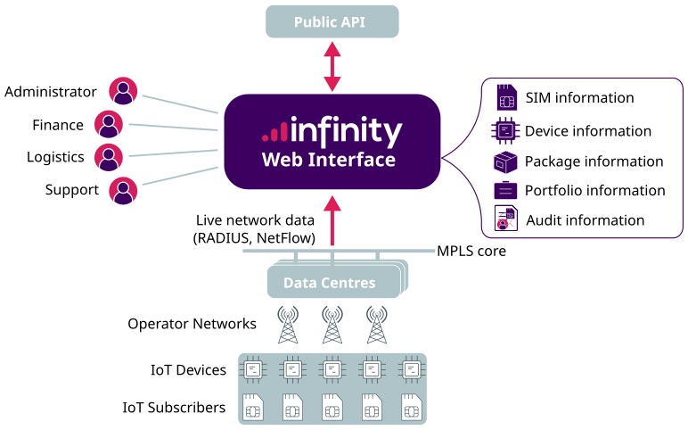
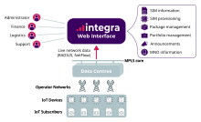
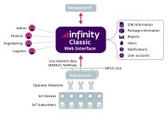

# Infinity IoT Platform

The Infinity IoT platform is where you manage your Eseye connectivity: the SIMs in the field, the portfolios and packages they belong to, and the orders that put them there.

Which product you use depends on the task. Infinity manages the day-to-day estate, Integra handles the commercial side, and Infinity Classic remains the home of a number of account-level settings.




**Infinity**

Monitor and manage your SIM estate — dashboards, alerts, reports, audit, and SIM state changes.

<a href="https://eseye-v3.gitbook.io/eseye-docs/L25WdLp1CEZBZ0aOlPAR/infinity" class="button primary">Learn more</a>




**Integra**

Administer the commercial side — portfolios, packages, orders, subscriptions, and users.

<a href="https://eseye-v3.gitbook.io/eseye-docs/L25WdLp1CEZBZ0aOlPAR/integra" class="button primary">Learn more</a>




**Infinity Classic**

Run the SIM lifecycle and configure account-level settings, including the Messaging API and reporting profiles.

<a href="https://eseye-v3.gitbook.io/eseye-docs/L25WdLp1CEZBZ0aOlPAR/infinityclassic" class="button primary">Learn more</a>



## Where to next?

Looking for the SIM itself rather than the platform? See [AnyNet SIM](https://eseye-v3.gitbook.io/eseye-docs/L25WdLp1CEZBZ0aOlPAR/anynet-sim) for how the SIM connects, roams, and is integrated into a device.
