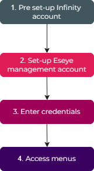
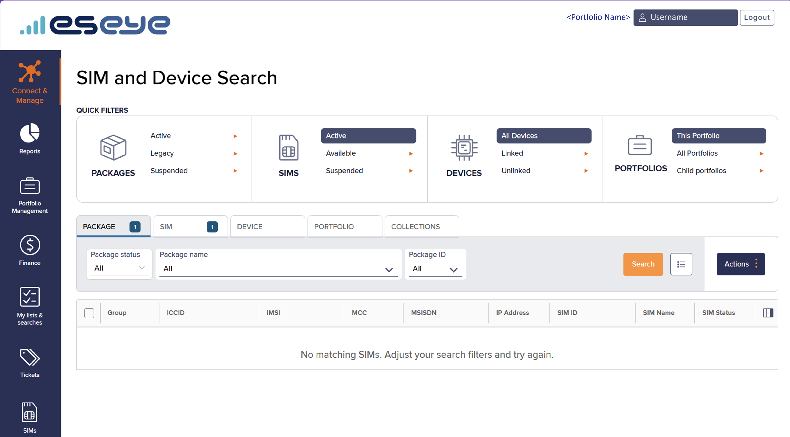
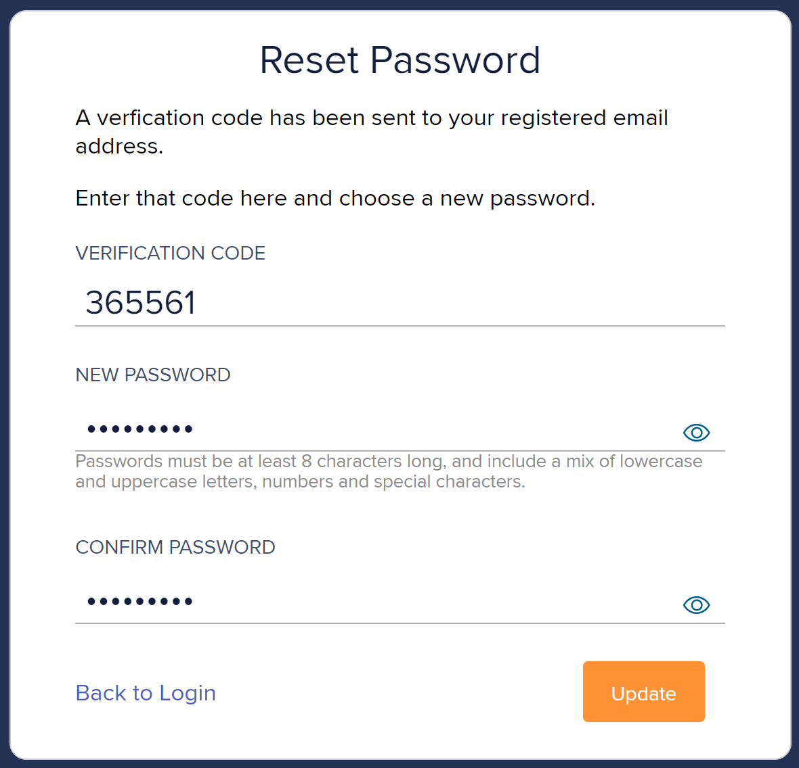

# About Infinity

Infinity provides tools to manage and monitor your IoT estate Eseye [Managing my Estate](sim-estate-management/how-to-manage-your-iot-estate.md). Eseye Infinity is designed to deliver multi-market cellular IoT connectivity and give customers access to control their SIM lifecycle, view device activity and manage their SIM estate. It captures user requirements in an intuitive manner.

It accesses and streamlines IoT estate information via the Public API and live network data from Eseye's PoPs. For more information, see About Eseye PoPs.

***

## Accessing the Infinity interface

Select the interactive components within the flowchart below.

**Use the following procedures/ follow the sequence:**

1. [Your Infinity account is pre-configured](./#your-infinity-account-is-pre-configured)
2. [Configuring an Eseye SIM management account](./#configuring-an-eseye-sim-management-account)
3. [Enter credentials](./#logging-into-infinity)
4. [About Infinity](./)
5. [Log out](./#logging-out-of-infinity)

### Your Infinity account is pre-configured

When you purchase AnyNet SIMs, your account is configured by the portfolio administrator and you will receive an email with the following details:

* **From:** [support@eseye.com](mailto:support@eseye.com)
* **Subject:** **Welcome to Eseye**
* **Body:** Contains a link to log in to Infinity interface available to users with AnyNet+ SIM. It contains login credentials for your Infinity user account.


Ensure that you change the temporary password.


### Configuring an Eseye SIM management account

To configure your Eseye SIM management account:

1. After signing into your Infinity account, you will receive a verification email with the following details:
   * **From:** `no_reply@anynetiot.com`
   * **Subject:** Welcome to Infinity
   * **Body:** Includes your login credentials (username and temporary password), provides an overview of features, and links to the Infinity documentation website and technical support.
2. Select log in here and follow the procedure, as described below.


The Infinity web interface automatically logs users out after 15 minutes of inactivity.


#### Logging into Infinity

To access the Infinity interface:

1. Navigate to [Infinity](https://infinity.anynetiot.com).
2.  Enter your username, then copy the verification code from the Welcome to Infinity email and paste it into the Password field.

    > This temporary password is time-sensitive and should be changed promptly.
3. From the **Language** drop-down list, , select your preferred language to access the Infinity portal.
4. Select **Sign In** to navigate to the [Two Factor Authentication screen](account-and-support/how-to-manage-your-infinity-user-profile.md#enabling-or-disabling-multi-factor-authentication-mfa).
5. Enable the MFA as described in [Managing your Infinity user profile](account-and-support/how-to-manage-your-infinity-user-profile.md).

After logging in, select **Launch Infinity** to see the Infinity landing page.

You can access various menus depending upon your assigned role, portfolio and package. For more information, see [Managing my Estate](sim-estate-management/how-to-manage-your-iot-estate.md).

#### Changing password in Infinity

To change your Infinity interface password:

1. Log in to the Infinity web interface.
2. Select your username in the top-right of the web interface to display the **Profile Settings** window.
3. Select **Change Password**.
4. In the **Change Password** dialog box, type your **Current Password**.
5. Type a **New Password**.
6. Alongside **Confirm New Password**, retype the new password.
7. Select **Update** to save your changes.

#### Resetting password in Infinity

To reset your Infinity interface password:

1. Navigate to [Infinity](https://infinity.anynetiot.com).
2. Select **Forgotten password?**.
3.  Specify your **Username**, then select **Send Code**.

    Infinity sends an email (from `no_reply@anynetiot.com`) displaying a six-digit verification code on the **Reset Password** screen:

    
4. Copy the verification code from the **Password Reset** email into the **Verification code** field.
5. Specify a new password, then select **Update**.
6. On the confirmation screen, select **Login** to return to the log in screen.

After logging in, you can see the Infinity landing page.

You can access various menus depending upon your assigned role, portfolio and package. For more information, see [Managing my Estate](sim-estate-management/how-to-manage-your-iot-estate.md).

#### Logging out of Infinity

To log out of the Infinity interface:

* At the top-right, select **Logout**.
