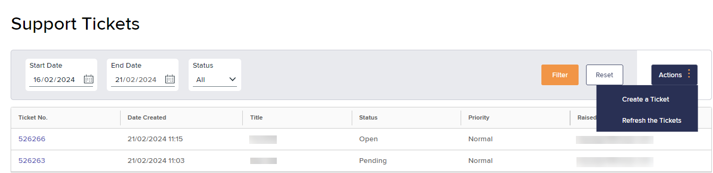
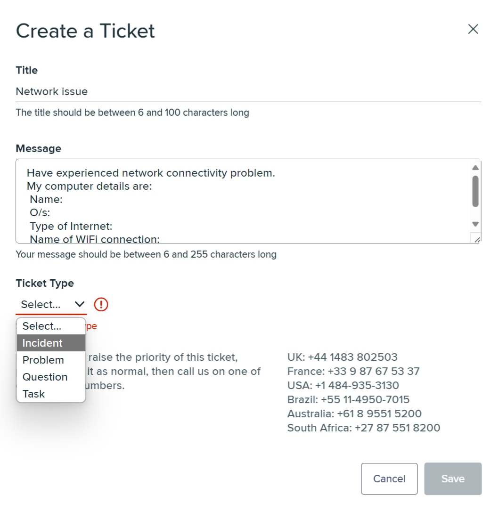
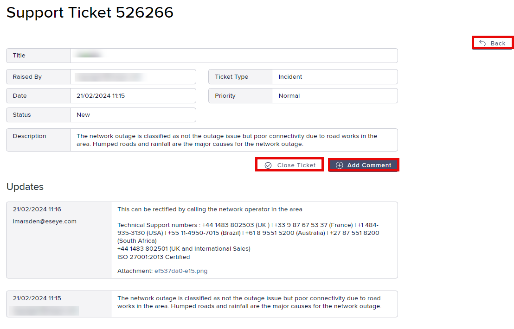
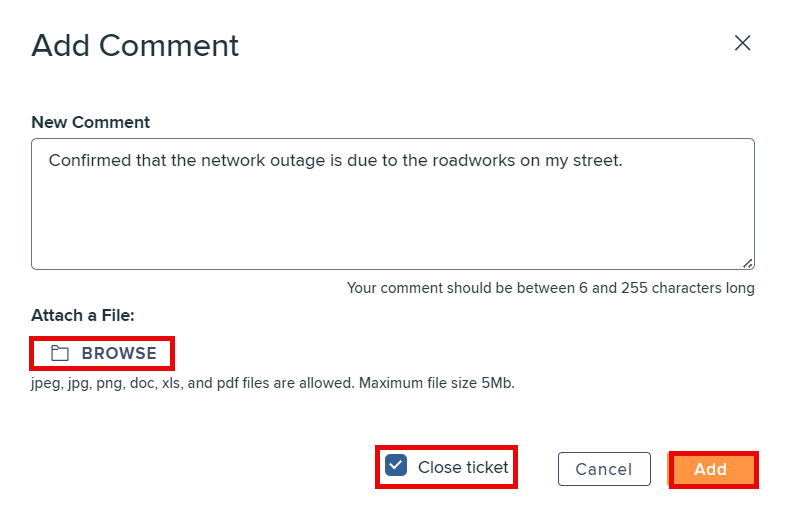

# How to manage Infinity Support tickets

You can log Support tickets for several reasons, primarily to report technical issues, track issues, seek help, or request services.

To access **Tickets**:

*   Using Infinity, on the left menu, select **Tickets** to display the **Support Tickets** page.

    All **Open** tickets for the current user are listed.

    

## Viewing tickets

The Support Tickets list contains the following fields:

| Field        | Description                                                                                                                                                                                                                                                                                                                                                                                                                                                                                                                                                                                                                                                                                                                                                                                                                                                       |
| ------------ | ----------------------------------------------------------------------------------------------------------------------------------------------------------------------------------------------------------------------------------------------------------------------------------------------------------------------------------------------------------------------------------------------------------------------------------------------------------------------------------------------------------------------------------------------------------------------------------------------------------------------------------------------------------------------------------------------------------------------------------------------------------------------------------------------------------------------------------------------------------------- |
| Ticket no.   | The Zendesk ticket number. Select to display the **Support ticket** details for your ticket.                                                                                                                                                                                                                                                                                                                                                                                                                                                                                                                                                                                                                                                                                                                                                                      |
| Date created | The ticket start date.                                                                                                                                                                                                                                                                                                                                                                                                                                                                                                                                                                                                                                                                                                                                                                                                                                            |
| Title        | Brief summary of the issue.                                                                                                                                                                                                                                                                                                                                                                                                                                                                                                                                                                                                                                                                                                                                                                                                                                       |
| Status       | 
Support assigns the following statuses to the ticket:
<ul><li><strong>New:</strong> An initial response email sent as acknowledgement to the customer.</li><li><strong>Open:</strong> Support are currently working on the ticket.</li><li><strong>Pending:</strong> Waiting for a response from the customer.</li><li><strong>On-Hold:</strong> Waiting for an action from a third party or internal team.</li><li><strong>Solved:</strong> Resolved by the customer support team with no further action required.</li><li><strong>Closed:</strong> Solved tickets are <strong>Closed</strong> after 7 days. To open a closed ticket, a follow-up ticket is created by the Support.</li></ul>                                                                                                                                                              |
| Priority     | 
Support triages the ticket based on the following priorities:
<ul><li><strong>Low/ P4:</strong> Less impact on business, or informational request.</li><li>
<strong>Normal/ P3:</strong> Minor impact to service affecting a small proportion of your estate, while other functions can operate normally.
<blockquote>
By default, Normal is assigned to the new ticket.
</blockquote></li><li><strong>High/ P2:</strong> Major impact to service affecting a large proportion of your estate, but not a complete outage.</li><li>
<strong>Critical/ P1:</strong> Severe impact affecting your entire estate, for example. a complete outage of service or a single critical system down.
<blockquote>
To escalate tickets categorised as P1/P2 incident, phone <a href="mailto:support@eseye.com">Support</a>.
</blockquote></li></ul> |
| Raised by    | The Infinity user that created the ticket.                                                                                                                                                                                                                                                                                                                                                                                                                                                                                                                                                                                                                                                                                                                                                                                                                        |

### Filtering the displayed tickets

To display tickets raised within a specified time period:

1. On the **Support Tickets** page, use any of the following filters to constrain the available list and find a specific ticket:
   * **Start Date** – date when the tickets were first raised (initial search range date)
   * **End Date** – date before which, the tickets were first raised (final search range date)
   *   **Status** – the current ticket status

       

By default, the <strong>Status</strong> value is <strong>Open</strong>. See <a href="how-to-manage-infinity-support-tickets.md#viewing-tickets">Viewing tickets</a> for status definitions.

2. Select **Filter** to display all tickets matching the specified parameters.
3. Select **Reset** to clear the values and display only **Open** tickets.

### Refreshing the list of tickets

To refresh the tickets list:

* On the **Support Tickets** page, select **Actions** > **Refresh the Tickets**.

## Creating a ticket

To raise a ticket:

1. On the left menu, select **Tickets**.
2.  On the **Support Tickets** page, select **Actions** > **Create a ticket** to display the **Create a Ticket** dialog.

    
3. Specify a **Title** and a detailed **Message** explaining the issue.
4. Select **Ticket Type** as:
   * **Incident** – If there is an outage or network issue
   * **Problem** – If there is an issue with the SIM or device
   * **Question** – If you have any doubt or query that requires clarification
   * **Task** – If you are unable to perform any procedure using the available menus
5. Select **Save** to log the issue as a ticket.

## Updating tickets

Use the **Support Ticket Details** page to:

* Add comments and attach files to the raised ticket.
* View Support updates.
*   Close the ticket

    

Depending on their role and permissions, some customers can close their tickets.

* Return to the **Support tickets** page

To update an open ticket:

1. On the left menu, select **Tickets** to list all the tickets raised that match the filter parameters.
2. In the ticket list, select the ticket number to display its details.
3.  To update the ticket, select **Add Comment** to display the **Add Comment** dialog.

    
4. In the **New Comment** text box, describe the update.
5.  To attach files or screenshots as additional information , select **BROWSE** to navigate to the file location, select it and select **Add** .

    

Attachments help Support replicate the issue and resolve it faster.

6. Below **Updates**, you can view a list of additional comments about the support ticket. Each update includes the:
   * **Updates** creation date and time
   * Email address of the user that added the update
   * Updates description text
   * Attachment(if any) in .png or .jpeg formats
7.  If you are satisfied with the resolution, select **Close Ticket**.

    

If Support updates your ticket status, you receive an email notification.

