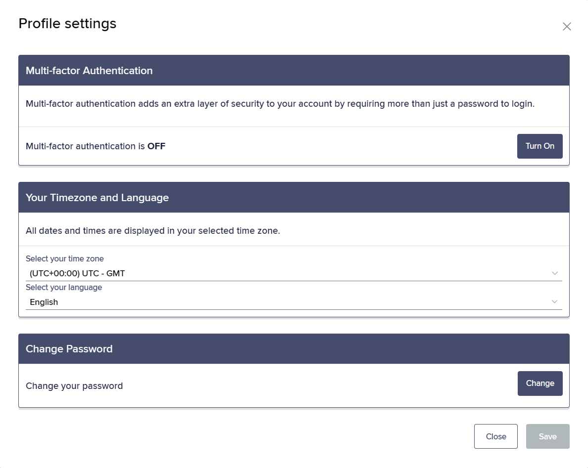
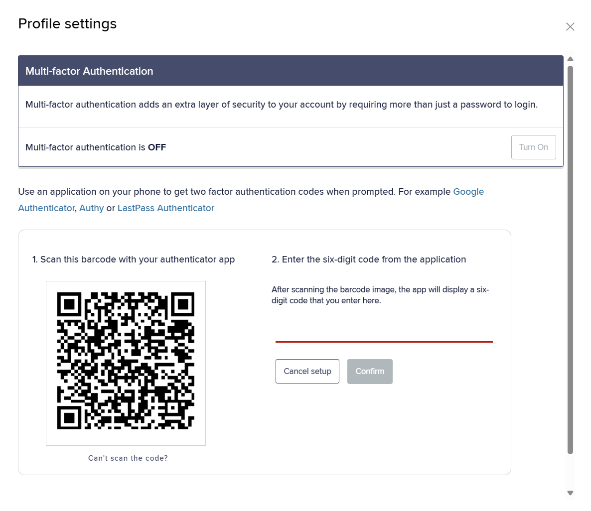
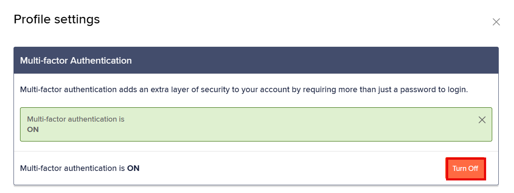
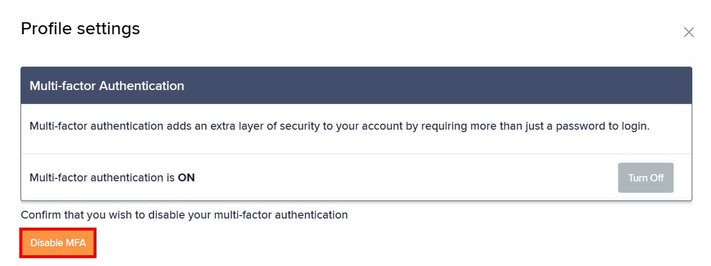
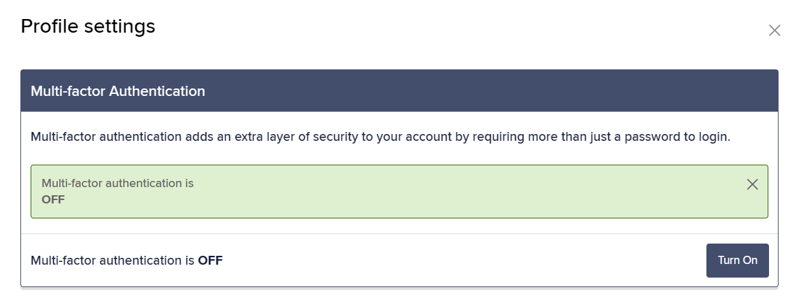
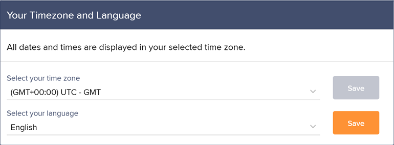
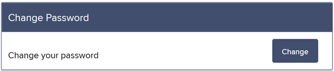
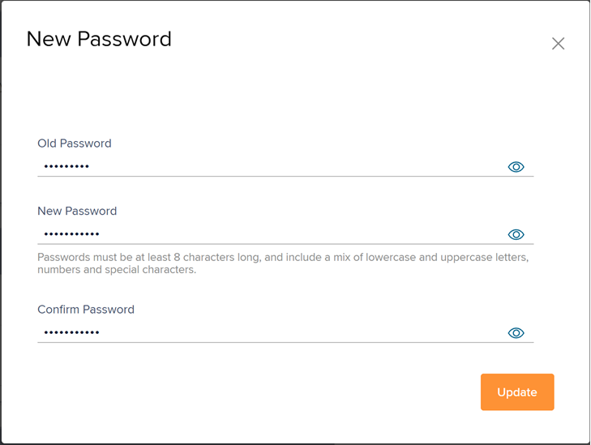

# How to manage your Infinity user profile

## Configuring Your User Profile

At the top right, select your > **Profile Settings** to display the **Profile Settings** dialog box.

* [**Enabling or disabling multi-factor authentication (MFA)**](how-to-manage-your-infinity-user-profile.md#enabling-or-disabling-multi-factor-authentication-mfa)
* [**Configuring your timezone and language**](how-to-manage-your-infinity-user-profile.md#configuring-your-timezone-and-language)
* [**Changing your password**](how-to-manage-your-infinity-user-profile.md#changing-your-password)

### Enabling or disabling multi-factor authentication (MFA)

Watch the below video for enabling MFA




Only portfolio administrators can use this feature.


Multi- factor authentication provides an additional layer of security by requiring two independent authentication factors:

1. Enter user credentials in the **Login** screen.
2.  Use a third-party authenticator application to generate a six-digit authentication code.

    > Ensure that you enter this authentication code into the the **Login** screen before it expires.

Use either of the following authentication applications:

* [**Google Authenticator**](https://support.google.com/accounts/answer/1066447)
* [**Authy**](https://www.authy.com/download/)
* [**LastPass Authenticator**](https://www.lastpass.com/products/authenticator)

To enable MFA:

1. At the top right, select your > **Profile Settings** to display the **Profile Settings** dialog box.
2. Under **Multi-factor Authentication**, select **Turn On**.
3.  Using the authenticator application installed on your phone, scan the QR code displayed on the profile page.

    
4.  Enter the six-digit code from the authenticator application, then select **Confirm** to accept, else select **Cancel setup** to abort.

    > On every subsequent log in, enter the six-digit authentication code generated by your authentication application.

To disable MFA:

1. At the top right, select your > **Profile Settings** to display the **Profile Settings** dialog box.
2.  Under **Multi-factor Authentication**, select **Turn Off**.

    
3.  Select **Disable MFA** to confirm.

    

    You receive a green notification confirming that the MFA is turned off.

    

### Configuring your timezone and language

All dates and times displayed on the user interface are shown in the timezone configured in the Profile Settings. The user interface automatically adjusts the date and time for region-specific differences, such as daylight savings.

All text on the user interface is displayed in your chosen language.

To change the timezone:

1. At the top right, select your > **Profile Settings** to display the **Profile Settings** dialog box.
2.  Under **Your Timezone and Language**, use the drop-down list to select the required timezone.

    
3. Select **Save** to update the timezone.

To change the language:

1. Under **Your Timezone and Language**, use the drop-down list to select your preferred language:
   * English
   * Español
   * Português
2. Select **Save** to update the language.

### Changing your password


Passwords require at least eight characters, including a mix of upper and lower case letters and at least one number and one special character.

Underscores (\_) are not included as special characters.


To change your password:

1. At the top right, select your > **Profile Settings** to display the **Profile Settings** dialog box.
2.  Under **Change Password**, select **Change**.

    
3.  In the **New Password** window, enter the **Old Password**, **New Password** and **Confirm Password** fields.

    

    * **Old Password** – the current user's existing password.
    * **New Password** – the new password.
    * **Confirm Password** – must match the **New Password**.
4. Select **Update** to accept the password.

***

## Additional options

* **Notifications** – For more information, see [Managing email notifications](../monitoring-and-alerts/how-to-manage-email-notifications.md).
* **Privacy Policy** – details how we collect, record, disclose, and manage your personal information.
* **Cookie Policy** – details the cookies and trackers used in Infinity web interface, and how to disable them.
* **Help** - navigates to Infinity online help.
* **About** – describes version information, feature, and last updated information about the Infinity application. Support may require this information to resolve your query.
