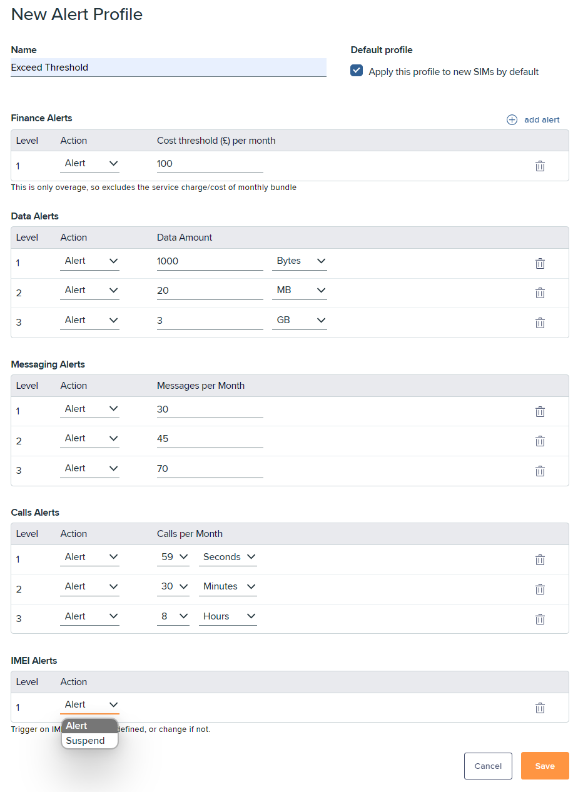
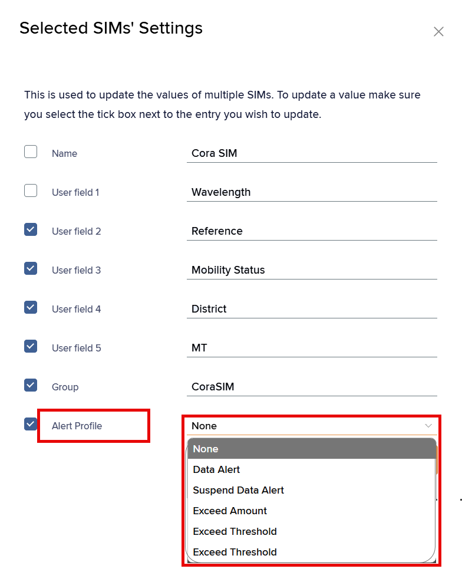

# About Infinity alert profiles

Alert profiles are customisable threshold rules applied to a SIM for monitoring. When a SIM breaches a threshold, the alerting system triggers alerts, notifications, and actions such as changing the SIM status.

To access the Infinity alert profile:

1.  On the left menu, select **Connect & Manage**.

    <figure><figcaption></figcaption></figure>
2. Select **Alerts** to view the alerts list.
3. Select the **Manage** tab to view the **Alert Profiles** list.

## Viewing Infinity alert profiles

Alert profiles contain the following information:

| Field          | Description                                                                                                                                                                                                        |
| -------------- | ------------------------------------------------------------------------------------------------------------------------------------------------------------------------------------------------------------------ |
| Alert Profile  | A set of conditions and rules that monitor SIM usage, activity, and security. You can receive notifications when thresholds or events occur, such as exceeding data or voice-call limits, or detecting a SIM swap. |
| Default        | .png>) Indicates this profile is the default for all SIMs in the current portfolio.                                                               |
| Active Devices | .png>) Indicates active devices use the specified alert profile.                                                                                         |
| Actions        | You can [update](about-infinity-alert-profiles.md#updating-alert-profiles) or [delete](about-infinity-alert-profiles.md#deleting-alert-profiles) the alert profile.                                                |

## Creating alert profiles

Alert profiles contain the following thresholds:

| Alert type       | Description                                                                                        |
| ---------------- | -------------------------------------------------------------------------------------------------- |
| Finance Alerts   | Monitors cost limit thresholds.                                                                    |
| Data Alerts      | Monitors data consumption thresholds in Bytes, KB, MB, GB, or a percentage of monthly consumption. |
| Messaging Alerts | Monitors the number of SMS messages the SIM can send or receive (MO or MT).                        |
| Call Alerts      | Monitors maximum voice-call usage in a month, measured in seconds, minutes, or hours.              |
| IMEI Alert       | Detects IMEI changes, which indicate the SIM has moved to another device.                          |

To create an alert profile:

1.  On the **Manage** tab, select **Add** to view the **New Alert Profile** form.

    
2.  In **Name**, enter a profile name.

    <div data-gb-custom-block data-tag="hint" data-style="info" class="hint hint-info"><p>If one or more alert profiles already exist, the <strong>Default profile</strong> checkbox appears alongside the <strong>Name</strong>. If only one alert profile exists, it is automatically assigned as the default.</p></div>
3. If required, select **Default profile** to assign this profile to all SIMs in the current portfolio.
4. Alongside an **Alert Type**, select **Add alert** to create a threshold.
5.  Set **Action required** to one of the following options:

    *   **Alert** displays an alert in the alerts list when a threshold is breached. It sends an email if you subscribe to notifications.

        For more information, see [Viewing alerts](about-infinity-alerts.md#viewing-alerts) and [Managing your Infinity user profile](../account-and-support/how-to-manage-your-infinity-user-profile.md).
    * **Suspend** temporarily suspends the SIM until the current billing cycle ends. It sends an email if you subscribe to notifications. The SIM remains on the network, but you cannot use it.

    <div data-gb-custom-block data-tag="hint" data-style="info" class="hint hint-info"><p>At the next billing cycle, the SIM is unsuspended and becomes active for use.</p></div>

    ```
    For more information, see [Understanding the SIM lifecycle](/spaces/XGhN6gzyULR0TDJArp4a/pages/H5Y1wrM7xOf9zeUBwC2q).
    ```
6.  Set the relevant threshold parameters:

    <div data-gb-custom-block data-tag="hint" data-style="info" class="hint hint-info"><p>You can set up to 3 alert levels for all the thresholds, except IMEI alert (which has only 1 alert level). Ensure that each added alert threshold exceeds the value of previously set thresholds.</p></div>

    | Alert type     | Parameters                                                                                                                                              |
    | -------------- | ------------------------------------------------------------------------------------------------------------------------------------------------------- |
    | Finance Alerts | **Cost limit threshold per month:** Enter the amount that triggers an alert when monthly spending reaches or exceeds that value.                        |
    | Data Alerts    | **Data usage limit per month:** Enter the KB, MB, GB, or percentage that triggers an alert when monthly data usage reaches or exceeds that value.       |
    | Message Alerts | **SMS usage per month:** Enter the number of messages that triggers an alert when monthly SMS usage reaches or exceeds that value.                      |
    | Call Alerts    | **Voice call usage per month:** Enter the seconds, minutes, or hours that trigger an alert when monthly voice-call usage reaches or exceeds that value. |
    | IMEI Alert     | Add a threshold that triggers an alert when the SIM moves to another device and its IMEI changes.                                                       |
7. Repeat this process to add further thresholds.
8.  Select **Save** to commit your changes.

    The alert profile appears in the **Alert Profiles** list.

## Assigning an alert profile

To assign an alert profile to a SIM:

1. On the left menu, select **Connect & Manage** > **SIM and Device Search**.
2. In the **Search results** table, select the checkboxes alongside the relevant SIM details rows.
3. At the top right, select **Actions** > **SIM Actions** > **SIM Settings**.
4.  In the **SIMs' Settings** dialog, select an option from the **Alert Profile** drop-down list.

    
5. Select **Update** to assign the alert profile to the selected SIMs.

## Updating alert profiles

To update existing alert profiles:

1. Select.png>) alongside an alert profile.
2. Make your changes.
3. If required, select .png>) alongside an alert level.
4.  Select **Save** to commit your changes.

    The updated alert profile appears in the **Alert Profiles** list.

## Deleting alert profiles

To delete existing alert profiles:

* Select .png>)alongside an alert profile.


You cannot delete the default alert profile, or alert profiles that are linked to active devices.

