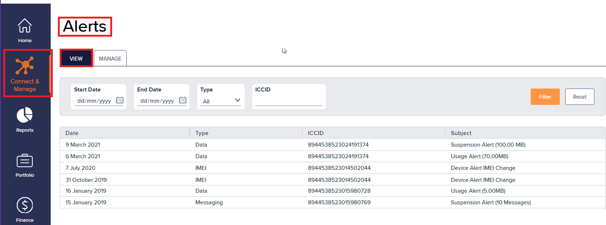

# About Infinity alerts

Alerts display the SIMs where the usage has exceeded alert thresholds. These are generated by the alerting system and used to initiate orchestrations.

You can [view alerts](about-infinity-alerts.md#viewing-alerts) and [filter alerts](about-infinity-alerts.md#filtering-the-displayed-alerts).


Alerts can trigger notifications. You must subscribe to receive them. For more information, see [Managing your Infinity user profile](../account-and-support/how-to-manage-your-infinity-user-profile.md).


To access the Infinity alerts:

1. On the left menu, select **Connect & Manage**.

<figure><figcaption></figcaption></figure>

1.  Select **Alerts** to view the alerts list.

    

## Viewing alerts

The **Alerts** list contains the following fields:

| Field   | Description                                                                                                                                      |
| ------- | ------------------------------------------------------------------------------------------------------------------------------------------------ |
| Date    | The date and time of the change, formatted as `dd/mm/yyyy hh:mm:ss`.                                                                             |
| Type    | Displays Finance, Data, Messaging, IMEI, or Calls alerts. For more information, see [Creating alert profiles](about-infinity-alert-profiles.md). |
| ICCID   | Displays the alerts triggered for a specific ICCID.                                                                                              |
| Subject | A short summary about the change made to the alert record, for auditing purposes.                                                                |

To view Infinity alerts:

1. On the **Alerts** page, select **View**.

### Filtering the displayed alerts

Use the available search filters to refine the **Alerts** list:

| Search filter | Description                                                                             | Example                                                                  |
| ------------- | --------------------------------------------------------------------------------------- | ------------------------------------------------------------------------ |
| Start Date    | Displays alerts triggered on or after the chosen date.                                  | `21/03/2024` returns alerts generated on or after March 21, 2024.        |
| End Date      | Displays alerts triggered up to and including the chosen date.                          | `21/03/2024` returns alerts generated on or before March 21, 2024.       |
| Type          | Displays alerts where Finance, Data, Messaging, IMEI, or Calls thresholds are breached. | `IMEI` returns alerts triggered because the SIM moved to another device. |
| ICCID         | Displays alerts triggered for a specific ICCID.                                         | `89445385230249074` returns alerts associated with that ICCID.           |

To filter alerts:

1. On the **Alerts** page, select the **View** tab.
2. Select **Start Date** to filter alerts from a date.
3. Select **End Date** to filter alerts up to a date.
4. Select **Type** to filter alerts by threshold.
5. Select **ICCID** to filter results by SIM.
6. Select **Filter** to return matching results.
7. Select **Reset** to clear all applied filters.
