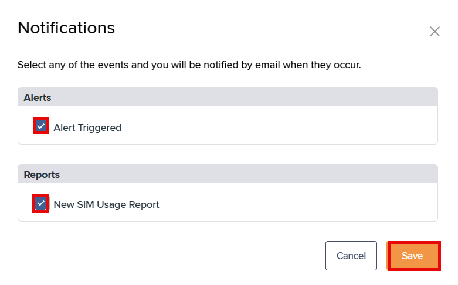

# How to manage email notifications

You can receive emails when alerts are triggered, and when the latest SIM usage report and SIM admin report become available.

## Enabling email notifications

To receive email notifications:

1. Sign in to the Infinity web interface.
2. At the top right, select your username > **Notifications**.
3. Under **Alerts**, select **Alert Triggered** to receive an email when the system generates an alert.
4.  Under **Reports**, select **New SIM Usage Report** to receive an email when the latest report becomes available.

    

This report tracks the usage cost per SIM. You can set how often it generates. For more information, see <a href="../reports-and-analytics/how-to-manage-infinity-reports.md">Managing Infinity reports</a>.

    
5. Select **Save** to commit your selection.

## Disabling email notifications

To disable email notifications:

1. Sign in to the Infinity web interface.
2. At the top right, select your username > **Notifications**.
3. Under **Alerts**, clear **Alert Triggered** to stop receiving alert emails.
4. Under **Reports**, clear **New SIM Usage Report** to stop receiving new-report emails.
5. Select **Save** to commit your selection.
