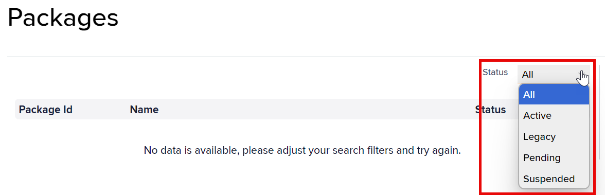
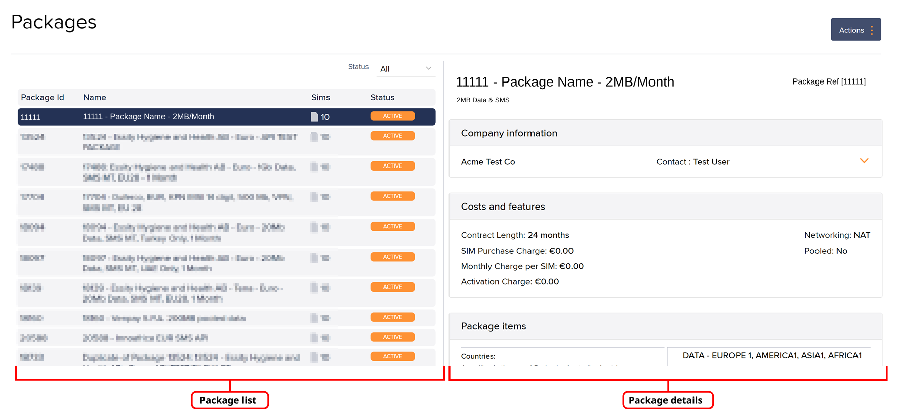

# About viewing packages using Infinity

To access packages using Infinity:

1. On the left menu, select Finance.
2. Select Packages to view the packages list.

## Viewing all packages

The package list displays all packages associated with the portfolio assigned to the current user.

The Infinity package list displays the following fields:

| Field      | Description                                                                                                                                                                                                                                                                                                                                                                                                                                                                                                                                                                                                        |
| ---------- | ------------------------------------------------------------------------------------------------------------------------------------------------------------------------------------------------------------------------------------------------------------------------------------------------------------------------------------------------------------------------------------------------------------------------------------------------------------------------------------------------------------------------------------------------------------------------------------------------------------------ |
| Package ID | The unique identifier for the package.                                                                                                                                                                                                                                                                                                                                                                                                                                                                                                                                                                             |
| Name       | The package name contains details that distinguish the package. These include the customer name, bundled data amount, and geographies.                                                                                                                                                                                                                                                                                                                                                                                                                                                                             |
| Status     | 
The package status, either:
<ul><li><strong>Active:</strong> Approved and ready for use.</li><li><strong>Legacy:</strong> A redundant package retained for auditing past transactions. It is unavailable for use.</li><li><strong>Pending:</strong> Awaiting approval to change state. It is unavailable for use.</li><li><strong>Suspended:</strong> Available for use, but you cannot assign more SIMs to it. You can manage SIMs already assigned to the package.</li><li><strong>Unsigned:</strong> Awaiting the customer's signature and Eseye Ltd final approval. It is unavailable for use.</li></ul> |

### Filtering the displayed packages

Refine the displayed Packages list using the Status filter.

To filter the packages list by status:

1. On the **Packages** page, select the **Status** drop-down list.
2.  Select the relevant status, or select **All** to view all packages.

    The list immediately filters.

## Viewing a specific package

To view a specific package:

*   On the **Packages** page, select a package in the package list.

    

    The package details include the following fields:

    | Field                    | Description                                                                                                                                                                                                                                            |
    | ------------------------ | ------------------------------------------------------------------------------------------------------------------------------------------------------------------------------------------------------------------------------------------------------ |
    | Name                     | The package name contains details that distinguish the package. These include the customer name, bundled data amount, and geographies.                                                                                                                 |
    | Package reference        | The unique package identifier. Packages contain contract, pricing, and billing information for a customer.                                                                                                                                             |
    | **Company information**  |                                                                                                                                                                                                                                                        |
    | Company name and address | The name and billing address of the company that signed the package contract.                                                                                                                                                                          |
    | Contact                  | The primary billing contact's first and last name.                                                                                                                                                                                                     |
    | Phone number             | The primary billing contact's phone number, including the international dialing code.                                                                                                                                                                  |
    | Email address            | The primary billing contact's email address.                                                                                                                                                                                                           |
    | Company No.              | The company registration number, such as BAN, CNPJ, CAF, or VAT.                                                                                                                                                                                       |
    | **Costs and features**   |                                                                                                                                                                                                                                                        |
    | Contract length          | The initial service contract length. It starts when an associated SIM is activated.                                                                                                                                                                    |
    | SIM purchase charge      | The cost of purchasing SIMs, in the portfolio currency. For more information, see SIM purchase price.                                                                                                                                                  |
    | Monthly charge per SIM   | The recurring monthly charge for each SIM, in the portfolio currency. For more information, see About prepay monthly billing charges.                                                                                                                  |
    | Activation charge        | The cost of activating a SIM on this package, in the portfolio currency. For more information, see About activation charges.                                                                                                                           |
    | Networking               | 
The networking type in use, either:
<ul><li><strong>NAT:</strong> Network address translation.</li><li><strong>VPN:</strong> Virtual private network.</li><li><strong>Fixed IP:</strong> Fixed IP address.</li></ul>                             |
    | Pooled                   | Indicates whether the SIMs in this package are pooled. For more information, see Understanding pooling.                                                                                                                                                |
    | **Package items**        |                                                                                                                                                                                                                                                        |
    | Countries                | Countries are assigned to a zone. Each zone has a tariff for enabled services. When a SIM registers on a network, services are billed at the zone's rates.                                                                                             |
    | Name                     | The package item name contains details about the service.                                                                                                                                                                                              |
    | Package item number      | The unique package item identifier. Package items define the transmission type, in-bundle and out-of-bundle charges, and geographic region.                                                                                                            |
    | Bundled                  | 
The in-bundle amount per SIM. It is measured as bytes, SMS units, or seconds.

For a bundle amount of <code>60</code>, the value is either:
<ul><li>60 bytes for data.</li><li>60 units for SMS.</li><li>60 seconds for voice.</li></ul>    |
    | Out of bundle            | 
The rounding amount applied when the in-bundle amount is exceeded. Each data session rounds up to the nearest specified amount.

The default is either:
<ul><li>Data: 1024 bytes.</li><li>SMS: 1 unit.</li><li>Voice: 60 seconds.</li></ul> |

## Viewing SIMs associated with a package

To view SIMs associated with a package:

1. On the **Packages** page, select the package in the packages list.
2.  At the top right, select **Actions** > **View SIMs**.

    The SIM and Device Search page appears, displaying a list of associated SIMs for the selected package.

## Changing the package status

If you have the relevant permissions, you can use Infinity to change a package status. For information about the package statuses, see [Viewing all packages](about-viewing-packages-using-infinity.md#viewing-all-packages).

You cannot change the package status if the current status is Legacy, Suspended, or Unsigned.


If you require help to change a package status, contact Support.


To change the package status:

1. On the **Packages** page, select the package that requires a status change.
2.  At the top right, select **Actions** > **Change Status**.

    

You will only see a list of available statuses that you have permission to use.

3.  In the **Status change** dialog, select the new status.

    

Changing a package status may affect your ability to activate SIMs associated with that package.

4. Select **Confirm** to initiate the change.
